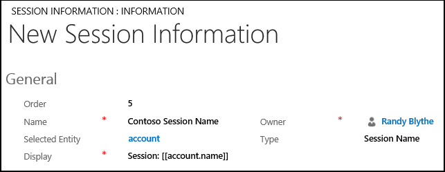
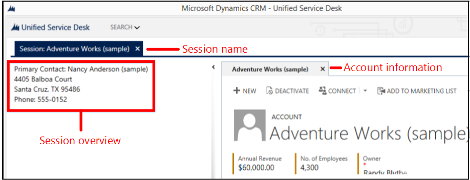
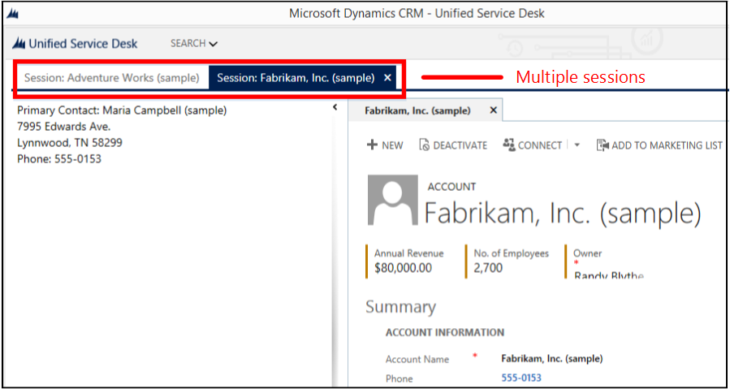

# Walkthrough 5: Display enhanced session information by displaying session name and overview data

[!INCLUDE[cc-data-platform-banner](../includes/cc-data-platform-banner.md)]

In the previous walkthrough, [Walkthrough 4: Display a record in a session in your agent application](../unified-service-desk/walkthrough-display-dynamics-365-record-session-agent-application.md), you learned how to display your customer record stored in a session in [!INCLUDE[pn_unified_service_desk](../includes/pn-unified-service-desk.md)]. However, the experience would be better if you can identify each session with a unique name along with some key overview information about the record in a session.  
  
 This walkthrough demonstrates how to dynamically display session name and session overview information to enhance the customer-interaction experience for your agents. This walkthrough is built on top of the previous walkthrough, [Walkthrough 4: Display a record in a session in your agent application](../unified-service-desk/walkthrough-display-dynamics-365-record-session-agent-application.md).  
  
## Prerequisites  
  
- You must have completed [Walkthrough 1: Build a simple agent application](../unified-service-desk/walkthrough-1-build-a-simple-agent-application.md) and [Walkthrough 4: Display a record in a session in your agent application](../unified-service-desk/walkthrough-display-dynamics-365-record-session-agent-application.md). The configurations that you completed in those walkthroughs are required in this walkthrough.  
  
- This walkthrough assumes that you’ll be using the same user credential that you used in walkthrough 1 to sign in to the agent application at the end of the walkthrough to test the application. If a different user will be testing the application, you must assign the user to **Contoso Configuration**. [!INCLUDE[proc_more_information](../includes/proc-more-information.md)] [Walkthrough 1: Build a simple agent application](../unified-service-desk/walkthrough-1-build-a-simple-agent-application.md)  
  
- You must know about the following in [!INCLUDE[pn_unified_service_desk](../includes/pn-unified-service-desk.md)]:  
  
  - **Session Lines** and **Session Tabs** type of hosted control. [!INCLUDE[proc_more_information](../includes/proc-more-information.md)] [Session Lines (Hosted Control)](../unified-service-desk/session-lines-hosted-control.md) and [Session Tabs (Hosted Control)](../unified-service-desk/session-tabs-hosted-control.md)  
  
  - Configure session name and session overview information. [!INCLUDE[proc_more_information](../includes/proc-more-information.md)] [Configure session information](../unified-service-desk/configure-session-information.md)  
  
  - Filter access using [!INCLUDE[pn_unified_service_desk](../includes/pn-unified-service-desk.md)] configuration. [!INCLUDE[proc_more_information](../includes/proc-more-information.md)] [Manage access using Unified Service Desk configuration](../unified-service-desk/admin/manage-access-using-unified-service-desk-configuration.md)  
  
## In This Walkthrough  
 [Step 1: Create a Session Lines type of hosted control to display session overview information](../unified-service-desk/walkthrough-5-display-enhanced-session-information-displaying-session-name-overview-data.md#Step1)  
  
 [Step 2: Define session name information](../unified-service-desk/walkthrough-5-display-enhanced-session-information-displaying-session-name-overview-data.md#Step2)  
  
 [Step 3: Define session overview information](../unified-service-desk/walkthrough-5-display-enhanced-session-information-displaying-session-name-overview-data.md#Step3)  
  
 [Step 4: Add the controls to the configuration](../unified-service-desk/walkthrough-5-display-enhanced-session-information-displaying-session-name-overview-data.md#Step4)  
  
 [Step 5: Test the application](../unified-service-desk/walkthrough-5-display-enhanced-session-information-displaying-session-name-overview-data.md#Step5)  
  
 [Conclusion](../unified-service-desk/walkthrough-5-display-enhanced-session-information-displaying-session-name-overview-data.md#Conclusion)  
  
<a name="Step1"></a>   
## Step 1: Create a Session Lines type of hosted control to display session overview information  
 To display session overview information in your agent application, create an instance of a **Session Lines** type of hosted control in your agent application.  
  
1. Sign in to the Dynamics 365 instance.  
  
2. [!INCLUDE[proc_settings_usd](../includes/proc-settings-usd.md)]  
  
3. Click **Hosted Controls**.  
  
4. Click **New**.  
  
5. On the **New Hosted Control** page, specify the following values:  
  
   |Field|Value|  
   |-----------|-----------|  
   |Name|Contoso Session Overview|  
   |USD Component Type|Session Lines|  
   |Display Group|SessionExplorerPanel|  
  
     
  
6. Click **Save**.  
  
<a name="Step2"></a>   
## Step 2: Define session name information  
 To dynamically display the session tab name, you’ll configure a session lines rule using the replacement parameters.  
  
1. Sign in to the Dynamics 365 instance.  
  
2. [!INCLUDE[proc_settings_usd](../includes/proc-settings-usd.md)]  
  
3. Click **Session Lines**.  
  
4. Click **New**.  
  
5. On the **New Session Information** page, specify the following values:  
  
   |Field|Value|  
   |-----------|-----------|  
   |Order|Any random value; say 5|  
   |Name|Contoso Session Name|  
   |Selected Entity|account|  
   |Type|Session Name|  
   |Display|Session: [[account.name]]<br /><br /> We are using the replacement parameters to define the session tab name format. In this case the session name will be **Session:** followed by the name of the account record that is displayed in the session.|  
  
     
  
6. Click **Save**.  
  
<a name="Step3"></a>   
## Step 3: Define session overview information  
 Define the session overview information to display in the **Session Lines** type of hosted control that you configured in step 1.  
  
1. Sign in to the Dynamics 365 instance.  
  
2. [!INCLUDE[proc_settings_usd](../includes/proc-settings-usd.md)]  
  
3. Click **Session Lines**.  
  
4. Click **New**.  
  
5. On the **New Session Information** page, specify the following values.  
  
   - **Order**: Any random value; say 6.  
  
   - **Name**: Contoso Session Overview Info  
  
   - **Selected Entity**: account  
  
   - **Type**: Session Overview  
  
   - **Display**:  
  
       ```xaml  
       <Grid Margin="0"      xmlns:x="https://schemas.microsoft.com/winfx/2006/xaml"      xmlns:CCA="clr-namespace:Microsoft.Crm.UnifiedServiceDesk.Dynamics;assembly=Microsoft.Crm.UnifiedServiceDesk.Dynamics">  
         <Grid.RowDefinitions>  
           <RowDefinition Height="auto" />  
           <RowDefinition Height="auto" />  
           <RowDefinition Height="auto" />  
           <RowDefinition Height="auto" />  
           <RowDefinition Height="auto" />  
           <RowDefinition Height="auto" />  
         </Grid.RowDefinitions>  
         <Grid.ColumnDefinitions>  
           <ColumnDefinition Width="80"/>  
           <ColumnDefinition Width="*" />  
           <ColumnDefinition Width="auto" />  
         </Grid.ColumnDefinitions>  
         <TextBlock Margin="5,0,0,0" Grid.Row="0" TextWrapping="Wrap" Padding="3,0,0,3" Grid.ColumnSpan="3" FontFamily="Tohoma" FontSize="14" Style="{DynamicResource AutoCollapse}" Text="Primary Contact: [[account.primarycontactid.name]x]" />  
         <TextBlock Margin="5,0,0,0" Grid.Row="1" TextWrapping="Wrap" Padding="3,0,0,3" Grid.ColumnSpan="3" FontFamily="Tohoma" FontSize="14" Text="[[account.address1_line1]x]"/>  
         <TextBlock Margin="5,0,0,0" Grid.Row="2" TextWrapping="Wrap" Padding="3,0,0,3" Grid.ColumnSpan="3" FontFamily="Tohoma" FontSize="14" Style="{DynamicResource AutoCollapse}" Text="[[account.address1_line2]+x]" />  
         <TextBlock Margin="5,0,0,0" Grid.Row="3" TextWrapping="Wrap" Padding="3,0,0,3" Grid.ColumnSpan="3" FontFamily="Tohoma" FontSize="14" Style="{DynamicResource AutoCollapse}" Text="[[account.address1_line3]+x]" />  
         <TextBlock Margin="5,0,0,0" Grid.Row="4" TextWrapping="Wrap" Padding="3,0,0,3" Grid.ColumnSpan="3" FontFamily="Tohoma" FontSize="14" Style="{DynamicResource AutoCollapse}" Text="[[account.address1_city]x], [[account.address1_stateorprovince]x] [[account.address1_postalcode]x]" />  
         <TextBlock Margin="5,0,0,0" Grid.Row="5" TextWrapping="Wrap" Padding="3,0,0,3" Grid.ColumnSpan="3" FontFamily="Tohoma" FontSize="14" Style="{DynamicResource AutoCollapse}" Text="Phone: [[account.telephone1]x]" />  
       </Grid>  
       ```  
  
       > [!NOTE]
       >  This sample uses XAML and replacement parameters to define the session overview information that displays the current account’s primary contact, address, and phone number in the session overview area.  
  
     
  
6. Click **Save**.  
  
<a name="Step4"></a>   
## Step 4: Add the controls to the configuration  
 In this step, you’ll add the hosted control and session line rules that were configured in this walkthrough to **Contoso Configuration** to display these controls to the user who is assigned to the configuration. **Contoso Configuration** was created in [Walkthrough 1: Build a simple agent application](../unified-service-desk/walkthrough-1-build-a-simple-agent-application.md).  
  
 Add the following to **Contoso Configuration**.  
  
|Control name|Control type|  
|------------------|------------------|  
|Contoso Session Overview|Hosted Control|  
|Contoso Session Name|Session Line|  
|Contoso Session Overview Info|Session Line|  
  
 To add a control to the configuration:  
  
1. Sign in to the Dynamics 365 instance.  
  
2. [!INCLUDE[proc_settings_usd](../includes/proc-settings-usd.md)]  
  
3. Click **Configuration**.  
  
4. Click **Contoso Configuration** to open the definition.  
  
5. On the nav bar, click the down arrow next to **Contoso Configuration**, and select **Hosted Controls**.  
  
6. On the next page, click **Add Existing Hosted Control**, type “`Contoso Session Overview`” in the search bar, and then press ENTER or click the search icon.  
  
7. In the search result box, click the hosted control to add it to **Contoso Configuration**.  
  
8. Similarly, add the session line controls by clicking the down arrow next to **Contoso Configuration**, and clicking **Session Lines**.  
  
9. Click **Save**.  
  
<a name="Step5"></a>   
## Step 5: Test the application  
  
1. Start the [!INCLUDE[pn_unified_service_desk](../includes/pn-unified-service-desk.md)] client application, and sign in to the Dynamics 365 instance where you configured [!INCLUDE[pn_unified_service_desk](../includes/pn-unified-service-desk.md)] by using the same user credentials that is assigned to Contoso Configuration in [Walkthrough 1: Build a simple agent application](../unified-service-desk/walkthrough-1-build-a-simple-agent-application.md). For information about connecting to Dataverse instance using the [!INCLUDE[pn_unified_service_desk](../includes/pn-unified-service-desk.md)] client application, see [Connect to a model-driven app instance using the Unified Service Desk client](../unified-service-desk/admin/connect-dynamics-365-instance-using-unified-service-desk-client.md)  
  
2. Click the down arrow next to the **Search** button in the toolbar, and then click **Account** to display the account records from your Dataverse instance.  
  
3. Click the expander to display the left pane (SessionExplorerPanel).  
  
     
  
4. Click any of the account records to display the respective account information in a session in the agent application. Note that the name of the session tab automatically displays the word **Session:** followed by the current account name. The left pane displays the session overview information that was defined earlier.  
  
     
  
5. If you open another account record, it will be displayed in another session in your client application. To open another account, click the down arrow next to the **Search** button, click **Account**, and then click an account name to display the account information in another session.  
  
     
  
<a name="Conclusion"></a>   
## Conclusion  
 In this walkthrough, you saw how to use the session lines configuration rules to contextually display the session tab name and key overview information about the record in a session in your agent application. You also learned how to filter access to [!INCLUDE[pn_unified_service_desk](../includes/pn-unified-service-desk.md)] controls using configuration.  
  
### See also  
 [Walkthrough 1: Build a simple agent application](../unified-service-desk/walkthrough-1-build-a-simple-agent-application.md)   
 
 [Walkthrough 2: Display an external webpage in your agent application](../unified-service-desk/walkthrough-2-display-an-external-webpage-in-your-agent-application.md)   
 
 [Walkthrough 3: Display records in your agent application](../unified-service-desk/walkthrough-3-display-microsoft-dynamics-365-records-in-your-agent-application.md)   
 
 [Walkthrough 4: Display a record in a session in your agent application](../unified-service-desk/walkthrough-display-dynamics-365-record-session-agent-application.md)   
 
 [Walkthrough 6: Configure the Debugger hosted control in your agent application](../unified-service-desk/walkthrough-configure-debugger-hosted-control-agent-application.md)   
 
 [Walkthrough 7: Configure agent scripting in your agent application](../unified-service-desk/walkthrough-configure-agent-scripting-agent-application.md)   
 
 [Unified Service Desk Configuration Walkthroughs](../unified-service-desk/unified-service-desk-configuration-walkthroughs.md)


[!INCLUDE[footer-include](../includes/footer-banner.md)]