# Walkthrough 7: Configure agent scripting in your agent application

[!INCLUDE[cc-data-platform-banner](../includes/cc-data-platform-banner.md)]

Agent scripting in [!INCLUDE[pn_unified_service_desk](../includes/pn-unified-service-desk.md)] helps to guide your agents during customer interaction. This walkthrough demonstrates how to create a simple agent script that helps the agents quickly create a new case for an account or browse existing cases from the agent application. The agent script created in this walkthrough is invoked when the agent pulls up an account record to view, which is displayed in a session in the [!INCLUDE[pn_unified_service_desk](../includes/pn-unified-service-desk.md)] client. The script provides the following three options:  

-   Create a case for the current account  

-   Display existing cases for the current account  

-   Close the session  

## Prerequisites  

- You must have completed [Walkthrough 1: Build a simple agent application](../unified-service-desk/walkthrough-1-build-a-simple-agent-application.md) and [Walkthrough 4: Display a record in a session in your agent application](../unified-service-desk/walkthrough-display-dynamics-365-record-session-agent-application.md). The configurations that you completed in those walkthroughs are required in this walkthrough.  

- This walkthrough assumes that you’ll be using the same user credential that you used in walkthrough 1 to sign in to the agent application. If a different user will be testing the application, you must assign the user to **Contoso Configuration**. [!INCLUDE[proc_more_information](../includes/proc-more-information.md)] [Walkthrough 1: Build a simple agent application](../unified-service-desk/walkthrough-1-build-a-simple-agent-application.md)  

- You must know be familiar with the following concepts in [!INCLUDE[pn_unified_service_desk](../includes/pn-unified-service-desk.md)]:  

  - **Agent Scripting** type of hosted control and how to configure agent scripts. [!INCLUDE[proc_more_information](../includes/proc-more-information.md)] [Agent Scripting (Hosted Control)](../unified-service-desk/agent-scripting-hosted-control.md) and [Guide customer interactions with agent scripts](../unified-service-desk/guide-customer-interactions-agent-scripts.md)  

  - How to configure [Action calls](../unified-service-desk/action-calls.md)  

  - How to configure window navigation rules. [!INCLUDE[proc_more_information](../includes/proc-more-information.md)] [Use window navigation rules in Unified Service Desk](../unified-service-desk/use-window-navigation-rules-unified-service-desk.md)  

  - Filter access using [!INCLUDE[pn_unified_service_desk](../includes/pn-unified-service-desk.md)] configuration. [!INCLUDE[proc_more_information](../includes/proc-more-information.md)] [Manage access using Unified Service Desk configuration](../unified-service-desk/admin/manage-access-using-unified-service-desk-configuration.md)  

## In This Walkthrough  
 [Step 1: Create an Agent Scripting type of hosted control](../unified-service-desk/walkthrough-configure-agent-scripting-agent-application.md#Step1)  

 [Step 2: Create hosted controls to display the new case form and existing cases](../unified-service-desk/walkthrough-configure-agent-scripting-agent-application.md#Step2)  

 [Step 3: Create an agent script task](../unified-service-desk/walkthrough-configure-agent-scripting-agent-application.md#Step3)  

 [Step 4: Add the answer, action call, and window navigation rule for creating a case from the agent script](../unified-service-desk/walkthrough-configure-agent-scripting-agent-application.md#Step4)  

 [Step 5: Add the answer and action calls for displaying existing cases](../unified-service-desk/walkthrough-configure-agent-scripting-agent-application.md#Step5)  

 [Step 6: Add the answer and action calls for closing the session](../unified-service-desk/walkthrough-configure-agent-scripting-agent-application.md#Step6)  

 [Step 7: Create an action call to display the agent script](../unified-service-desk/walkthrough-configure-agent-scripting-agent-application.md#Step7)  

 [Step 8: Display the agent script when the account record is displayed in a session](../unified-service-desk/walkthrough-configure-agent-scripting-agent-application.md#Step8)  

 [Step 9: Add the controls to the configuration](../unified-service-desk/walkthrough-configure-agent-scripting-agent-application.md#Step9)  

 [Step 10: Test the application](../unified-service-desk/walkthrough-configure-agent-scripting-agent-application.md#Step10)  

 [Conclusion](../unified-service-desk/walkthrough-configure-agent-scripting-agent-application.md#Conclusion)  

   
## Step 1: Create an Agent Scripting type of hosted control  
 An instance of the **Agent Scripting** type of hosted control must be available in your agent application to display agent scripts.  

1. Sign in to the Dynamics 365 instance.  

2. [!INCLUDE[proc_settings_usd](../includes/proc-settings-usd.md)]  

3. Click **Hosted Controls**.  

4. Click **New**.  

5. On the **New Hosted Control** page, specify the following values.  

   |Field|Value|  
   |-----------|-----------|  
   |Name|Contoso Agent Scripting|  
   |USD Component Type|Agent Scripting|  
   |Display Group|WorkflowPanel|  

     

6. Click **Save**.  

   
## Step 2: Create hosted controls to display the new case form and existing cases  
 In this step, you’ll create two hosted controls of CRM Page type to display the new case creation form and existing cases for the current account.  

1. On the hosted controls page, click **New**.  

2. On the **New Hosted Control** page, specify the following values:  

   |Field|Value|  
   |-----------|-----------|  
   |Name|Contoso new case form|  
   |Display Name|New Case|  
   |USD Component Type|CRM Page|  
   |Allow Multiple Pages|No|  
   |Hosting Type|Internal WPF|  
   |Application is Global|Not checked|  
   |Display Group|MainPanel|  

     

3. Click **Save**.  

4. On the hosted controls page, click **New** to create another hosted control.  

5. On the **New Hosted Control** page, specify the following values:  

   |Field|Value|  
   |-----------|-----------|  
   |Name|Contoso existing cases for an account|  
   |Display Name|Cases for [[$Context.name]] **Note:**  We are using the replacement parameter to dynamically display the name of the current account from the execution context as the hosted control display name.|  
   |USD Component Type|CRM Page|  
   |Allow Multiple Pages|No|  
   |Hosting Type|Internal WPF|  
   |Application is Global|Not checked|  
   |Display Group|MainPanel|  

     

6. Click **Save**.  

   
## Step 3: Create an agent script task  
 Create an agent script task to display when an account record is displayed in a session.  

1. Sign in to the Dynamics 365 instance.  

2. [!INCLUDE[proc_settings_usd](../includes/proc-settings-usd.md)]  

3. Click **Agent Scripts**.  

4. Click **New**.  

5. On the **New Agent Script Task** page, specify the following values:  

   |Field|Value|  
   |-----------|-----------|  
   |Name|Contoso: Welcome to Account Session|  
   |Start Task|No|  
   |ScriptText|Welcome [[$Context.name]]. My name is [[$User.firstname]]. Is this call regarding a new or an existing service request? **Note:**  We are using replacement parameters to dynamically display the account name and the current agent’s name to the agent at runtime.|  
   |Instructions|Based on the customer response, click one of the tasks below.|  

     

6. Click **Save** to create the agent script.  

   
## Step 4: Add the answer, action call, and window navigation rule for creating a case from the agent script  
 In this step, you’ll create answer, action call, and window navigation rule for displaying a new case form with some prepopulated values from the currently active account record.  

1. In the **Answers** area of the agent script task that you created in step 4, click **+** to create answer.  

2. In the search box, press ENTER or click the search icon, and then click **New** in the search results box.  

   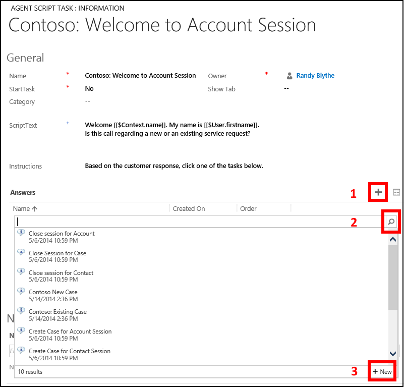  

3. On the **New Agent Script Answer** page, specify the following values:  

   |Field|Value|  
   |-----------|-----------|  
   |Name|Contoso: New case|  
   |Answer Text|Create a case|  
   |Linked Task|Contoso: Welcome to Account Session|  
   |Order|1|  

   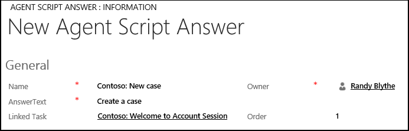  

4. Click **Save**.  

5. Next, add an action call to this answer to display a new case form for the account when the agent clicks this answer. On the nav bar, click the down arrow next to **Contoso: New case**, and select **Actions**.  

   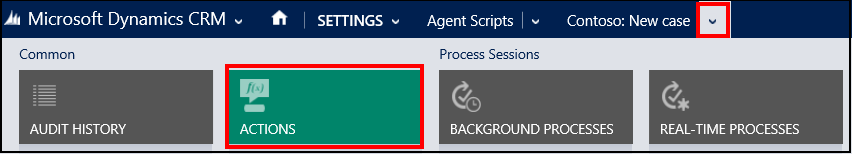  

6. On the next page, click **Add Existing Action Call**.  

7. In the search box, press ENTER or click the search icon, and then click **New** to create an action call.  

8. On the **New Action Call** page, specify the following values:  

   |Field|Value|  
   |-----------|-----------|  
   |Name|Contoso Action Call: Create Case|  
   |Order|1|  
   |Hosted Control|Contoso new case form|  
   |Action|New_CRM_Page|  
   |Data|LogicalName=incident  customerid=EntityReference([[$Context.InitialEntity]],[[$Context.Id]])    customeridname=[[$Context.name]]   primarycontactid=[[$Context.primarycontactid.id]+]    primarycontactidname=[[$Context.primarycontactid.name]+] **Note:**  The new case form will be populated with the current account record data to help the agent quickly create a case for the customer.|  

     

9. Click **Save**.  

10. Next, create a window navigation rule to display the new case form. [!INCLUDE[proc_settings_usd](../includes/proc-settings-usd.md)]  

11. Click **Window Navigation Rules**.  

12. Click **New**.  

13. On the **New Window Navigation Rule** page, specify the following values.  

    |Field|Value|  
    |-----------|-----------|  
    |Name|Contoso New Case for Account Session Rule|  
    |Order|20|  
    |From|Contoso new case form|  
    |Entity|incident|  
    |Route Type|Popup|  
    |Destination|Tab|  
    |Action|Route Window|  
    |Target Tab|Contoso new case form|  
    |Show Tab|Contoso new case form|  
    |Hide Command Bar|No|  
    |Hide Navigation Bar|Yes|  

    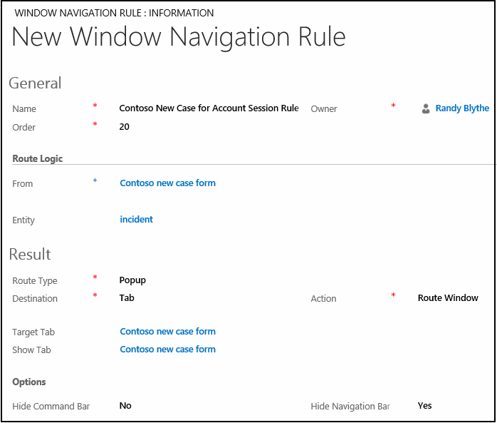  

14. Click **Save**.  

   
## Step 5: Add the answer and action calls for displaying existing cases  
 In this step, add answer and action calls for displaying existing cases for the current account.  

1. In the **Answers** area of the **Contoso: Welcome to Account Session** agent script, click **+** to create an answer.  

2. In the search box, press ENTER or click the search icon, and then click **New** in the search results box.  

3. On the **New Agent Script Answer** page, specify the following values.  

   |    Field    |                Value                |
   |-------------|-------------------------------------|
   |    Name     |       Contoso: Existing cases       |
   | Answer Text |       Display existing cases        |
   | Linked Task | Contoso: Welcome to Account Session |
   |    Order    |                  2                  |

4. Click **Save**.  

5. Next, add an action call to this answer to display the existing cases for the current account. On the nav bar, click the down arrow next to **Contoso: Existing Cases**, and select **Actions**.  

6. On the next page, click **Add Existing Action Call**.  

7. In the search box, press ENTER or click the search icon, and then click **New** to create an action call.  

8. On the **New Action Call** page, specify the following values:  

   |Field|Value|  
   |-----------|-----------|  
   |Name|Contoso Action Call: Display Existing Cases|  
   |Order|1|  
   |Hosted Control|Contoso existing cases for an account|  
   |Action|AssociatedView|  
   |Data|navItemName=Cases Id=[[$Context.Id]]  type=[[$Context.etc]]  tabset=areaService|  

   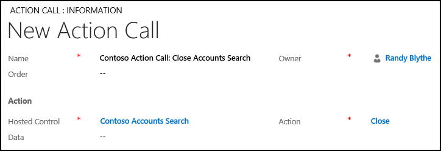  

9. Click **Save**.  

10. Add another action call to set the focus on the new case form. On the **New Action Call** page, specify the following values:  

    |Field|Value|  
    |-----------|-----------|  
    |Name|Contoso Action Call: Set Focus on Existing Cases|  
    |Order|2|  
    |Hosted Control|Contoso Global Manager|  
    |Action|ShowTab|  
    |Data|Contoso existing cases for an account|  

    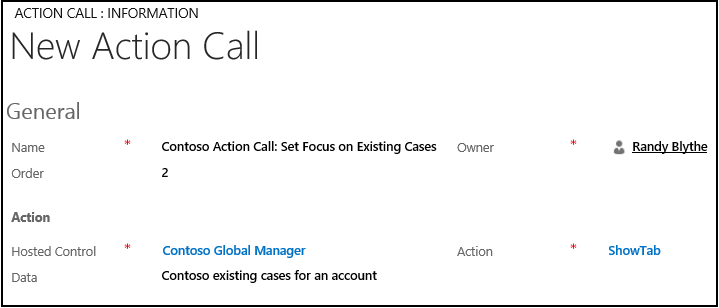  

11. Click **Save**.  

   
## Step 6: Add the answer and action calls for closing the session  
 In this step, add answer and action calls for closing the current session.  

1. In the **Answers** area of the **Contoso: Welcome to Account Session** agent script, click **+** to create an answer.  

2. In the search box, press ENTER or click the search icon, and then click **New** in the search results box.  

3. On the **New Agent Script Answer** page, specify the following values:  

   |    Field    |                Value                |
   |-------------|-------------------------------------|
   |    Name     |       Contoso: Close session        |
   | Answer Text |            Close session            |
   | Linked Task | Contoso: Welcome to Account Session |
   |    Order    |                  3                  |

4. Click **Save**.  

5. Next, add an action call to this answer to close the session. On the nav bar, click the down arrow next to **Contoso: Close session**, and select Actions.  

6. On the next page, click **Add Existing Action Call**.  

7. In the search box, press ENTER or click the search icon, and then click **New** to create an action call.  

8. On the **New Action Call** page, specify the following values.  

   |Field|Value|  
   |-----------|-----------|  
   |Name|Contoso Action Call: Close Session|  
   |Hosted Control|Contoso Session Tab **Note:**  The Contoso Session Tab hosted control was created in [Walkthrough 4: Display a record in a session in your agent application](../unified-service-desk/walkthrough-display-dynamics-365-record-session-agent-application.md).|  
   |Action|CloseSession|  
   |Data|sessionid=[[$Context.SessionId]]|  

     

9. Click **Save**.  

   
## Step 7: Create an action call to display the agent script  
 In this step, create an action call to display the agent script.  

1. Sign in to the Dynamics 365 instance.  

2. [!INCLUDE[proc_settings_usd](../includes/proc-settings-usd.md)]  

3. Click **Action Calls**.  

4. Click **New**.  

5. On the **New Action Call** page, specify the following values.  

   |Field|Value|  
   |-----------|-----------|  
   |Name|Contoso Action Call: Load Agent Script|  
   |Hosted Control|Contoso Agent Scripting|  
   |Action|GoToTask|  
   |Data|Contoso: Welcome to Account Session|  

   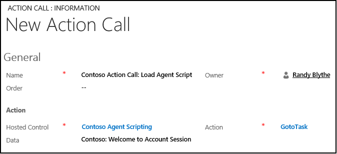  

6. Click **Save**.  

   
## Step 8: Display the agent script when the account record is displayed in a session  
 In this step, add the action call created in the previous step to the **BrowserDocumentComplete** event on the **Contoso Account Session** hosted control so that after it’s loaded, the action call is executed to load the agent script. The **Contoso Account Session** hosted control was created in [Walkthrough 4: Display a record in a session in your agent application](../unified-service-desk/walkthrough-display-dynamics-365-record-session-agent-application.md).  

1. Sign in to the Dynamics 365 instance.  

2. [!INCLUDE[proc_settings_usd](../includes/proc-settings-usd.md)]  

3. Click **Hosted Controls**.  

4. Search for the **Contoso Account Session** hosted control, and click it to open the hosted control definition.  

5. On the nav bar, click the down arrow next to **Contoso Account Session**, and then click **Events**.  

   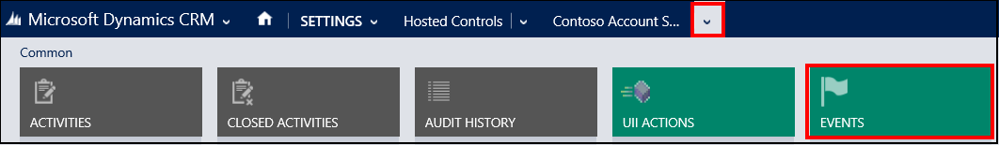  

6. On the events page, click **BrowserDocumentComplete**.  

7. On the **BrowserDocumentComplete** page, click **+** in the **Active Actions** area to add an action call to the event.  

8. In the search box, type “`Contoso Action Call: Load Agent Script`”, and press ENTER or click the search icon.  

9. In the search results, click **Contoso Action Call: Load Agent Script** to add it.  

10. Click **Save**.  

   
## Step 9: Add the controls to the configuration  
 In this step, add the action calls, agent script, hosted controls, and window navigation rule that you configured in this walkthrough to **Contoso Configuration** to display these controls to the user who is assigned to the configuration. **Contoso Configuration** was created in [Walkthrough 1: Build a simple agent application](../unified-service-desk/walkthrough-1-build-a-simple-agent-application.md).  

 Add the following to **Contoso Configuration**.  

|Control name|Control type|  
|------------------|------------------|  
|Contoso Action Call: Create Case|Action call|  
|Contoso Action Call: Display Existing Cases|Action Call|  
|Contoso Action Call: Set Focus on Existing Cases|Action Call|  
|Contoso Action Call: Close Session|Action Call|  
|Contoso Action Call: Load Agent Script|Action Call|  
|Contoso: Welcome to Account Session|Agent Script|  
|Contoso Agent Scripting|Hosted Control|  
|Contoso new case form|Hosted Control|  
|Contoso existing cases for an account|Hosted Control|  
|Contoso New Case for Account Session Rule|Window navigation rule|  

 To add a control to the configuration:  

1. Sign in to the Dynamics 365 instance.  

2. [!INCLUDE[proc_settings_usd](../includes/proc-settings-usd.md)]  

3. Click **Configuration**.  

4. Click **Contoso Configuration** to open the definition.  

5. On the nav bar, click the down arrow next to **Contoso Configuration**, and select **Action Calls**.  

6. On the next page, click **Add Existing Action Call**, type “Contoso Action Call” in the search bar, and then press ENTER or click the search icon.  

7. Select the five action calls from the search results box to add them to **Contoso Configuration**.  

8. Similarly, add the agent script, hosted controls, and window navigation rule by clicking the down arrow next to **Contoso Configuration**, and clicking **Agent Scripts** **Hosted Controls** and **Window navigation Rules** respectively.  

9. Click **Save**.  

   
## Step 10: Test the application  

1. Start the [!INCLUDE[pn_unified_service_desk](../includes/pn-unified-service-desk.md)] client application, and sign in to the Dynamics 365 instance where you configured [!INCLUDE[pn_unified_service_desk](../includes/pn-unified-service-desk.md)] by using the same user credentials that is assigned to Contoso Configuration in [Walkthrough 1: Build a simple agent application](../unified-service-desk/walkthrough-1-build-a-simple-agent-application.md). For information about connecting to Dataverse instance using the [!INCLUDE[pn_unified_service_desk](../includes/pn-unified-service-desk.md)] client application, see [Connect to CRM instance using the Unified Service Desk client](../unified-service-desk/admin/connect-dynamics-365-instance-using-unified-service-desk-client.md)  

2. Click the down arrow next to the **SEARCH** button in the toolbar, and then click **Account** to display the account records from your Dataverse instance.  

3. Click the expander to display the left pane.  

   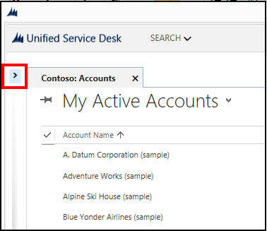  

4. Click on any of the account records to display the respective account information in a session. In the left pane, the **Contoso: Welcome to Account Session** agent script appears.  

     

5. In the agent script:  

   1.  Click **New case** to open a new case form with pre-populated values (in the red box) from the current account record.  

   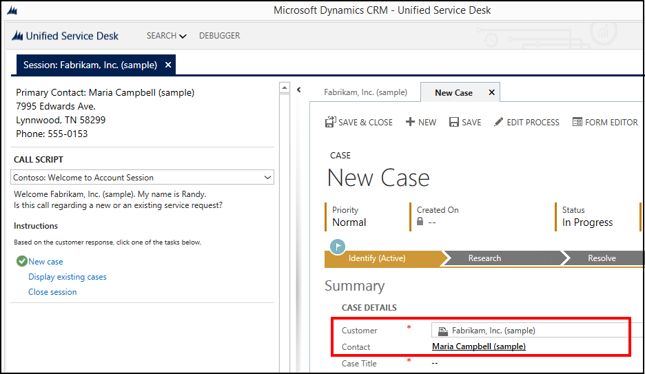  

   2.  Click **Display existing cases** to display the associated cases for the current account record.  

   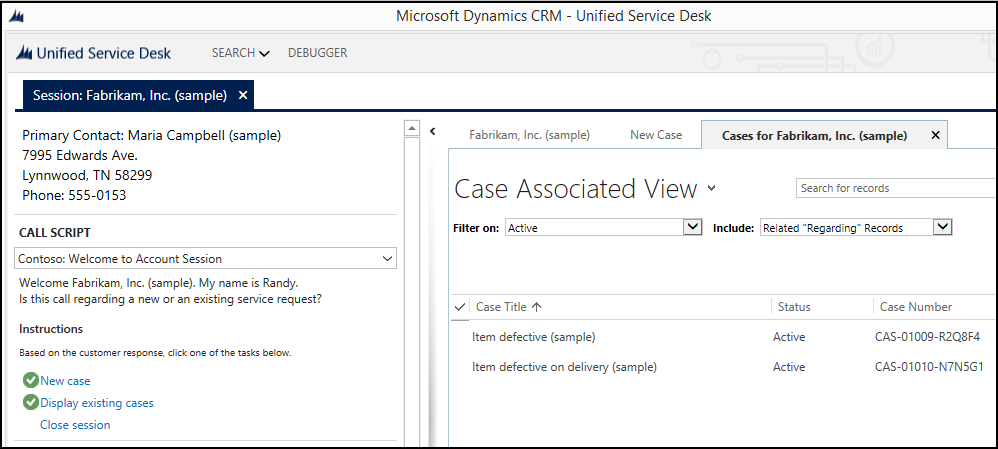  

   3.  Click **Close session** to close the current session.  

   
## Conclusion  
 In this walkthrough, you learned how to configure a simple agent script to guide your call center agents. [!INCLUDE[pn_unified_service_desk](../includes/pn-unified-service-desk.md)] allows you to create more complex scripts with branching logic that contain child answers and actions. You also learned how to filter access to [!INCLUDE[pn_unified_service_desk](../includes/pn-unified-service-desk.md)] controls using configuration.  

### See also  
 [Walkthrough 1: Build a simple agent application](../unified-service-desk/walkthrough-1-build-a-simple-agent-application.md)   

 [Walkthrough 2: Display an external webpage in your agent application](../unified-service-desk/walkthrough-2-display-an-external-webpage-in-your-agent-application.md)   

 [Walkthrough 3: Display records in your agent application](../unified-service-desk/walkthrough-3-display-microsoft-dynamics-365-records-in-your-agent-application.md)   

 [Walkthrough 4: Display a record in a session in your agent application](../unified-service-desk/walkthrough-display-dynamics-365-record-session-agent-application.md)   

 [Walkthrough 5: Display enhanced session information by displaying session name and overview data](../unified-service-desk/walkthrough-5-display-enhanced-session-information-displaying-session-name-overview-data.md)   

 [Walkthrough 6: Configure the Debugger hosted control in your agent application](../unified-service-desk/walkthrough-configure-debugger-hosted-control-agent-application.md)   

 [Unified Service Desk Configuration Walkthroughs](../unified-service-desk/unified-service-desk-configuration-walkthroughs.md)

[!INCLUDE[footer-include](../includes/footer-banner.md)]