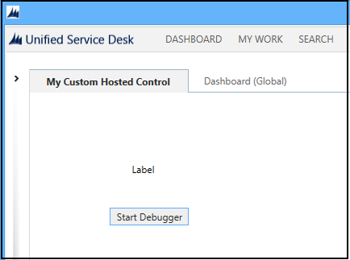
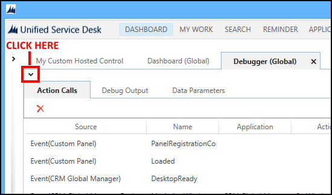
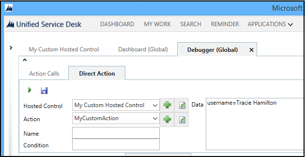
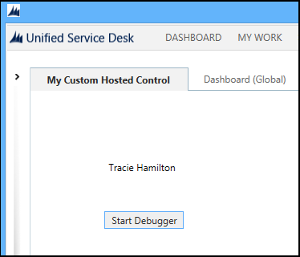

# Walkthrough: Create custom hosted control for Unified Service Desk

[!INCLUDE[cc-data-platform-banner](../includes/cc-data-platform-banner.md)]

In this topic, you’ll learn how to create a custom hosted control called `My Custom Control` with a custom action. The custom hosted control has two [!INCLUDE[pn_ms_Windows_Presentation_Foundation](../includes/pn-ms-windows-presentation-foundation.md)] controls: a button that calls the Debugger hosted control and a text label that displays the user name when a custom action, `MyCustomAction`, is called.

## In This Section
 [Prerequisites](../unified-service-desk/walkthrough-create-custom-hosted-control-for-unified-service-desk.md#Prereq)

 [Create a custom hosted control](../unified-service-desk/walkthrough-create-custom-hosted-control-for-unified-service-desk.md#HowTo)

 [Test your custom hosted control](../unified-service-desk/walkthrough-create-custom-hosted-control-for-unified-service-desk.md#Test)

<a name="Prereq"></a>
## Prerequisites

- [!INCLUDE[pn_Microsoft_.Net_Framework](../includes/pn-microsoft-net-framework.md)] 4.6.2

- [!INCLUDE[pn_unified_service_desk](../includes/pn-unified-service-desk.md)] client application; the client application is required for testing the hosted control

- [!INCLUDE[pn_microsoft_visual_studio_2012](../includes/pn-microsoft-visual-studio-2012.md)], [!INCLUDE[pn_visual_studio_2013](../includes/pn-visual-studio-2013.md)], or [!INCLUDE[pn_visual_studio_2015](../includes/pn-visual-studio-2015.md)]

- [!INCLUDE[tn_nuget](../includes/tn-nuget.md)] Package Manager for [Visual Studio 2012](https://visualstudiogallery.msdn.microsoft.com/27077b70-9dad-4c64-adcf-c7cf6bc9970c), [Visual Studio 2013](https://visualstudiogallery.msdn.microsoft.com/4ec1526c-4a8c-4a84-b702-b21a8f5293ca), or [Visual Studio 2015](https://visualstudiogallery.msdn.microsoft.com/5d345edc-2e2d-4a9c-b73b-d53956dc458d)

- **CRM SDK Templates** for [!INCLUDE[pn_Visual_Studio_short](../includes/pn-visual-studio-short.md)] that contains the custom hosted control project template. [Download](https://go.microsoft.com/fwlink/p/?LinkId=400925) the **CRM SDK Templates** from the Visual Studio gallery, and double-click the CRMSDKTemplates.vsix file to install the template in [!INCLUDE[pn_Visual_Studio_short](../includes/pn-visual-studio-short.md)].

<a name="HowTo"></a>
## Create a custom hosted control

<a name="Step1"></a>
1. Start [!INCLUDE[pn_Visual_Studio_short](../includes/pn-visual-studio-short.md)], and create a new project.

2. In the **New Project** dialog box:

   1. From the list of installed templates, expand **Visual C#**, and select **CRM SDK Templates** > **Unified Service Desk** > **USD Custom Hosted Control**.

   2. Ensure that **[!INCLUDE[pn_NET_Framework](../includes/pn-net-framework.md)] 4.6.2** is selected.

   3. Specify the name and location of the project, and click **OK** to create a new project.

   

3. In **Solution Explorer**, double-click the USDControl.xaml file to bring up the XAML designer.

4. In the designer, add the following controls from the **Toolbox**:

   - **Label**: In the **Properties** pane, set the name of the control to “myLabel.”

   - **Button**: In the **Properties** pane, set the name of the control to “myButton,” and the content to “**Start Debugger**.”

     This is how the controls look in the XAML designer.

   

5. Double-click the button to add code behind the XAML. This will take you to the click event definition of myButton in the USDControl.xaml.cs file. Add the following command.

   ```csharp
   private void myButton_Click(object sender, RoutedEventArgs e)
   {
       if (!this.desktopAccess.AppExistsInUI("Debugger"))
       {
           this.desktopAccess.CreateDynamicApplication("Debugger");
       }
       this.FireRequestAction(new Microsoft.Uii.Csr.RequestActionEventArgs("Debugger", "default", null));
   }
   ```

6. Define a custom action for the hosted control. In the USDControl.xaml.cs file, browse to the override definition of `DoAction`.

   ```csharp
   protected override void DoAction(Microsoft.Uii.Csr.RequestActionEventArgs args)
   ```

7. Add the following code within the override definition of `DoAction` to define a custom action called `MyCustomAction`, which accepts a parameter called `username`.

   ```csharp
   if (args.Action.Equals("MyCustomAction", StringComparison.OrdinalIgnoreCase))
   {
       List<KeyValuePair<string, string>> actionDataList = Utility.SplitLines(args.Data, CurrentContext, localSession);
       string valueIwant = Utility.GetAndRemoveParameter(actionDataList, "username"); // assume there is a myKey=<value> in the data.

       if (!string.IsNullOrEmpty(valueIwant))
       {
           this.Dispatcher.Invoke(() => { this.myLabel.Content = valueIwant; });
       }
   }
   ```

   > [!TIP]
   >  The template provides most of the code as comment within the override definition of `DoAction` to help you quickly get started with the development. You need to uncomment the required line of code, and replace the placeholder values with your values.  
  
8. Save your project, and build it (**Build** > **Build Solution**) to verify that it builds successfully.  
  
<a name="Test"></a>   
## Test your custom hosted control  
 After your project builds successfully, test the custom hosted control. Testing consists of two parts: defining the custom hosted control on the server and then connecting to [!INCLUDE[pn_unified_service_desk](../includes/pn-unified-service-desk.md)] on the server using your client application.  
  
### Define the custom hosted control and action  
  
1. Sign in to Unified Service Desk Administrator.  
  
2. Select **Hosted Controls** under **Basic Settings**.
  
3. Select **+ New**.  
  
4. On the hosted control page, specify the following.

  | Field | Value |
  |-------------------------|-------------------------------|
  | Name | My custom hosted control |
  | Display Name | My Custom Hosted Control| 
  | Unified Service Desk Component Type | USD Hosted Control |
  | Application is Global | Checked |
  | Display Group | MainPanel |

5. Select the **Hosting** tab, and specify the following:

  | Field | Value |
  |-------------------------|-------------------------------|
  | Assembly Uri | MyCustomControl|
  | Assembly Type | MyCustomControl.USDControl|

   > [!NOTE]
   > **Assembly URI** is the name of your assembly and the **Assembly Type** is the name of your assembly (dll) followed by a dot (.) and then the class name in your [!INCLUDE[pn_Visual_Studio_short](../includes/pn-visual-studio-short.md)] project. In this example, the name of the assembly is **MyCustomControl** and name of the class is **USDControl**, which is the default class name when you create a custom hosted control.  
  
6. Select **Save** to create the hosted control.  
  
7. Create the action for the hosted control that you defined in Visual Studio. Select the **Related** tab, and the select **UII Actions**.  
  
8. Select **+ New UII Action**.  
  
9. Type **MyCustomAction** in the **Name** field, and choose **Save**.  
  
   You have now configured your custom hosted control and custom action on your Microsoft Dataverse server.  
  
<a name="Run"></a>   
### Run the Unified Service Desk client to work with custom hosted control  
  
1. Copy the assembly that contains your custom hosted control definition from your [!INCLUDE[pn_Visual_Studio_short](../includes/pn-visual-studio-short.md)] project output folder (\<*ProjectFolder*>\bin\debug) to the [!INCLUDE[pn_unified_service_desk](../includes/pn-unified-service-desk.md)] application directory. In this case, you’ll copy the MyCustomControl.dll file to the c:\Program Files\Microsoft Dynamics CRM USD\USD directory.  
  
2. Run [!INCLUDE[pn_unified_service_desk](../includes/pn-unified-service-desk.md)] client to connect to your Dataverse server.  
  
3. On successful sign in, you’ll see the custom hosted control, **My Custom Hosted Control**, on your desktop.  
  
     
  
4. Select **Start Debugger** to launch the Debugger hosted control.  
  
5. To test the custom action, choose the **Debugger** tab, and then Select the down arrow above the **Action Calls** tab to display the area where you can test action calls and [!INCLUDE[pn_uii_acronym](../includes/pn-uii-acronym.md)] actions.  
  
     
  
6. Choose the **Direct Action** tab.  
  
7. From the **Hosted Control** list, select **My Custom Hosted Control**, and from the **Action** list, select **MyCustomAction**.  
  
8. As per the custom action definition, this action call expects a parameter called `username`, so add the following value in the **Data** field: **username=Tracie Hamilton**.  
  
     
  
9. Select the **Run Direct Action** icon (), and then select the **My Custom Hosted Control** tab. The specified user name is displayed in the label field.  
  
   

### See also
 [USD Hosted Control (Hosted Control)](../unified-service-desk/usd-hosted-control-hosted-control.md)
 [Hosted control types and action/event reference](../unified-service-desk/hosted-control-types-action-event-reference.md)
 [Unified Service Desk Configuration Walkthroughs](../unified-service-desk/unified-service-desk-configuration-walkthroughs.md)
 [Use custom hosted control in Unified Service Desk](../unified-service-desk/use-custom-hosted-control-unified-service-desk.md)


[!INCLUDE[footer-include](../includes/footer-banner.md)]