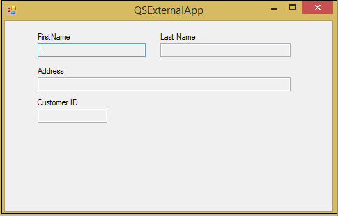
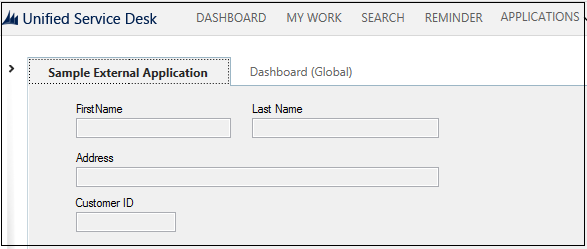
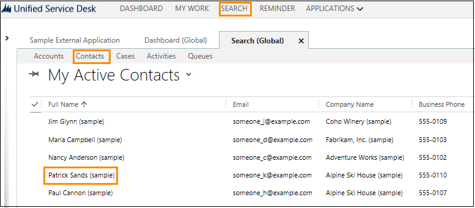
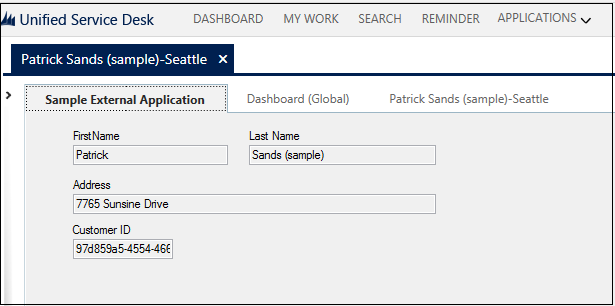

# Walkthrough: Create a UII Application Adapter

[!INCLUDE[cc-data-platform-banner](../includes/cc-data-platform-banner.md)]

You can create an application adapter if you want to integrate an external application with [!INCLUDE[pn_unified_service_desk](../includes/pn-unified-service-desk.md)]. Microsoft Dataverse provides a [!INCLUDE[pn_Visual_Studio](../includes/pn-visual-studio.md)] template for creating an application adapter. The template provides basic code as comments to help you get started with creating the application adapter.  
  
 In this walkthrough, you’ll build an external application `QsExternalApp` and host it in [!INCLUDE[pn_unified_service_desk](../includes/pn-unified-service-desk.md)]. You’ll then create and configure an application adapter `ExternalApplicationAdapter` for the external application to interact with [!INCLUDE[pn_unified_service_desk](../includes/pn-unified-service-desk.md)]. The external application has four labels: one each for the customer’s first name, last name, address and ID and four corresponding text boxes to display the values from [!INCLUDE[pn_unified_service_desk](../includes/pn-unified-service-desk.md)].  
  
## In This Section  
 [Prerequisites](../unified-service-desk/walkthrough-create-uii-application-adapter.md#Prereq)  
  
 [Step 1: Build a sample external application](../unified-service-desk/walkthrough-create-uii-application-adapter.md#CreateExternalApp)  
  
 [Step 2: Configure a external application](../unified-service-desk/walkthrough-create-uii-application-adapter.md#ConfigureExApp)  
  
 [Step 3: Test the external application](../unified-service-desk/walkthrough-create-uii-application-adapter.md#TestExApp)  
  
 [Step 4: Create the application adapter](../unified-service-desk/walkthrough-create-uii-application-adapter.md#CreateAppAdapter)  
  
 [Step 5: Configure the application adapter](../unified-service-desk/walkthrough-create-uii-application-adapter.md#ConfigureAppAdapter)  
  
 [Step 6: Test the application adapter](../unified-service-desk/walkthrough-create-uii-application-adapter.md#TestAppAdapter)  
  
<a name="Prereq"></a>   
## Prerequisites  
  
- [!INCLUDE[pn_Microsoft_.Net_Framework](../includes/pn-microsoft-net-framework.md)] 4.6.2  
  
- [!INCLUDE[pn_unified_service_desk](../includes/pn-unified-service-desk.md)] client application; required for testing the hosted control.  
  
- [!INCLUDE[pn_microsoft_visual_studio_2012](../includes/pn-microsoft-visual-studio-2012.md)], [!INCLUDE[pn_visual_studio_2013](../includes/pn-visual-studio-2013.md)], or [!INCLUDE[pn_visual_studio_2015](../includes/pn-visual-studio-2015.md)]  
  
- [!INCLUDE[tn_nuget_package_manager](../includes/tn-nuget-package-manager.md)] for [Visual Studio 2012](https://visualstudiogallery.msdn.microsoft.com/27077b70-9dad-4c64-adcf-c7cf6bc9970c), [Visual Studio 2013](https://visualstudiogallery.msdn.microsoft.com/4ec1526c-4a8c-4a84-b702-b21a8f5293ca), or [Visual Studio 2015](https://visualstudiogallery.msdn.microsoft.com/5d345edc-2e2d-4a9c-b73b-d53956dc458d)  
  
- **CRM SDK Templates** for [!INCLUDE[pn_Visual_Studio_short](../includes/pn-visual-studio-short.md)] that contains the UII hosted control project template. [Download](https://go.microsoft.com/fwlink/p/?LinkId=400925) the **CRM SDK Templates** from the Visual Studio gallery, and double-click the CRMSDKTemplates.vsix file to install the template in [!INCLUDE[pn_Visual_Studio_short](../includes/pn-visual-studio-short.md)].  
  
<a name="CreateExternalApp"></a>   
## Step 1: Build a sample external application  
  
1. [Download the UII SDK package](https://go.microsoft.com/fwlink/p/?LinkId=519179).  
  
2. Double-click the package file to extract the contents.  
  
3. Navigate to the \<ExtractedFolder>\UII\SampleCode\UII\AIF\QsExternalApp folder, and open the Microsoft.Uii.QuickStarts.QsExternalApp.csproj file in [!INCLUDE[pn_Visual_Studio_short](../includes/pn-visual-studio-short.md)].  
  
4. Press F5 or choose **Debug** > **Start Debugging** to create a sample external application. The application (Microsoft.Uii.QuickStarts.QsExternalApp.exe) is created in the /bin/debug folder of the project.  
  
     
  
<a name="ConfigureExApp"></a>   
## Step 2: Configure the external application 
 
 In this step, you will create a hosted control of **External Hosted Application** type to display the [!INCLUDE[pn_ms_Windows_short](../includes/pn-ms-windows-short.md)] forms application.  
  
1. Sign in to Unified Service Desk Administrator.  
  
2. Select **Hosted Controls** under **Basic Settings**.  
  
3. Select **+ New**.  
  
4. On the **New Hosted Control** page, specify the following values:  
  
   |Field|Value|  
   |-----------|-----------|  
   |Name|QsExternalApp|  
   |USD Component|CCA Hosted Application|  
   |Hosted Application Type|External Hosted Application|  
   |Application is Global|Checked|  
   |Display Group|MainPanel|  
   |Adapter|Use No Adapter|  
   |Application is Dynamic|No| 

5. Select the **Hosting** tab and enter the **External App URI** value as **Microsoft.Uii.QuickStarts.QsExternalApp.exe**.
  
6. Select **Save**.  
  
<a name="TestExApp"></a>   
## Step 3: Test the external application  
  
1. Copy the application from your [!INCLUDE[pn_Visual_Studio_short](../includes/pn-visual-studio-short.md)] project output folder (\<ProjectFolder>\bin\debug) to the [!INCLUDE[pn_unified_service_desk](../includes/pn-unified-service-desk.md)] application directory. In this case, we will copy the Microsoft.Uii.QuickStarts.QsExternalApp.exe file to the C:\Program Files\Microsoft Dynamics CRM USD\USD directory.  
  
2. Run the [!INCLUDE[pn_unified_service_desk](../includes/pn-unified-service-desk.md)] client to connect to your Dataverse server.  
  
3. On successful sign in, you’ll see the **Sample External Application** button on your desktop.  
  
4. Choose **Sample External Application** to see your external application hosted within [!INCLUDE[pn_unified_service_desk](../includes/pn-unified-service-desk.md)].  
  
     
  
> [!NOTE]
>  At this point the fields are empty as you’re only hosting the application in [!INCLUDE[pn_unified_service_desk](../includes/pn-unified-service-desk.md)]. To populate them with values from [!INCLUDE[pn_unified_service_desk](../includes/pn-unified-service-desk.md)], you’ll have to create an application adapter as described in the next step.  
  
<a name="CreateAppAdapter"></a>   
## Step 4: Create the application adapter  
  
1. Start [!INCLUDE[pn_Visual_Studio](../includes/pn-visual-studio.md)], and create a new project.  
  
2. In the **New Project** dialog box:  
  
   1. From the list of installed templates, expand [!INCLUDE[pn_Visual_C#](../includes/pn-visual-csharp.md)], and select CRM SDK Templates > **Unified Service Desk** > [!INCLUDE[pn_uii_acronym](../includes/pn-uii-acronym.md)] Application Adapter  
  
   2. Specify the name and location of the project, and select **OK** to create a new project.  
  
     
  
3. In Solution Explorer, expand the References section to ensure all the assembly references resolve correctly.  
  
4. Open the AppAdapter.cs file and add the following lines of code to set the locations for each component on the page in the class definition.  
  
   ```csharp  
   // Set up your locations for each component on the page.  
           // If you wish, you could use Spy++ to get the actual names as well.  
           // First Name text box  
           int intFirstNameCoordX = 47;  
           int intFirstNameCoordY = 32;  
           // Last Name text box  
           int intLastNameCoordX = 223;  
           int intLastNameCoordY = 32;  
           // Address Text box  
           int intAddressCoordX = 47;  
           int intAddressCoordY = 81;  
           // Customer ID text box  
           int intIDCoordX = 47;  
           int intIDCoordY = 126;  
   ```  
  
5. Add the following code to the definition of `NotifyContextChange` to notify the application that the context has changed. For more information, see [Context)](/dotnet/api/microsoft.uii.csr.hostedapplicationadapter.notifycontextchange(microsoft.uii.csr.context))  
  
   ```csharp  
   public override bool NotifyContextChange(Context context)  
           {  
               IntPtr ptr = MainWindowHandle;  
               // Find the control (first name) by position  
               IntPtr childHwnd = Win32API.FindWindowByPosition(ptr, new Point(intFirstNameCoordX, intFirstNameCoordY));  
               // Fill data out  
               Win32API.SetWindowTextAny(childHwnd, context["firstname"]);  
               // Find the control (last name) by position  
               childHwnd = Win32API.FindWindowByPosition(ptr, new Point(intLastNameCoordX, intLastNameCoordY));  
               // Fill out the data  
               Win32API.SetWindowTextAny(childHwnd, context["lastname"]);  
               childHwnd = Win32API.FindWindowByPosition(ptr, new Point(intAddressCoordX, intAddressCoordY));  
               Win32API.SetWindowTextAny(childHwnd, context["address1_line1"]);  
               childHwnd = Win32API.FindWindowByPosition(ptr, new Point(intIDCoordX, intIDCoordY));  
               Win32API.SetWindowTextAny(childHwnd, context["CustomerID"]);  
               // Hands control back over to the base class to notify next app of context change.  
               return base.NotifyContextChange(context);  
  
           }  
   ```  
  
6. Add the following code to the override definition of `DoAction` to update the form fields with values from [!INCLUDE[pn_unified_service_desk](../includes/pn-unified-service-desk.md)].  
  
   ```csharp  
   public override bool DoAction(Microsoft.Uii.Csr.Action action, RequestActionEventArgs args)  
           {  
               IntPtr ptr;  
               IntPtr childHwnd;  
               switch (args.Action)  
               {  
                   case "UpdateFirstName":  
                       // Get locations of what you want to update and handles  
                       ptr = MainWindowHandle;  
                       childHwnd = Win32API.FindWindowByPosition(ptr, new Point(intFirstNameCoordX, intFirstNameCoordY));  
                       // Populate data into fields  
                       Win32API.SetWindowTextAny(childHwnd, args.Data);  
                       break;  
                   case "UpdateLastName":  
                       // Get locations of what you want to update and handles  
                       ptr = MainWindowHandle;  
                       childHwnd = Win32API.FindWindowByPosition(ptr, new Point(intLastNameCoordX, intLastNameCoordY));  
                       // Populate data into fields  
                       Win32API.SetWindowTextAny(childHwnd, args.Data);  
                       break;  
               }  
               return base.DoAction(action, args);  
           }  
   ```  
  
7. Save your project, and build it (**Build** > **Build Solution**). After the project builds successfully, an assembly (ExternalApplicationAdapter.dll) is generated in the \bin\debug folder of your project folder. You’ll need this assembly later for testing and using your application adapter.  
  
<a name="ConfigureAppAdapter"></a>   
## Step 4: Configure the application adapter  
  
1. Sign in to Unified Service Desk Administrator.  
  
2. Select **Hosted Controls** under **Basic Settings**.
  
3. From the list of hosted controls, select the `QsExternalApp` hosted control. 
  
4. In the Adapter Configuration section, specify the following values:  
  
   |||  
   |-|-|  
   |Field|Value|  
   |Adapter|Use Adapter|  
   |URI|`ExternalApplicationAdapter`|  
   |Type|`ExternalApplicationAdapter.AppAdapter`|  
  
     
  
   > [!NOTE]
   >  URI is the name of your assembly and the Type is the name of your assembly (dll) followed by a dot (.) and then the class name in your [!INCLUDE[pn_Visual_Studio_short](../includes/pn-visual-studio-short.md)] project. In this example, the name of the assembly is `ExternalApplicationAdapter` and name of the class is `AppAdapter`, which is the default class name when you create an application adapter.  
  
5. Select **Save** to save the changes.  
  
<a name="TestAppAdapter"></a>   
## Step 5: Test the application adapter  
  
1. Copy the assembly that contains your application adapter definition from your [!INCLUDE[pn_Visual_Studio_short](../includes/pn-visual-studio-short.md)] project output folder (\<ProjectFolder>\bin\debug) to the [!INCLUDE[pn_unified_service_desk](../includes/pn-unified-service-desk.md)] application directory. In this case, we will copy the ExternalApplicationAdapter.dll file to the c:\Program Files\Microsoft Dynamics CRM USD\USD directory.  
  
2. Run [!INCLUDE[pn_unified_service_desk](../includes/pn-unified-service-desk.md)] client to connect to your Dataverse server.  
  
3. On successful sign in, you’ll see the sample external application on your desktop.  
  
4. Choose **Search** and then choose **Contacts** and select a contact. In this case, we’ll select `Patrick Sands`.  
  
     
  
5. Select **Sample External Application** and you’ll see the customer’s first name, last name, address, and ID populated.  
  
     
  
> [!NOTE]
>  This walkthrough demonstrates how to display or read data from [!INCLUDE[pn_unified_service_desk](../includes/pn-unified-service-desk.md)] in the external application. To understand how to update the data in [!INCLUDE[pn_unified_service_desk](../includes/pn-unified-service-desk.md)] from the external application, see [Walkthrough: Create a UII Windows Forms Hosted Control](../unified-service-desk/walkthrough-create-uii-windows-forms-hosted-control.md)

### See also
 [Use UII adapters to interact with external and web applications](../unified-service-desk/use-uii-adapters-interact-external-web-applications.md)


[!INCLUDE[footer-include](../includes/footer-banner.md)]