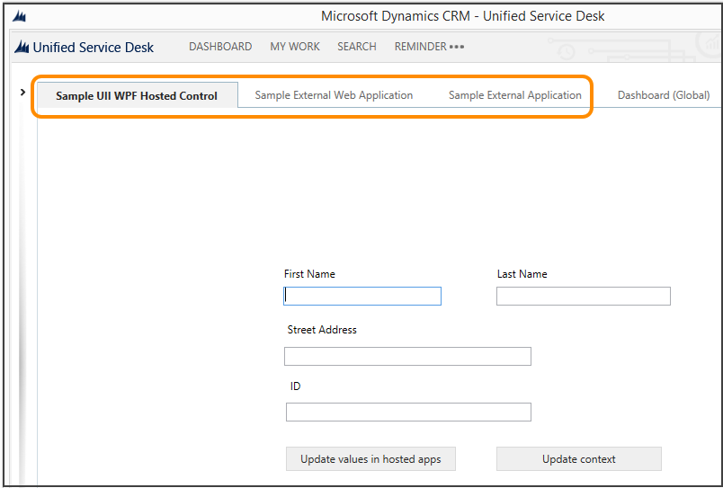
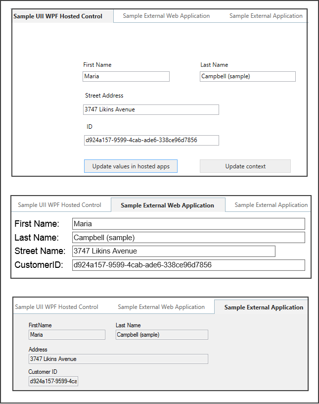
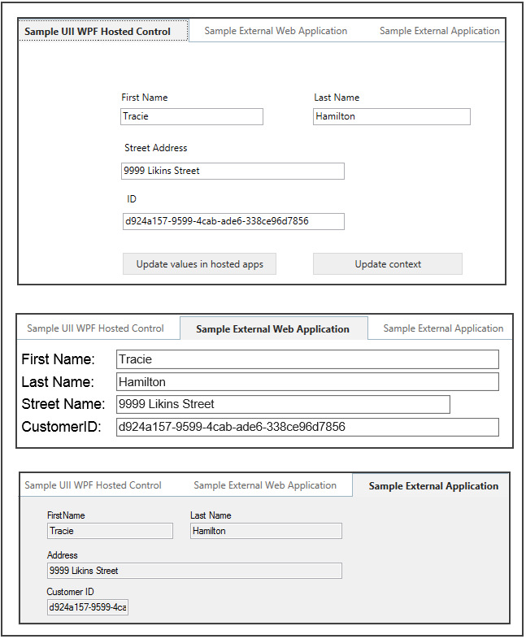
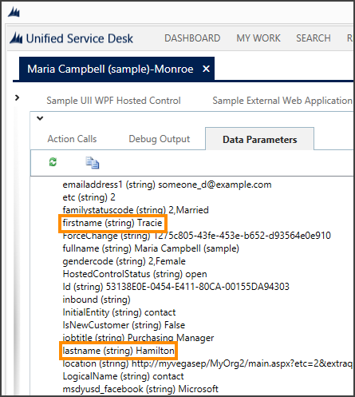

# Walkthrough: Create a UII WPF Hosted Control in Unified Service Desk

[!INCLUDE[cc-data-platform-banner](../includes/cc-data-platform-banner.md)]

This walkthrough demonstrates how you can build a [Windows Presentation Foundation (WPF)](https://msdn.microsoft.com/library/ms754130\(v=vs.110\).aspx)-based [!INCLUDE[pn_user_inteface_integration_uii](../includes/pn-user-interface-integration-uii.md)] hosted control that interacts with [!INCLUDE[pn_unified_service_desk](../includes/pn-unified-service-desk.md)] and external applications (standalone and web).  
  
 In this walkthrough, you’ll:  
  
- Create a [!INCLUDE[pn_uii_acronym](../includes/pn-uii-acronym.md)][!INCLUDE[pn_wpf_acronym](../includes/pn-wpf-acronym.md)] hosted control, **Sample UII WPF Hosted Control**, which will display first name, last name, street address and ID of a contact when you search for contacts, and click a contact name to open it in a session in [!INCLUDE[pn_unified_service_desk](../includes/pn-unified-service-desk.md)]. These values are displayed from the [!INCLUDE[pn_unified_service_desk](../includes/pn-unified-service-desk.md)] context.  
  
- Change first name, last name, or street address values in an external application and web application hosted in [!INCLUDE[pn_unified_service_desk](../includes/pn-unified-service-desk.md)] from the [!INCLUDE[pn_uii_acronym](../includes/pn-uii-acronym.md)][!INCLUDE[pn_wpf_acronym](../includes/pn-wpf-acronym.md)] hosted control that we create. The external and web applications were created in the following earlier walkthroughs: [Walkthrough: Create a UII Application Adapter](../unified-service-desk/walkthrough-create-uii-application-adapter.md) and [Walkthrough: Create a UII Web Application Adapter](../unified-service-desk/walkthrough-create-uii-web-application-adapter.md).  
  
- Notify changes to the [!INCLUDE[pn_unified_service_desk](../includes/pn-unified-service-desk.md)] context to update the values there.  
  
<a name="Prereq"></a>   
## Prerequisites  
  
- [!INCLUDE[pn_Microsoft_.Net_Framework](../includes/pn-microsoft-net-framework.md)] 4.6.2  
  
- [!INCLUDE[pn_unified_service_desk](../includes/pn-unified-service-desk.md)] client application. This is required for testing the hosted control.  
  
- [!INCLUDE[pn_microsoft_visual_studio_2012](../includes/pn-microsoft-visual-studio-2012.md)], [!INCLUDE[pn_visual_studio_2013](../includes/pn-visual-studio-2013.md)], or [!INCLUDE[pn_visual_studio_2015](../includes/pn-visual-studio-2015.md)]  
  
- [!INCLUDE[tn_nuget_package_manager](../includes/tn-nuget-package-manager.md)] for [Visual Studio 2012](https://visualstudiogallery.msdn.microsoft.com/27077b70-9dad-4c64-adcf-c7cf6bc9970c), [Visual Studio 2013](https://visualstudiogallery.msdn.microsoft.com/4ec1526c-4a8c-4a84-b702-b21a8f5293ca), or [Visual Studio 2015](https://visualstudiogallery.msdn.microsoft.com/5d345edc-2e2d-4a9c-b73b-d53956dc458d)  
  
- **CRM SDK Templates** for [!INCLUDE[pn_Visual_Studio_short](../includes/pn-visual-studio-short.md)] that contain the [!INCLUDE[pn_uii_acronym](../includes/pn-uii-acronym.md)][!INCLUDE[pn_wpf_acronym](../includes/pn-wpf-acronym.md)] hosted control project template. [Download](https://go.microsoft.com/fwlink/p/?LinkId=400925) the **CRM SDK Templates** from the Visual Studio gallery, and double-click the CRMSDKTemplates.vsix file to install the template in [!INCLUDE[pn_Visual_Studio_short](../includes/pn-visual-studio-short.md)].  
  
- You should have completed the [Walkthrough: Create a UII Application Adapter](../unified-service-desk/walkthrough-create-uii-application-adapter.md) and [Walkthrough: Create a UII Web Application Adapter](../unified-service-desk/walkthrough-create-uii-web-application-adapter.md) to ensure that you have the external and web applications set up with the adapters to facilitate interaction with those applications.  
  
<a name="step1"></a>   
## Step 1: Create a UII WPF hosted control using Visual Studio  
  
<a name="Step1"></a>   
1. Start [!INCLUDE[pn_Visual_Studio_short](../includes/pn-visual-studio-short.md)], and create a new project.  
  
2. In the **New Project** dialog box:  
  
   1.  From the list of installed templates, expand **Visual C#**, and select **CRM SDK Templates** > **Unified Service Desk** > **UII WPF Hosted Control**.  
  
   2.  Specify the name and location of the project, and choose **OK** to create a new project.  
  
     
  
3. In **Solution Explorer**, right-click the **UiiWpfControl.xaml** file, and select **Open** to display the XAML designer.  
  
4. In the designer, add the following controls from the **Toolbox**:  
  
   |Control type|Name|Text|  
   |------------------|----------|----------|  
   |Label|lblFirstName|First Name|  
   |Label|lblLastName|Last Name|  
   |Label|lblAddress|Street Address|  
   |Label|lblID|ID|  
   |TextBox|txtFirstName||  
   |TextBox|txtLastName||  
   |TextBox|txtAddress||  
   |TextBox|txtID||  
   |Button|btnUpdate|Update values in hosted apps|  
   |Button|btnUpdateContext|Update context|  
  
    This is how the controls should be laid out in the XAML designer.  
  
     
  
5. Double-click the **Update values in hosted apps** button (btnUpdate) to add the code for the `click` event for this button, and add the following code.  
  
   ```csharp  
   private void btnUpdate_Click(object sender, System.Windows.RoutedEventArgs e)  
   {  
      // This is how you fire an action to other hosted applications.   
      // The DoAction() code in the other application or application adapter   
      // will be called.  
      FireRequestAction(new RequestActionEventArgs("QsExternalApp", "UpdateFirstName", txtFirstName.Text)); // For the external application  
      FireRequestAction(new RequestActionEventArgs("QsExternalApp", "UpdateLastName", txtLastName.Text)); // For the external application  
      FireRequestAction(new RequestActionEventArgs("QsExternalApp", "UpdateAddress", txtAddress.Text)); // For the external application  
  
      FireRequestAction(new RequestActionEventArgs("QsWebApplication", "UpdateFirstName", txtFirstName.Text)); // For the external web application  
      FireRequestAction(new RequestActionEventArgs("QsWebApplication", "UpdateLastName", txtLastName.Text)); // For the external web application  
      FireRequestAction(new RequestActionEventArgs("QsWebApplication", "UpdateAddress", txtAddress.Text)); // For the external web application  
   }  
   ```  
  
6. Go to the XAML designer, and double-click the **Update context** button (btnUpdateContext) to add the code for the `click` event for this button. Add the following code.  
  
   ```csharp  
   private void btnContextChange_Click(object sender, System.Windows.RoutedEventArgs e)  
   {  
      // Get the current context and create a new context object from it.  
      string temp = Context.GetContext();  
      Context updatedContext = new Context(temp);  
  
      // Update the new context with the changed information.  
      updatedContext["firstname"] = txtFirstName.Text;  
      updatedContext["lastname"] = txtLastName.Text;  
      updatedContext["address1_line1"] = txtAddress.Text;  
  
      // Notify Unified Service Desk of this new context information.  
      FireChangeContext(new ContextEventArgs(updatedContext));  
  
      // Notify this UII hosted control about the change.  
      NotifyContextChange(updatedContext);  
   }  
   ```  
  
7. In the same file (UiiWpfControl.xaml.cs), update the override definition of the `NotifyContextChange` method to the following.  
  
   ```csharp  
   public override void NotifyContextChange(Context context)  
   {  
      // Populating text fields from context information.  
      txtFirstName.Text = context["firstname"];  
      txtLastName.Text = context["lastname"];  
      txtAddress.Text = context["address1_line1"];  
      txtID.Text = context["CustomerID"];  
  
      base.NotifyContextChange(context);  
   }  
   ```  
  
8. Save your project, and build it (**Build** > **Build Solution**). After the project builds successfully, an assembly (.dll file) is generated with the same name as your project name (in this case, UIIWPFHostedControl1.dll) in the /bin/debug folder of your project.  
  
9. Copy this file to your [!INCLUDE[pn_unified_service_desk](../includes/pn-unified-service-desk.md)] client application installation directory (typically C:\Program Files\Microsoft Dynamics CRM USD\USD). This file is required for testing, and eventually using this control from your client application.  
  
   > [!TIP]
   >  Note the name of the class that is used to build your [!INCLUDE[pn_uii_acronym](../includes/pn-uii-acronym.md)] hosted control in the UiiWpfControl.xaml.cs file. In this case, it’s `UiiWpfControl`. You’ll need this information in the next step.  
  
<a name="step2"></a>   
## Step 2: Define the hosted control in Unified Service Desk  
 To host the [!INCLUDE[pn_uii_acronym](../includes/pn-uii-acronym.md)] WPF hosted control in [!INCLUDE[pn_unified_service_desk](../includes/pn-unified-service-desk.md)], you’ll have to define and configure it.  
  
1. Sign in to Unified Service Desk Administrator.  
  
2. Select **Hosted Controls** under **Basic Settings**. 
  
3. Select **+ New**.  
  
5. On the **New Hosted Control** page, specify the following values.  
  
   |Field|Value|  
   |-----------|-----------|  
   |Name|UIIWPFHostedControl|  
   |Display Name|Sample UII WPF Hosted Control|  
   |USD Component Type|CCA Hosted Application|  
   |Hosted Application|Hosted Control|  
   |Application is Global|Selected|  
   |Display Group|MainPanel|  
   |Adapter|Use No Adapter|  
   |Assembly URI|UIIWPFHostedControl1|  
   |Assembly Type|UIIWPFHostedControl1.UiiWpfControl|  
  
   > [!NOTE]
   > **Assembly URI** is the name of your assembly and the **Assembly Type** is the name of your assembly followed by a dot (.) and then the class name in your [!INCLUDE[pn_Visual_Studio_short](../includes/pn-visual-studio-short.md)] project. In this example, the name of the assembly is `UIIWPFHostedControl1` and name of the class is `UiiWpfControl`, which is the default class name when you create a [!INCLUDE[pn_uii_acronym](../includes/pn-uii-acronym.md)] WPF hosted control.

6. Select **Save** to create the hosted control.

<a name="step3"></a>
## Step 3: Define UII actions for the external application and web application hosted controls in Unified Service Desk
 The adapters for the external standalone and web applications expose the following three actions: `UpdateFirstName`, `UpdateLastName`, and `UpdateAddress`. These adapters and the hosted controls for the external standalone and web applications were created in the earlier walkthroughs ([Walkthrough: Create a UII Application Adapter](../unified-service-desk/walkthrough-create-uii-application-adapter.md) and [Walkthrough: Create a UII Web Application Adapter](../unified-service-desk/walkthrough-create-uii-web-application-adapter.md)).

 To update information in the external applications from within the [!INCLUDE[pn_uii_acronym](../includes/pn-uii-acronym.md)] WPF hosted control, you’ll have to define three [!INCLUDE[pn_uii_acronym](../includes/pn-uii-acronym.md)] actions with the same name as defined earlier in the adapters for each of the external applications. In the earlier adapter walkthroughs ([Walkthrough: Create a UII Application Adapter](../unified-service-desk/walkthrough-create-uii-application-adapter.md) and [Walkthrough: Create a UII Web Application  Adapter](../unified-service-desk/walkthrough-create-uii-web-application-adapter.md)), we defined the following two hosted controls in [!INCLUDE[pn_unified_service_desk](../includes/pn-unified-service-desk.md)] to display the external applications within [!INCLUDE[pn_unified_service_desk](../includes/pn-unified-service-desk.md)]:  `QsExternalApp` and `QsExternalWebApplication`. In this step, we will add three [!INCLUDE[pn_uii_acronym](../includes/pn-uii-acronym.md)] actions for each hosted control.

> [!IMPORTANT]
>  If you have already added the [!INCLUDE[pn_uii_acronym](../includes/pn-uii-acronym.md)] actions as part of step 3 in [Walkthrough: Create a UII Windows Forms Hosted Control](../unified-service-desk/walkthrough-create-uii-windows-forms-hosted-control.md), you don’t have to perform this step again. You can proceed to the next section for testing your hosted control.  
  
1. Sign in to Unified Service Desk Administrator.  
  
2. Select **Hosted Controls** under **Basic Settings**.  
  
3. Select the **QSExternalApp** from the the list.  
  
4. Select the **Related** tab, and then select **UII Actions**.  
  
5. Select **+ New UII Action**.  
  
6. On the **New UII Action** page, type the name as `UpdateFirstName`, and choose **Save & Close**. This adds the action in the previous page.  
  
7. Similarly, add the following two actions:  `UpdateLastName` and `UpdateAddress`. All the three actions become available for the `QSExternalApp` hosted control.  
  
     
  
8. Follow Steps 5 and 6  to create three [!INCLUDE[pn_uii_acronym](../includes/pn-uii-acronym.md)] actions with the same names for the **QSExternalWebApp**.  
  
<a name="test"></a>   
## Test the hosted control  
 Before you test the [!INCLUDE[pn_uii_acronym](../includes/pn-uii-acronym.md)][!INCLUDE[pn_wpf_acronym](../includes/pn-wpf-acronym.md)] hosted control, ensure that your sample web application is running so that it renders within [!INCLUDE[pn_unified_service_desk](../includes/pn-unified-service-desk.md)].  
  
1. Run [!INCLUDE[pn_unified_service_desk](../includes/pn-unified-service-desk.md)] client to connect to your Microsoft Dataverse server.  
  
2. On successful sign in, you’ll see three hosted controls: **Sample UII WPF Hosted Control**, **Sample External Web Application**, and **Sample External Application**.  
  
     
  
3. Choose **Search**, and then choose **Contacts**. Choose any of the contacts to display the contact details in a session. This also displays the first name, last name, street address, and ID of the currently displayed contact record in all the three sample controls:  
  
     
  
4. Change the values in **Sample UII WPF Hosted Control**, and select **Update values in hosted apps** to update the values in the other two external applications.  
  
     
  
5. In **Sample UII WPF Hosted Control**, choose **Update context** to update the context information in [!INCLUDE[pn_unified_service_desk](../includes/pn-unified-service-desk.md)].  
  
     
  
### See also  
 [Integrate with external applications and web applications](../unified-service-desk/integrate-external-applications-web-applications.md)   
 [Work with UII Hosted Controls](../unified-service-desk/use-uii-hosted-controls-unified-service-desk.md)   
 [Walkthrough: Create a UII Windows Forms Hosted Control](../unified-service-desk/walkthrough-create-uii-windows-forms-hosted-control.md)   
 [UII actions](../unified-service-desk/uii-actions.md)


[!INCLUDE[footer-include](../includes/footer-banner.md)]