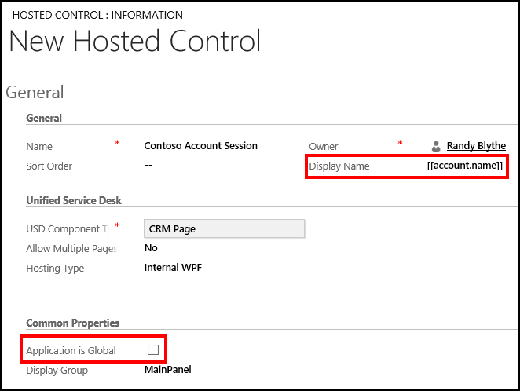
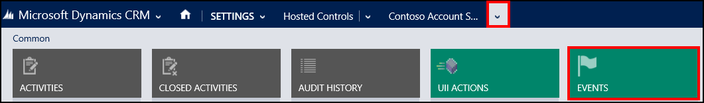
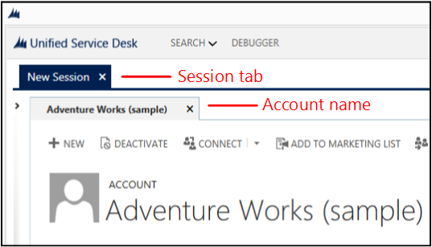
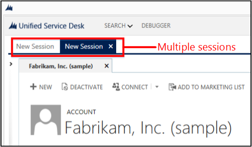

# Walkthrough 4: Display a record in a session in your agent application

[!INCLUDE[cc-data-platform-banner](../includes/cc-data-platform-banner.md)]

This walkthrough demonstrates how to display records in a session in your agent application using window navigation rules and session controls in [!INCLUDE[pn_unified_service_desk](../includes/pn-unified-service-desk.md)]. It also demonstrates the use of replacement parameters to dynamically display the name of the hosted control based on the currently displayed account record. This walkthrough is built on top of the previous walkthrough, [Walkthrough 3: Display records in your agent application](../unified-service-desk/walkthrough-3-display-microsoft-dynamics-365-records-in-your-agent-application.md), to display an account record in a session when you select on one of the accounts in the **Account** search result window.  
  
## Prerequisites  
  
- You must have completed [Walkthrough 1: Build a simple agent application](../unified-service-desk/walkthrough-1-build-a-simple-agent-application.md) and [Walkthrough 3: Display records in your agent application](../unified-service-desk/walkthrough-3-display-microsoft-dynamics-365-records-in-your-agent-application.md). The configurations that you completed in these walkthroughs are required in this walkthrough.  
  
- This walkthrough assumes that you’ll be using the same user credential that you used in walkthrough 1 to sign in to the agent application at the end of the walkthrough to test the application. If a different user will be testing the application, you must assign the user to **Contoso Configuration**. [!INCLUDE[proc_more_information](../includes/proc-more-information.md)] [Walkthrough 1: Build a simple agent application](../unified-service-desk/walkthrough-1-build-a-simple-agent-application.md)  
  
- You must know about the following in [!INCLUDE[pn_unified_service_desk](../includes/pn-unified-service-desk.md)]:  
  
  - **Session Tabs** type of hosted control. [!INCLUDE[proc_more_information](../includes/proc-more-information.md)] [Session Tabs (Hosted Control)](../unified-service-desk/session-tabs-hosted-control.md)  
  
  - How to configure [Action calls](../unified-service-desk/action-calls.md)  
  
  - How to configure window navigation rules. [!INCLUDE[proc_more_information](../includes/proc-more-information.md)] [Use window navigation rules in Unified Service Desk](../unified-service-desk/use-window-navigation-rules-unified-service-desk.md)  
  
  - Filter access using [!INCLUDE[pn_unified_service_desk](../includes/pn-unified-service-desk.md)] configuration. [!INCLUDE[proc_more_information](../includes/proc-more-information.md)] [Manage access using Unified Service Desk configuration](../unified-service-desk/admin/manage-access-using-unified-service-desk-configuration.md)  
  
## In This Walkthrough  
 [Step 1: Create a session-scoped hosted control to display account record in a session](../unified-service-desk/walkthrough-display-dynamics-365-record-session-agent-application.md#Step1)  
  
 [Step 2: Configure the event to close the hosted control from where the search originated](../unified-service-desk/walkthrough-display-dynamics-365-record-session-agent-application.md#Step2)  
  
 [Step 3: Create a Session Tabs hosted control](../unified-service-desk/walkthrough-display-dynamics-365-record-session-agent-application.md#Step3)  
  
 [Step 4: Create a window navigation rule to display the account record in a session](../unified-service-desk/walkthrough-display-dynamics-365-record-session-agent-application.md#Step4)  
  
 [Step 5: Add the controls to the configuration](../unified-service-desk/walkthrough-display-dynamics-365-record-session-agent-application.md#Step5)  
  
 [Step 6: Test the application](../unified-service-desk/walkthrough-display-dynamics-365-record-session-agent-application.md#Step6)  
  
 [Conclusion](../unified-service-desk/walkthrough-display-dynamics-365-record-session-agent-application.md#Conclusion)  
  
   
## Step 1: Create a session-scoped hosted control to display account record in a session  
 In this step, you’ll create a session-scoped hosted control to display an account record in a session.  
  
1. Sign in to the Dynamics 365 instance.  
  
2. [!INCLUDE[proc_settings_usd](../includes/proc-settings-usd.md)]  
  
3. Select **Hosted Controls**.  
  
4. Select **New**.  
  
5. On the **New Hosted Control** page, specify the following values.  
  
   |Field|Value|  
   |-----------|-----------|  
   |Name|Contoso Account Session|  
   |Display Name|[[account.name]] **Note:**  We will use replacement parameter to dynamically display the name of the selected account as hosted control display name.|  
   |USD Component Type|CRM Page|  
   |Allow Multiple Pages|No|  
   |Hosting Type|Internal WPF|  
   |Application is Global|Not checked **Note:**  This ensures that the hosted control is session-scoped, that is, only displayed in a session.|  
   |Display Group|MainPanel|  
  
     
  
6. Select **Save**.  
  
   
## Step 2: Configure the event to close the hosted control from where the search originated  
 In this step, you’ll configure the **BrowserDocumentComplete** event on the **Contoso Account Session** hosted control so that when it’s loaded, the parent hosted control from where the user selected to open the account, **Contoso Accounts Search**, is closed. The **Contoso Accounts Search** hosted control was created in [Walkthrough 3: Display records in your agent application](../unified-service-desk/walkthrough-3-display-microsoft-dynamics-365-records-in-your-agent-application.md). This is done to ensure that the user can’t open other account information in the same session tab.  
  
1. On the nav bar, select the down arrow next to the **Contoso Account Session** hosted control, and select **Events**.  
  
     
  
2. On the events page, select **BrowserDocumentComplete**.  
  
3. On the **BrowserDocumentComplete** page, select **+** in the **Active Actions** area to add an action call to the event.  
  
4. In the search box, select the search icon or press ENTER, and then select **New** in the lower-right corner of the search results box.  
  
     
  
5. On the **New Action Call** page, specify the following values.  
  
   |Field|Value|  
   |-----------|-----------|  
   |Name|Contoso Action Call: Close Accounts Search|  
   |Hosted Control|Contoso Account Search|  
   |Action|Close|  
  
     
  
6. Select **Save** to add the action call to the **BrowserDocumentComplete** event.  
  
   
## Step 3: Create a Session Tabs hosted control  
 To display records in sessions in your agent application, an instance of the **Session Tabs** type of hosted control must be configured in your agent application.  
  
1. On the hosted control page, select **New**.  
  
2. On the New Hosted Control page, specify the following values.  
  
   |Field|Value|  
   |-----------|-----------|  
   |Name|Contoso Session Tab|  
   |USD Component Type|Session Tabs|  
  
   

3. Update the XML in the **Extensions XML** field. To learn more, see [Chat indicator XML](session-tabs-hosted-control.md#chat-indicator-xml).
  
4. Select **Save**.

  
   
## Step 4: Create a window navigation rule to display the account record in a session  
 In this step, you’ll create a window navigation rule that displays the record in a session when the user selects any of the accounts in the search results window.  
  
1. Sign in to the Dynamics 365 instance.  
  
2. [!INCLUDE[proc_settings_usd](../includes/proc-settings-usd.md)]  
  
3. Select **Window Navigation Rules**.  
  
4. Select **New**.  
  
5. On the **New Window Navigation Rule** page, specify the following values.  
  
   |Field|Value|  
   |-----------|-----------|  
   |Name|Contoso Account Session Rule|  
   |Order|5|  
   |From|Contoso Accounts Search|  
   |Entity|account|  
   |Route Type|Popup|  
   |Destination|Tab|  
   |Action|Create Session|  
   |Target Tab|Contoso Account Session|  
   |Show Tab|Contoso Account Session|  
   |Hide Command Bar|No|  
   |Hide Navigation Bar|Yes|  
  
     
  
6. Select **Save**.  
  
   
## Step 5: Add the controls to the configuration  
 In this step, you’ll add the action call, event, hosted controls, and window navigation rule configured in this walkthrough to **Contoso Configuration** to display these controls to the user who is assigned to the configuration. **Contoso Configuration** was created in [Walkthrough 1: Build a simple agent application](../unified-service-desk/walkthrough-1-build-a-simple-agent-application.md).  
  
 Add the following to **Contoso Configuration**.  
  
|Control name|Control type|  
|------------------|------------------|  
|Contoso Action Call: Close Accounts Search|Action call|  
|BrowserDocumentComplete|Event for the Contoso Account Session hosted control|  
|Contoso Account Session|Hosted Control|  
|Contoso Session Tab|Hosted Control|  
|Contoso Account Session Rule|Window navigation rule|  
  
 To add a control to the configuration:  
  
1. Sign in to the Dynamics 365 instance.  
  
2. [!INCLUDE[proc_settings_usd](../includes/proc-settings-usd.md)]  
  
3. Select **Configuration**.  
  
4. Select **Contoso Configuration** to open the definition.  
  
5. On the nav bar, select the down arrow next to **Contoso Configuration**, and select **Action Calls**.  
  
6. On the next page, select **Add Existing Action Call**, type “`Contoso Action Call: Close Accounts Search`” in the search bar, and then press ENTER or select the search icon.  
  
7. In the search result box, select the action call to add it to **Contoso Configuration**.  
  
8. Similarly, add the event, hosted controls and window navigation rule by selecting the down arrow next to **Contoso Configuration**, and selecting **Events** **Hosted Controls** and **Window navigation Rules** respectively.  
  
9. Select **Save**.  
  
   
## Step 6: Test the application  
  
1. Start the [!INCLUDE[pn_unified_service_desk](../includes/pn-unified-service-desk.md)] client application, and sign in to the Dynamics 365 instance where you configured Unified Service Desk by using the same user credentials that is assigned to Contoso Configuration in [Walkthrough 1: Build a simple agent application](../unified-service-desk/walkthrough-1-build-a-simple-agent-application.md). For information about connecting to Dataverse instance using the [!INCLUDE[pn_unified_service_desk](../includes/pn-unified-service-desk.md)] client application, see [Connect to CRM instance using the Unified Service Desk client](../unified-service-desk/admin/connect-dynamics-365-instance-using-unified-service-desk-client.md).  
  
2. To display the account records from your Dataverse instance, select the down arrow next to the **Search** button in the toolbar, and then select **Account**.  
  
3. Select any of the account records to display the respective account information in a session; the information is displayed under a session tab. Note that the name of the hosted control tab that contains the account record automatically displays the account name because earlier you used replacement parameters to dynamically display the current account name instead of a static value.  
  
     
  
4. If you open another account record, it will be displayed in another session in your client application. To open another account, select the down arrow next to the **Search** button, select **Account**, and then select an account name to display the account information in another session.  
  
     
  
   
## Conclusion  
 In this walkthrough, you learned how to use the session hosted control and window navigation rules to display records in a session in your agent application. You also learned how to filter access to [!INCLUDE[pn_unified_service_desk](../includes/pn-unified-service-desk.md)] controls using configuration.  
  
> [!NOTE]
>  Try the next walkthrough to present enhanced session information in your agent application: [Walkthrough 5: Display enhanced session information by displaying session name and overview data](../unified-service-desk/walkthrough-5-display-enhanced-session-information-displaying-session-name-overview-data.md).  
  
### See also  
 [Walkthrough 1: Build a simple agent application](../unified-service-desk/walkthrough-1-build-a-simple-agent-application.md)   
 
 [Walkthrough 2: Display an external webpage in your agent application](../unified-service-desk/walkthrough-2-display-an-external-webpage-in-your-agent-application.md)   
 
 [Walkthrough 3: Display records in your agent application](../unified-service-desk/walkthrough-3-display-microsoft-dynamics-365-records-in-your-agent-application.md)   
 
 [Walkthrough 6: Configure the Debugger hosted control in your agent application](../unified-service-desk/walkthrough-configure-debugger-hosted-control-agent-application.md)   
 
 [Walkthrough 7: Configure agent scripting in your agent application](../unified-service-desk/walkthrough-configure-agent-scripting-agent-application.md)   
 
 [Unified Service Desk Configuration Walkthroughs](../unified-service-desk/unified-service-desk-configuration-walkthroughs.md)

[!INCLUDE[footer-include](../includes/footer-banner.md)]