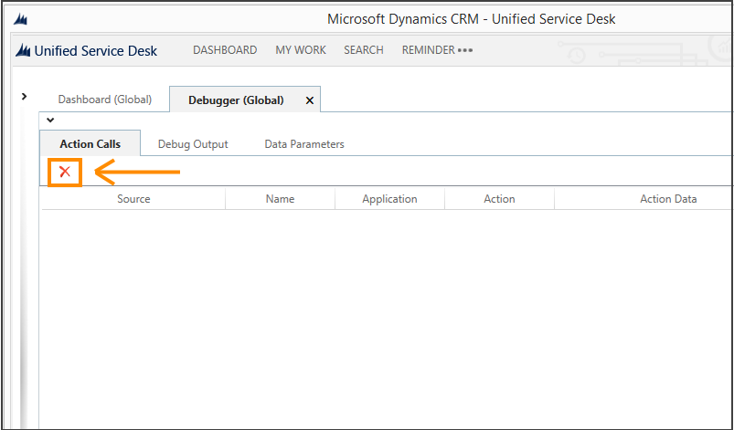
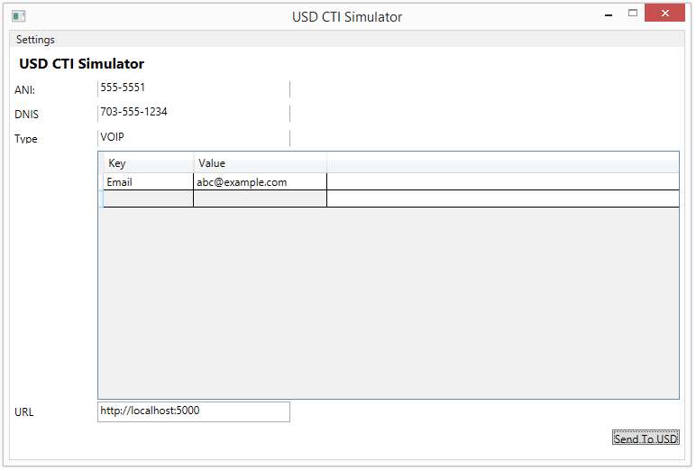
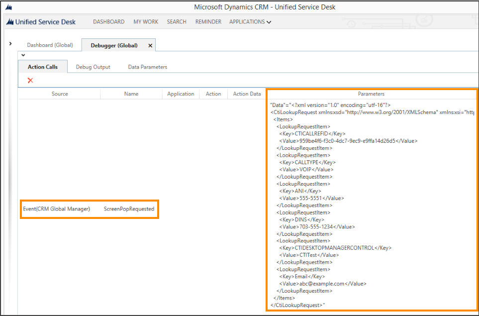
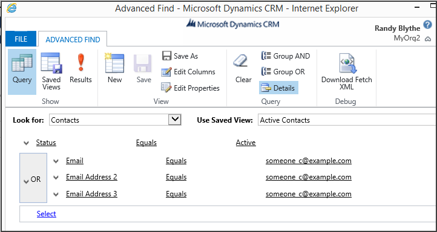
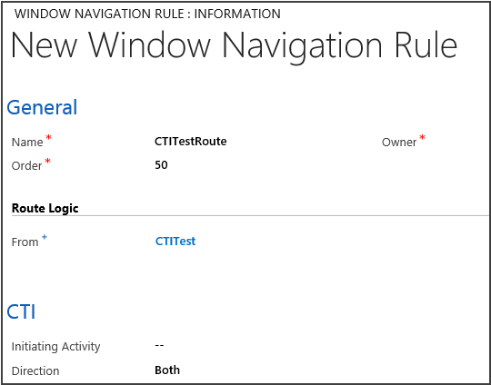
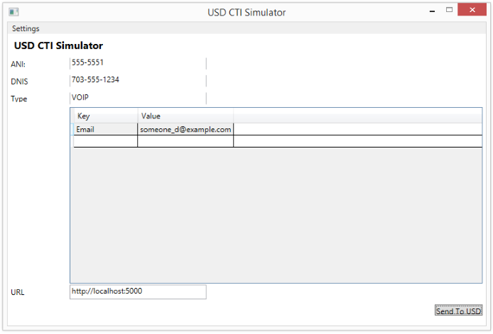
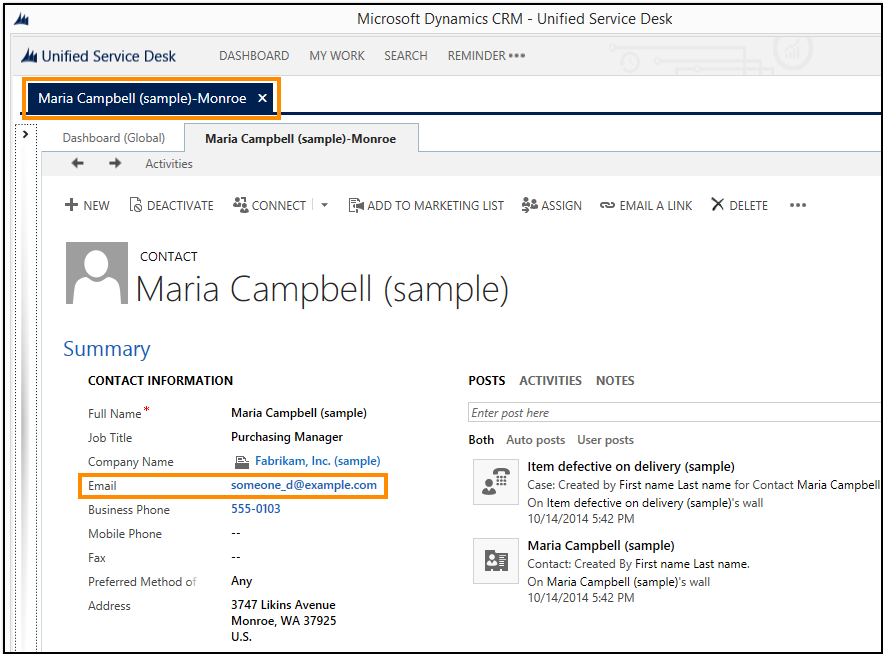

# Walkthrough: Use the generic listener adapter for CTI event routing
This walkthrough demonstrates how you can use the CTI Desktop Manager and generic listener in [!INCLUDE[pn_unified_service_desk](../includes/pn-unified-service-desk.md)] to expose the CTI events as screen pops in [!INCLUDE[pn_unified_service_desk](../includes/pn-unified-service-desk.md)]. For this walkthrough, we will use a sample CTI Simulator application that sends CTI requests to [!INCLUDE[pn_unified_service_desk](../includes/pn-unified-service-desk.md)].  
  
 In this walkthrough, you’ll:  
  
- Search for a contact record in the sample data based on an email address specified in the sample CTI Call Tester application.  
  
- Create a window navigation rule to display the matching record in a session in [!INCLUDE[pn_unified_service_desk](../includes/pn-unified-service-desk.md)].  
  
<a name="Prereq"></a>   
## Prerequisites  
  
- [!INCLUDE[pn_Microsoft_.Net_Framework](../includes/pn-microsoft-net-framework.md)] 4.6.2  
  
- [!INCLUDE[pn_unified_service_desk](../includes/pn-unified-service-desk.md)] client application; required for testing the hosted control.  
  
- [!INCLUDE[pn_microsoft_visual_studio_2012](../includes/pn-microsoft-visual-studio-2012.md)] or [!INCLUDE[pn_visual_studio_2013](../includes/pn-visual-studio-2013.md)]  
  
- [Download the sample CTI Simulator Application Visual Studio project to your computer](http://go.microsoft.com/fwlink/p/?LinkId=519007). Build the project, and run the application (.exe file) from the bin\debug folder of the sample application project. You must run the USD CTI Simulator application on the same computer where [!INCLUDE[pn_unified_service_desk](../includes/pn-unified-service-desk.md)] client is running to test the application.  
  
<a name="step1"></a>   
## Step 1: Configure a CTI Desktop Manager hosted control in Unified Service Desk  
  
1. Sign in to the Common Data Service platform.  
  
2. On the nav bar, choose **Dynamics 365** > **Settings** > **Unified Service Desk**.  
  
3. On the **Unified Service Desk** page, choose **Hosted Controls**.  
  
4. On the **Hosted Controls** page, choose **New**.  
  
5. On the **New Hosted Control** page, specify the following values.  
  
   |Field|Value|  
   |-----------|-----------|  
   |Name|CTITest|  
   |USD Component Type|CTI Desktop Manager|  
   |Display Group|HiddenPanel|  
   |Assembly URI|Microsoft.Crm.UnifiedServiceDesk.GenericListener|  
   |Assembly Type|Microsoft.Crm.UnifiedServiceDesk.GenericListener.DesktopManager|  
  
   > [!NOTE]
   >  The values specified in the **Assembly URI** and **Assembly Type** fields are the generic listener values for the **CTI Desktop Manager** hosted control type.  
  
     
  
6. Click **Save** to create the hosted control.  
  
<a name="step2"></a>   
## Step 2: Test if the CTI events are raised in Unified Service Desk  
  
1. Start [!INCLUDE[pn_unified_service_desk](../includes/pn-unified-service-desk.md)] client, and connect to your Common Data Service platform instance. After the client is up, choose **Settings** in the top-right corner to display the debugger control, and then choose **Clear Debug Output** to clear the desktop.  
  
     
  
2. Start the USD CTI Simulator application, type **Email** in the **Key** column and specify a random value in the **Value** column. Click **Send to USD**.  
  
     
  
3. A screen pop-up occurs in the client application to expose the CTI event. In this case, a `CTILookUpRequest` is initiated with the value that was specified in the USD CTI Simulator application. Because you haven’t wired it yet with a window navigation rule, nothing further happens.  
  
     
  
<a name="step3"></a>   
## Step 3: Define a window navigation rule to route the CtiLookUpRequest  
 Create a window navigation rule to create a session if a match is found, and then display the matching contact record in a session in [!INCLUDE[pn_unified_service_desk](../includes/pn-unified-service-desk.md)]  
  
1. Sign in to the Common Data Service platform.  
  
2. Navigate to the advanced find for contacts, and create a query where you search for active contacts where the email, email address 2, or email address 3 field equals a certain value, for example, someone_c@example.com.  
  
     
  
3. Click **Download Fetch XML** to save the query as `FetchXML`.  
  
4. On the nav bar, choose **Dynamics 365** > **Settings** > **Unified Service Desk** > **Window Navigation Rules**.  
  
5. Click **New**, and on the **New Window Navigation Rule** window, specify the following values.  
  
   |Field|Value|  
   |-----------|-----------|  
   |Name|CTITestRoute|  
   |Order|50|  
   |From|CTITest<br /><br /> This is the name of your CTI Desktop Manager hosted control.|  
   |Direction|Both|  
  
     
  
6. Save the rule. This enables the rest of the controls on the page.  
  
7. Now, add the `FetchXML` query that was saved earlier to this rule. Under the **CTI Searches** area, choose Add .  
  
8. In the **New CTI Search** window, specify the following values:  
  
   - **Name**: CTIContactSearch  
  
   - **Order**: 1  
  
   - **FetchXML**:  
  
       ```xml  
  
       <fetch version="1.0" output-format="xml-platform" mapping="logical" distinct="false">  
         <entity name="contact">  
           <attribute name="fullname" />  
           <attribute name="parentcustomerid" />  
           <attribute name="telephone1" />  
           <attribute name="emailaddress1" />  
           <attribute name="contactid" />  
           <order attribute="fullname" descending="false" />  
           <filter type="and">  
             <condition attribute="statecode" operator="eq" value="0" />  
             <filter type="or">  
               <condition attribute="emailaddress1" operator="eq" value="[[cti.Email]]" />  
               <condition attribute="emailaddress2" operator="eq" value="[[cti.Email]]" />  
               <condition attribute="emailaddress3" operator="eq" value="[[cti.Email]]" />  
             </filter>  
           </filter>  
         </entity>  
       </fetch>  
       ```  
  
     > [!NOTE]
     >  The address someone_c@example.com was replaced with `[[cti.Email]]` so that the search is run based on the value specified for the **Email** key in the [!INCLUDE[pn_unified_service_desk](../includes/pn-unified-service-desk.md)] CTI Simulator application.  
  
     
  
9. Save the CTI search rule, and return to the window navigation rule.  
  
10. Under **Single Match**, in the **Decision** field, select **Create Session, Load Match then Do Action**.  
  
11. Under **Single Match**, in the **Action** field, click the search icon to select a value, and then click **New**.  
  
12. On the **New Action Call** page, create an action call to open the contact record by specifying the following values.  
  
    |Field|Value|  
    |-----------|-----------|  
    |Name|CTIOpenContact|  
    |Hosted Control|CRM Global Manager|  
    |Action|Open_CRM_Page|  
    |Data|Id=[[$Context.Id]]<br />LogicalName=[[$Context.LogicalName]]|  
  
      
  
13. Save the action call, and then close the action call page to return to the window navigation rule definition page.  
  
14. Under the **Result** area:  
  
    1. In the **Destination** field, choose **Tab** to display the matching contact record in a tab.  
  
    2. In the **Target Tab** field, choose the **Contact** hosted control. The **Contact** hosted control was created when you deployed a sample [!INCLUDE[pn_unified_service_desk](../includes/pn-unified-service-desk.md)] application on your Common Data Service platform server using the [!INCLUDE[pn_package_deployer_tool](../includes/pn-package-deployer-tool.md)]. For more information, see [Deploy sample Unified Service Desk applications to CRM server using Package Deployer](admin/deploy-sample-unified-service-desk-applications-using-package-deployer.md).  
  
    3. In the **Show Tab** field, choose the **Contact** hosted control  
  
      
  
15. Save the window navigation rule.  
  
<a name="test"></a>   
## Test your CTI adapter  
  
1. Start [!INCLUDE[pn_unified_service_desk](../includes/pn-unified-service-desk.md)] client, and connect to your Common Data Service platform instance. After the client is up, choose **Settings** in the top-right corner to display the debugger control, and then choose **Clear Debug Output** to clear the desktop.  
  
     
  
2. Start the USD CTI Simulator application, type **Email** in the **Key** column and specify a valid email ID for the contact that you want to search. In this case, type someone_d@example.com in the **Value** column. Click **Send To USD**.  
  
     
  
3. The matching contact record is displayed in a session in [!INCLUDE[pn_unified_service_desk](../includes/pn-unified-service-desk.md)].  
  
     
  
4. Check the Debugger hosted control to view the events that got raised as a result of the CTI search. Also check out the **Data Parameters** tab to view the context information in the `$Context` variable and CTI information under the `CTI` variable.  
  
### See also  
 [Integrate with CTI systems](../unified-service-desk/integrate-cti-systems-cti-adapters.md)   
 [UII Computer Telephony Integration (CTI) framework](../unified-service-desk/uii-computer-telephony-integration-cti-framework.md)
