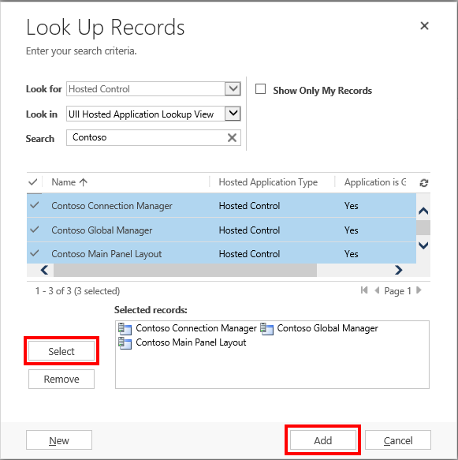
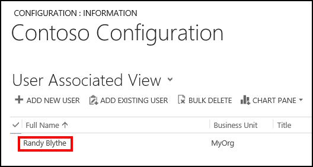
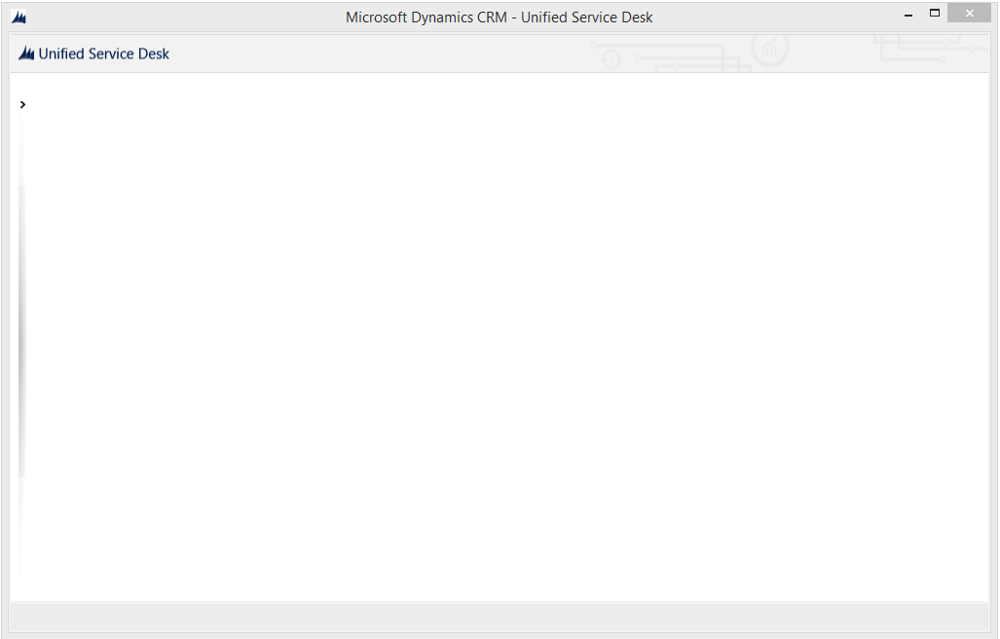

# Walkthrough 1: Build a simple agent application for Unified Interface apps

[!INCLUDE[cc-data-platform-banner](../includes/cc-data-platform-banner.md)]

This walkthrough demonstrates how to set up a basic agent application from scratch using [!INCLUDE[pn_unified_service_desk](../includes/pn-unified-service-desk.md)] that can connect to Microsoft Dataverse. This agent application provides you with an empty desktop without any functionality, and you can use it when you go through the rest of the walkthroughs in this section. In this walkthrough, you’ll use the [!INCLUDE[pn_unified_service_desk](../includes/pn-unified-service-desk.md)] configuration to filter out existing controls in the "New Environment" sample application package from appearing in your agent application.
  
## Prerequisites  
  
- A [!INCLUDE[pn_unified_service_desk](../includes/pn-unified-service-desk.md)] package must be deployed on your Dataverse instance, and the [!INCLUDE[pn_unified_service_desk](../includes/pn-unified-service-desk.md)] client application must already be installed to test the application at the end of the walkthrough. [!INCLUDE[proc_more_information](../includes/proc-more-information.md)] [Install, upgrade, and deploy Unified Service Desk](../unified-service-desk/admin/install-upgrade-deploy-unified-service-desk.md)  
  
- You must have required permissions to configure [!INCLUDE[pn_unified_service_desk](../includes/pn-unified-service-desk.md)] and access the required Dataverse entities. [!INCLUDE[proc_more_information](../includes/proc-more-information.md)] [Access management in Unified Service Desk](../unified-service-desk/admin/security-unified-service-desk.md)  
  
- You must be familiar with the following concepts in [!INCLUDE[pn_unified_service_desk](../includes/pn-unified-service-desk.md)]:  
  
  - [Unified Service Desk Hosted Controls](../unified-service-desk/unified-service-desk-hosted-controls.md)  
  
  - These three types of hosted controls: Connection Manager, Global Manager, and Panel Layout. [!INCLUDE[proc_more_information](../includes/proc-more-information.md)] [Hosted control types, action, and event reference](../unified-service-desk/hosted-control-types-action-event-reference.md)  
  
  - Filter access using [!INCLUDE[pn_unified_service_desk](../includes/pn-unified-service-desk.md)]. [!INCLUDE[proc_more_information](../includes/proc-more-information.md)] [Manage access using Unified Service Desk configuration](../unified-service-desk/admin/manage-access-using-unified-service-desk-configuration.md)  
  
   
## In this walkthrough  
 [Step 1: Create the basic hosted controls](../unified-service-desk/walkthrough1-unified-interface-build-a-simple-agent-application.md#Step1) 
  
 [Step 2: Add the hosted controls to a configuration](../unified-service-desk/walkthrough1-unified-interface-build-a-simple-agent-application.md#Step2)  
  
 [Step 3: Assign users to the configuration](../unified-service-desk/walkthrough1-unified-interface-build-a-simple-agent-application.md#Step3)  
  
 [Step 4: Test the application](../unified-service-desk/walkthrough1-unified-interface-build-a-simple-agent-application.md#Step4)  
  
 [Conclusion](../unified-service-desk/walkthrough1-unified-interface-build-a-simple-agent-application.md#Conclusion)  
  
   
## Step 1: Create the basic hosted controls  
 Create the following three types of hosted control so that the application can connect to an instance of Dataverse: Connection Manager, Global Manager, and Panel Type.  
  
1. Sign in to Unified Service Desk Administrator.  
  
2. Select **Hosted Controls** under **Basic Settings**.  
  
3. Select **+ New**.  
  
4. On the **New Hosted Control** page, specify the following values:  
  
   |Field|Value|  
   |-----------|-----------|  
   |Name|Contoso Connection Manager|  
   |Sort Order|1|  
   |Unified Service Desk Component Type|Connection Manager|

5. Select **Save**.
  
6. Repeat Step 4 and 5 to create another hosted control with the following values:  
  
   |Field|Value|  
   |-----------|-----------|  
   |Name|Contoso Global Manager|  
   |Sort Order|2|  
   |Unified Service Desk Component Type|Global Manager|
  
7. Select **Save**.

8. Repeat Step 4 and 5 to create another hosted control with the following values:  
  
    |Field|Value|  
    |-----------|-----------|  
    |Name|Contoso Main Panel Layout|  
    |Unified Service Desk Component Type|Panel Layout|  
    |Panel Type|Standard Main Panel|  
    |Application is Dynamic|No|  
    |User Can Close|Unchecked|
  
9. Select **Save**.  
  
> [!IMPORTANT]
>  If you don’t create a **Panel Layout** type of hosted control in your agent application, the default panel layout, **Standard Main Panel**, is created automatically when you run the client application. 
  
   
## Step 2: Add the hosted controls to a configuration  
 A configuration in [!INCLUDE[pn_unified_service_desk](../includes/pn-unified-service-desk.md)] helps you filter access to components that are displayed in the agent application to a user. In this step, create a configuration, and then add the hosted controls created earlier to the configuration.  
  
1. Sign in to Unified Service Desk Administrator.  
  
2. Select **Configuration** under **Advanced Settings**.  
  
3. Select **+ New**. 
  
4. On the **New Configuration** page, type `Contoso Configuration` as the name of the configuration, and select **Save**.  
  
5. After the new configuration is saved, select the **Hosted Controls, Events and Action Calls** tab.  
  
6. Select the ellipsis (...) under **Hosted Controls** and select **Add Existing Hosted Control**. The **Lookup Records** pane is displayed.

7. Type `Contoso` in the search bar, and select the search icon. The three hosted controls that you created earlier are displayed in the search results. Select the records and then select **Add**. 
  
     
  
    The hosted controls are added to the configuration. 

8. Select **Save**.  
  
   
## Step 3: Assign users to the configuration  

 In this step, assign users to the configuration so that when they sign in using the [!INCLUDE[pn_unified_service_desk](../includes/pn-unified-service-desk.md)] client application, they can only access the three hosted controls that are added to this configuration. For this walkthrough, assign only a single user to the configuration who will be testing the application at the end of the walkthrough.  
  
1. Select the **General** tab of the **Contoso Configuration**, and then select ellipsis (...) in the **Users** section.  
  
2. Select **Add Existing User**. The **Lookup Records** pane is displayed. 

3. Type the name of the user in the search bar, and then select **Add**.  
  
3. Select **Save**.  
  
    
  
   
## Step 4: Test the application  
 Start the [!INCLUDE[pn_unified_service_desk](../includes/pn-unified-service-desk.md)] client application, and sign in to the Dynamics 365 instance where you configured [!INCLUDE[pn_unified_service_desk](../includes/pn-unified-service-desk.md)] using the same user credentials that you assigned to the **Contoso Configuration** in the previous step. [!INCLUDE[proc_more_information](../includes/proc-more-information.md)] [Connect to a model-driven app instance using the Unified Service Desk client](../unified-service-desk/admin/connect-dynamics-365-instance-using-unified-service-desk-client.md).  
  
 Your agent application will look like the following:  
  
   
  
 The desktop in the agent application is empty because no other controls were added to **Contoso Configuration** apart from the hosted controls required for setting up a basic agent application. In the rest of the walkthroughs, you’ll see controls appear in the agent application as you progressively configure and add controls to **Contoso Configuration**. 
  
   
## Conclusion  
 In this walkthrough, you saw how to quickly build a basic agent application that can connect to an instance of Dataverse. You also learned how to filter access to [!INCLUDE[pn_unified_service_desk](../includes/pn-unified-service-desk.md)] controls using configuration.  
  
### See also

 [Support for Unified Interface Apps in Unified Service Desk](../unified-service-desk/admin/Support-unified-interfaces-apps-usd.md)

 [Unified Interface Page (Hosted Control)](../unified-service-desk/unified-interface-page-hosted-control.md)

 [Unified Service Desk and Unified Interface Configuration Walkthroughs](../unified-service-desk/unified-service-desk-unified-interface-configuration-walkthroughs.md)
  
 [Walkthrough 2: Display an external webpage in your agent application](../unified-service-desk/walkthrough2-unified-interface-display-an-external-webpage-in-your-agent-application.md)

 [Walkthrough 3: Display Unified Interface apps records in your agent application](../unified-service-desk/walkthrough3-unified-interface-display-microsoft-dynamics-365-records-in-your-agent-application.md)

 [Walkthrough 4: Display a Unified Interface apps record in a session in your agent application](../unified-service-desk/walkthrough4-unified-interface-display-dynamics-365-record-session-agent-application.md)

 [Walkthrough 5: Display enhanced session information by displaying session name and overview data](../unified-service-desk/walkthrough5-unified-interface-display-enhanced-session-information-displaying-session-name-overview-data.md)

 [Walkthrough 6: Configure the Debugger hosted control in your agent application](../unified-service-desk/walkthrough6-unified-interface-configure-debugger-hosted-control-agent-application.md)

 [Walkthrough 7: Configure agent scripting in your agent application](../unified-service-desk/walkthrough7-unified-interface-configure-agent-scripting-agent-application.md)

[!INCLUDE[footer-include](../includes/footer-banner.md)]