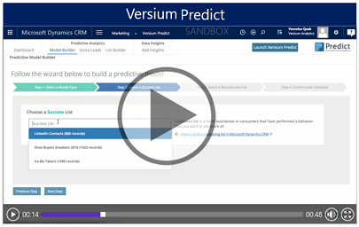

# Versium Predict
 

 Use Versium Predict with Dynamics 365 Sales to increase your marketing and sales effectiveness. Enhance your existing marketing process with predictive analytics that allow you to precisely target your campaigns.

 With Versium Predict, you can:

- **Build Predictive Models:** Analyze your marketing lists to create a model of the business or consumer lead characteristics that correlate with desired behaviors with the Predictive Analytics Model Builder.

- **Score leads:** Using a predictive model for a specific behavior, you can score a marketing list to see who in that list is more likely to do a specific behavior, such as clicking a link in an email campaign.

- **Generate new leads:**  Generate a new list of leads based on a predictive model. The new list will be imported into Dynamics 365 Sales as a "leads" marketing list

- **Enhance your lead data:** Enhance your marketing lists with additional information from  Versium Predict Data Warehouse, such as email addresses, phone numbers, financial information, social network information, and demographic data.

  Predict Versium is a preferred provider solution that your administrator can add from the Dynamics 365 admin center. [!INCLUDE[proc_more_information](../includes/proc-more-information.md)] [Install or remove a preferred solution](/power-platform/admin/install-remove-preferred-solution).

## Get started
 [Versium Predict home page](https://versium.com/predict)

  [Versium Predict Setup Guide](https://predict-help.versium.com/wp-content/uploads/Versium-Predict-Setup-Guide-Microsoft-Dynamics-365.pdf)

  [Versium Predict User Guide](https://predict-help.versium.com/predict-for-dynamics-365-user-guide)

[!INCLUDE[footer-include](../includes/footer-banner.md)]