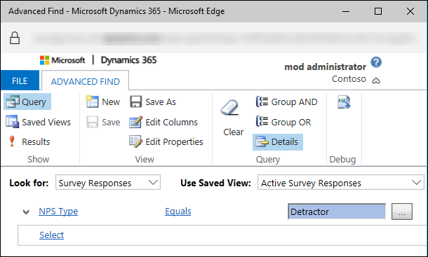
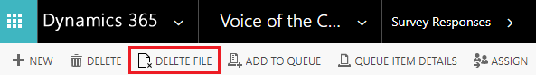
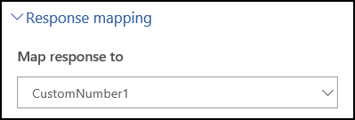

# Analyze survey data

> [!IMPORTANT]
> Voice of the Customer (VoC) is being deprecated and replaced with Microsoft Forms Pro. [Learn more](https://go.microsoft.com/fwlink/p/?linkid=2097704)

Voice of the Customer stores all survey responses in Dynamics 365, and you can analyze them by using features such as:

- Survey response entity

- Advance find queries

- Dynamics 365 reports

- Feedback entity

- Survey dashboard

You can also generate custom reports based on the responses to meet your requirements. More information about creating reports: [Create or edit a report using the Report Wizard](https://docs.microsoft.com/dynamics365/customer-engagement/basics/create-edit-copy-report-wizard)  

## Survey responses

A survey response record is created after a respondent submits a survey. Based on the response received, out-of-the-box workflows are triggered, and the corresponding fields are populated in the survey response. If you have mapped the question responses to additional fields, the mapped field is populated with the survey response.

To view all survey responses:

1. Sign in to the Voice of the Customer legacy web client or [open Voice of the Customer app](install-solution.md#open-voice-of-the-customer-app).

2. Go to **Voice of the Customer** &gt; **Survey Responses**.

3. Select the survey response you want to view.

To view survey response for a survey:

**Web client**

1. Sign in to the Voice of the Customer legacy web client.

2. Go to **Voice of the Customer** &gt; **Surveys**.

3. Select the name of the survey for which you want to view survey responses.

4. Select the down arrow next to your survey name at the top of the screen, and then select **Survey Responses**.

5. Select the survey response you want to view.

**Voice of the Customer app**

1.  [Open Voice of the Customer app](install-solution.md#open-voice-of-the-customer-app).

2.  Go to **Voice of the Customer** &gt; **Surveys**.

3.  Select the name of the survey for which you want to view survey responses.

4.  Under **Related**, select **Survey Responses**.

5.  Select the survey response you want to view.

Additionally, you can export survey responses to [!INCLUDE[pn-excel-short](../includes/pn-excel-short.md)] and perform further analysis by using [!INCLUDE[pn-excel-short](../includes/pn-excel-short.md)] features. [!INCLUDE[proc-more-information](../includes/proc-more-information.md)] [Export data to [!INCLUDE[pn-excel-short](../includes/pn-excel-short.md)]](https://docs.microsoft.com/dynamics365/customer-engagement/basics/export-data-excel)  

You can also use Advanced Find to create customized queries. For example, you can create a query to fetch all the survey responses where the Net Promoter Score is equal to Detractor. [!INCLUDE[proc-more-information](../includes/proc-more-information.md)] [Advanced Find search](https://docs.microsoft.com/dynamics365/customer-engagement/basics/save-advanced-find-search)  

  

If a file is uploaded in response to the question type **File upload**, you can delete it by selecting **Delete file** on the command bar. The file is deleted from the storage.

> [!div class=mx-imgBorder]
>   

## Store responses in a custom field by using response mapping

Voice of the Customer provides some additional fields in the Survey Response entity on the **Measures** tab in the Survey Response form. You can map and store the response to a question in these fields. To map the response to a question to a field, you must select the field from the **Response Mapping** list in the question form (in web client) or **Map response to** list in the **Properties** pane (in Voice of the Customer app) when you create the question.

**Web client**

  

**Voice of the Customer app**

Response mapping makes the question responses directly available as part of the Survey Response entity and, therefore, readily available to reports and workflows. The mapping fields available on the survey response are listed in the following table.

|| | | |
|------------------|----------------------|------------------------------------|------------------|
| Salutation       | Company Response     | Generic number 11                  | Linked Answer 2  |
| First Name       | Generic string 2     | Generic number 14                  | Linked Answer 3  |
| Last Name        | Custom Value         | Generic number 13                  | Linked Answer 4  |
| Job Title        | Generic text 4       | Generic number 16                  | Linked Answer 5  |
| Street1          | Generic text value 5 | Generic number 15                  | Linked Answer 6  |
| Street 2         | Generic text 6       | Custom Number                      | Linked Answer 7  |
| Street3          | Generic number 12    | Generic number 17                  | Linked Answer 8  |
| City             | Generic number 1     | Generic number 21                  | Linked Answer 9  |
| State            | Generic number 4     | Generic number 19                  | Linked Answer 10 |
| Postal Code      | Generic number 3     | Date                               | Linked Answer 11 |
| Country          | Generic number 6     | Custom Date 1                      | Linked Answer 12 |
| Telephone        | Generic number 5     | Satisfaction Rating (Whole Number) | Linked Answer 13 |
| Website Response | Generic number 8     | Satisfaction Rating                | Linked Answer 14 |
| Email Response   | Generic number 7     | Customer Effort Score              | Linked Answer 15 |
| Fax              | Generic number 10    | Linked Answer 1                    |                  |
||||

## Run and export reports

You can run the following reports for a survey:

- **Net Promoter Score**: Displays the monthly Net Promoter Score details measured by the survey.

- **Survey Export**: Displays survey responses in a tabular format.

- **Survey Summary**: Displays a summary of survey responses.

> [!NOTE]
> The reports are available in English locale only.

To run and export a report:

1. Sign in to the Voice of the Customer legacy web client.

2. Go to **Voice of the Customer** &gt; **Surveys**.

3. Select the name of the survey for which you want to run a report.

4. Select **More Commands** on the toolbar, select **Run Report**, and then select the report you want to run.

5. To export the report, select **Export**, and then select the format you want:

   - XML file with report data

   - CSV (comma-delimited)

   - Acrobat (PDF) file

   - MHTML (web archive)

   - [!INCLUDE[pn-excel-short](../includes/pn-excel-short.md)]

   - TIFF file

   - [!INCLUDE[pn-ms-word-short](../includes/pn-ms-word-short.md)]

The report is exported in the selected format.

## View survey invitations and responses

The survey dashboard allows you to view the summary of survey invitations and responses. You can select a combination of view and chart to see the results you're interested in. You can also create your personal, customized view to see the results.

  

1. Sign in to the Voice of the Customer legacy web client.

2. Go to **Voice of the Customer** &gt; **Surveys**.

3. Select the name of the survey for which you want to view the dashboard.

4. From the **Survey** box, select **Dashboard**.

     

5. Select a view and chart from the view list and chart list, respectively. The corresponding chart is displayed.

Additionally, you can create your own customized dashboard. [!INCLUDE[proc-more-information](../includes/proc-more-information.md)] [Create or edit dashboards](https://docs.microsoft.com/dynamics365/customer-engagement/customize/create-edit-dashboards)  

### See also
[Plan a survey](plan-survey.md)   
[Design a basic survey](design-basic-survey.md)   
[Design an advanced survey](design-advanced-survey.md)   
[Distribute a survey](distribute-survey.md) 
