# Design an advanced survey

> [!IMPORTANT]
> Voice of the Customer (VoC) is being deprecated and replaced with Microsoft Forms Pro. [Learn more](https://go.microsoft.com/fwlink/p/?linkid=2097704)

This section provides information about advanced features for designing surveys—for example, response routing, scoring, piping, and so on.

## Design interactive surveys by using response routing

When you want to ask additional questions based on responses in a survey, create one or more response routing rules for the response you want more information about.

For example, for the question **How likely is it that you would recommend us to a friend?**, you can create a response routing rule to ask the reason if someone responds **Not likely**.

**Web client**

1. Sign in to the Voice of the Customer legacy web client.

2. Go to **Voice of the Customer** &gt; **Surveys**.

3. Select the name of the survey to which you want to add a response routing rule.

4. Select the down arrow next to your survey name at the top of the screen, and then select **Response Routings**.

   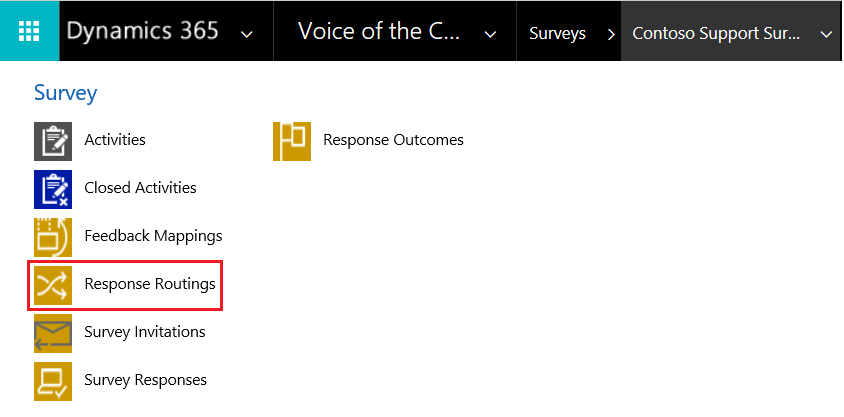  

5. Select **Add New Response Routing**.

6. Enter a name for the response routing rule in **Name**, and then select **Save** so you can continue editing your response routing.

7. In the **Conditions** area, select the plus sign **(+)** to add a response condition.

8. In the **Question** field, browse to and select the question for which you want to create a rule. After you select a question, a few fields are enabled as defined by the selected question type.

9. Select values for **Operator**, **Comparison Value**, and **Answer** fields.

   > [!NOTE]
   > The fields will differ based on the selected question type and operator.

   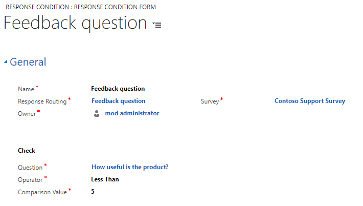  

10. Select **Save**.

11. In the **Actions** area, select the plus sign **(+)** to add a response action.

12. In the **Name** field, select the search button, and then select **+ New**.

13. Enter a name for the action, and then select one of the following scopes:

    - **Client**: Choose this if the action occurs within the survey (for example, show or hide a question). In the **Client** area, select the survey and the action to take, and then select **Save**. [!INCLUDE[proc-more-information](../includes/proc-more-information.md)] [Client-side routing](#client-side-routing)  

    - **Server**: Choose this if the action occurs outside of the survey (for example, request contact or unsubscribe). In the **Server** area, select the action type, and then select the users or queues to notify, if applicable. Select **Save**.

    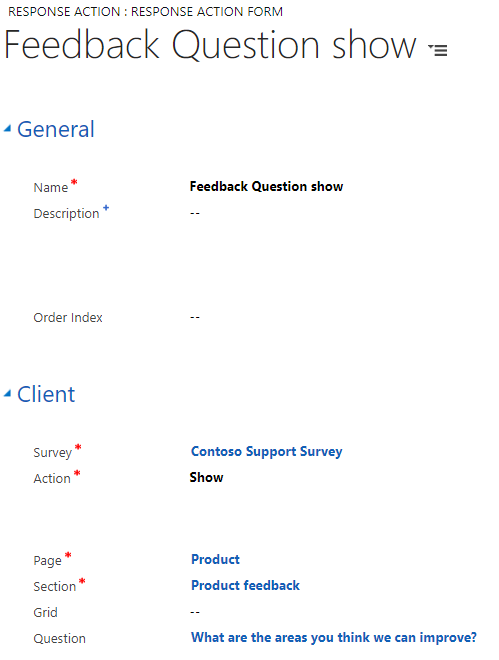  

14. In the **Actions** area, select the plus sign **(+)**, browse to and select the action you created.

15. In the **Otherwise** area, create an action by following the steps you took to add a response action. This action is triggered when the above-mentioned response action does not meet the specified response condition.

    For example, you added an Net Promoter Score question to the survey and you want to collect feedback when the rating is less than 5.

    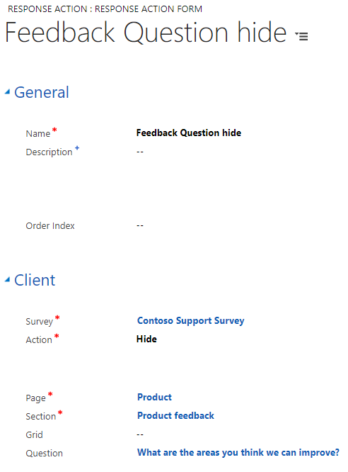

**Voice of the Customer app**

1. [Open Voice of the Customer app](install-solution.md#open-voice-of-the-customer-app).

2. Go to **Voice of the Customer** > **Surveys**.

3. Select the name of the survey to which you want to add a response routing rule.

4. Under **Related**, select **Response Routings**.

   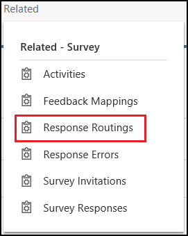

5. Select **Add New Response Routing**.

6. Under **General**, enter a name for the response routing rule, and then select **Save** so you can continue editing your response routing.

7. Under **Conditions**, select **Add New Response Condition**.

8. In the **Question** field, browse to and select the question for which you want to create a rule. After you select a question, a few fields are enabled as defined by the selected question type.

9. Select values for **Operator**, **Comparison Value**, and **Answer** fields.

   > [!NOTE]
   > The fields will differ based on the selected question type and operator.

   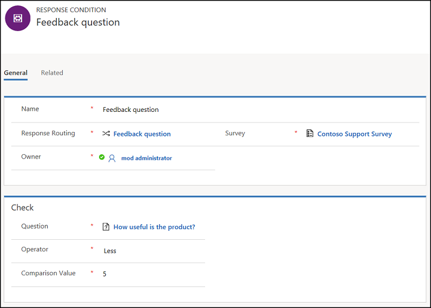 

10.	Select **Save**.

11.	Navigate to the response routing rule you created.

12.	Under **Actions**, select **Add Existing Response Action**. A pane on the right side of the screen appears.

13.	Select **New**.

14.	Enter a name for the action, and then select one of the following scopes:
    - **Client**: Choose this if the action occurs within the survey (for example, show or hide a question). Under **Client**, select the survey and the action to take, and then select **Save**. [!INCLUDE[proc-more-information](../includes/proc-more-information.md)] [Client-side routing](#client-side-routing)

    - **Server**: Choose this if the action occurs outside of the survey (for example, request contact or unsubscribe). Under **Server**, select the action type, and then select the users or queues to notify, if applicable. Select **Save**.

    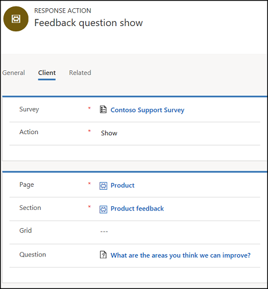

15.	Navigate to the response routing rule you created.

16.	Under **Actions**, select **Add Existing Response Action**. A pane on the right side of the screen appears.

17.	Browse to and select the action you created.

18.	Select **Add**.

19.	In the **Otherwise** section, create an action by following the steps you took to add a response action. This action is triggered when the previously mentioned response action does not meet the specified response condition.

    For example, you added a Net Promoter Score question to the survey and you want to collect feedback when the rating is less than 5.

    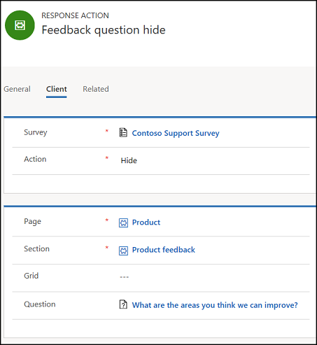

### Client-side routing

You can use client-side routing to keep the survey relevant to the respondent and interactive. For example, show or hide a question based on the response to another question.

**Note**: Be careful not to create a huge logic tree with many combinations of response actions, because this will increase your testing effort. Instead, split the survey into multiple, smaller surveys and send invitations to different groups of people.

When you [design an interactive survey](#design-interactive-surveys-by-using-response-routing) and select **Client** as **Scope**, the following actions are available:  

- **Show**: Shows a page, section, grid, or question based on a given response.

- **Hide**: Hides a page, section, grid, or question based on a given response.

- **Skip to**: Skips to a section, question, or grid based on the answer of a question.

- **End survey**: Goes to the end of the survey. This is useful for qualification questions.

- **Chain survey**: Opens a different survey based on a given response.

- **Toggle visibility**: Changes the visibility from visible to hidden and vice versa, depending on the current state of the control.

Additional fields are displayed based on the selected action. If you need help, point to any field to read the tooltips.

## Design interactive surveys by using answer tag

If you want to personalize a question based on the answer to the previous question, you must use an answer tag. This allows you to insert dynamic text based on the response to the previous question in subsequent questions and answers in the survey at run time.

The answer tag must meet the following requirements:
- The answer tag must start and end with an underscore and must contain only alphanumeric characters (0-9, A-Z, and a-z).
- The answer tag must not exceed 100 characters.
- Each answer tag must be unique in a survey.

The following question types can be used to capture response in the answer tag:
- Short answer
- Long answer
- Single response
- Net Promoter Score®
- Customer Effort Score
- CSAT
- Rating
- Numerical response
- Smilies rating
- List of ratings 
- Single rating in columns

The answer tag can be consumed in:
- Question text of all question types.
- Option text of single and multiple responses questions, except drop-down.

The following example illustrates the use of answer tag.

You create a survey to find out tea and coffee drinking habit of your colleagues. You create the questions as follows:

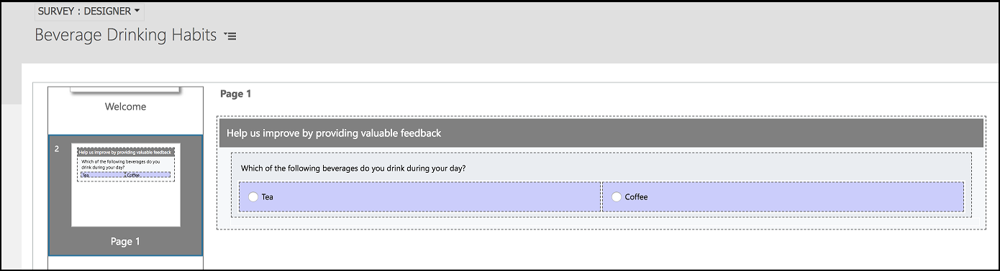

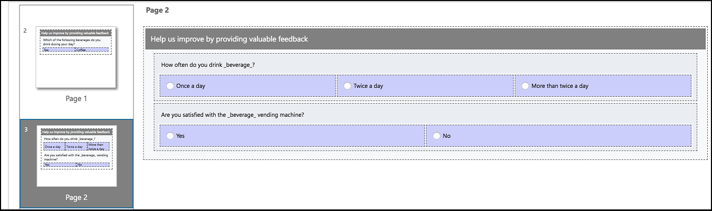

In the above question, you have entered \_beverage\_ in the **Answer Tag** field of question 1. The answer tag \_beverage\_ stores the response to question 1. 

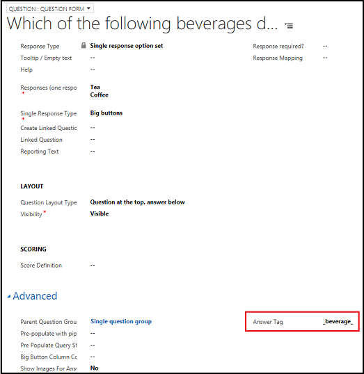

When you view the survey at run time, the \_beverage\_ in the subsequent questions is replaced with the answer of the question 1.

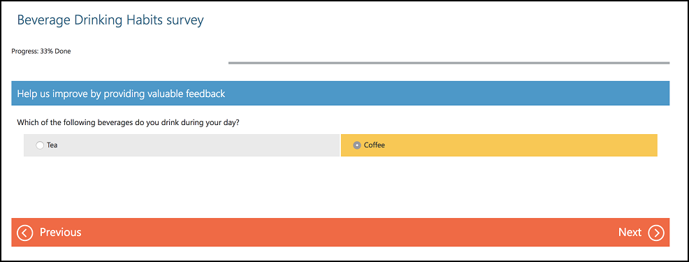

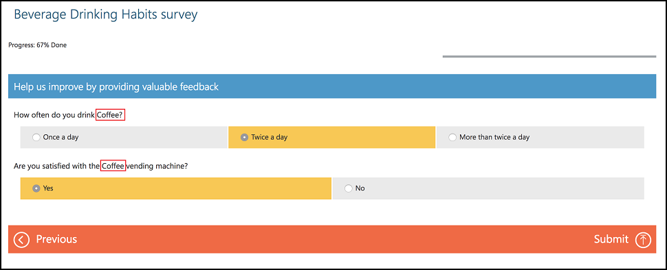

To add an answer tag:

**Web client**

1.	Sign in to the Voice of the Customer legacy web client.

2.	Go to **Voice of the Customer** > **Surveys**.

3.	Select the name of the survey to which you want to add an answer tag.

4.	Add the questions to the survey, if required. If the questions are already added, go to the question editor.

5.	Under **Advanced**, enter a value in the **Answer Tag** field.
    
    

6.	Save the question and publish the survey.

**Voice of the Customer app**

1. [Open Voice of the Customer app](install-solution.md#open-voice-of-the-customer-app).

2. Go to **Voice of the Customer** > **Surveys**.

3. Select the name of the survey to which you want to add an answer tag.

4. Add the questions to the survey, if required. If the questions are already added, select the question to which you want to add an answer tag.

5. In the **Properties** pane, enter a value in the **Answer tag** field.

   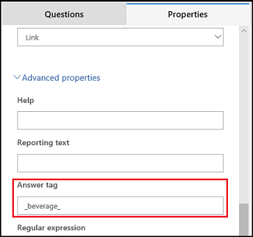

6. Save the question and publish the survey.

## Add the unsubscribe option to a survey

You can configure your survey to include a link that allows a respondent to unsubscribe from the survey. If this option is configured, the respondent is redirected to another survey to capture reasons for unsubscribing. When the response is received in Dynamics 365, the respondent's contact preferences can be updated to prevent further surveys being sent.

> [!NOTE]
> Unsubscribe actions work only for customer records stored in Dynamics 365 and not for anonymous surveys.

1.  [Create a survey that contains the questions to capture reasons for unsubscribing.](design-basic-survey.md#create-or-edit-a-survey)  

2.  Open the survey to which you want to add the unsubscribe option.

3.  Under **Summary**, select **Yes** for the **Allow Unsubscribe** field. Two new fields are displayed: **Unsubscribe Survey** and **Unsubscribe Link Text**.

4.  From the **Unsubscribe Survey** field, select the survey you created to capture reasons for unsubscribing.

5.  In the **Unsubscribe Link Text** field, enter text to display to the respondent.

6.  Select **Save** in the lower-right corner of the screen.

## Create a lead from a survey response

You can configure your survey to create a lead automatically from a survey response that is given by an anonymous respondent.

**Web client**

1. Sign in to the Voice of the Customer legacy web client.

2. Go to **Voice of the Customer** &gt; **Surveys**.

3. Select the name of the survey for which you want to create a lead automatically for an anonymous respondent.

4. Under **Invitations and Actions**, select **Yes** for the **Create Lead For Anonymous Responses** field.

5. Save the changes.

6. From the **Survey** box, select **Designer**.

7. Edit the questions you want to configure to create the lead by selecting a lead attribute from the **Response Mapping** list. [!INCLUDE[proc-more-information](../includes/proc-more-information.md)] [Store responses in a custom field by using response mapping](analyze-survey-data.md#store-responses-in-a-custom-field-by-using-response-mapping)  

   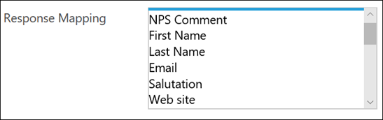  

8. Save the changes.

**Voice of the Customer app**

1. [Open Voice of the Customer app](install-solution.md#open-voice-of-the-customer-app).

2. Go to **Voice of the Customer** > **Surveys**.

3. Select the name of the survey for which you want to create a lead automatically for an anonymous respondent. [!INCLUDE[proc-more-information](../includes/proc-more-information.md)] [Store responses in a custom field by using response mapping](analyze-survey-data.md#store-responses-in-a-custom-field-by-using-response-mapping)

4. Under **Invitations and Actions**, select **Yes** for the **Create Lead For Anonymous Responses** field.

5. Save the changes.

6. From the **Survey** box, select **Designer**.

7. Select the question you want to configure to create the lead by selecting a lead attribute from the **Map response to** list.

    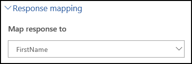

8. Save the changes.

When a survey generates an anonymous response, and is configured to create a lead, the **Create Lead** workflow is invoked in the background for creating the lead. The lead entities are mapped to the survey response fields as described in the following table.

| **Lead entity**                  | **Survey response field**   |
|----------------------------------|-----------------------------|
| Job Title                        | Job Title                   |
| Business Phone                   | Telephone                   |
| Email                            | Email                       |
| Company                          | Company                     |
| Website                          | Website                     |
| Country/Region                   | Country                     |
| City                             | City                        |
| Street 1                         | Street 1                    |
| Street 2                         | Street 2                    |
| Street 3                         | Street 3                    |
| State/Province                   | State                       |
| ZIP/Postal Code                  | Postal Code                 |
| Fax                              | Fax                         |
| First Name                       | First Name                  |
| Last Name                        | Last Name                   |
| Owner                            | Owner                       |
| Salutation                       | Salutation                  |
| &lt;&lt;Any custom field&gt;&gt; | &lt;&lt;Custom Text&gt;&gt; |
|||

After a lead is created, the **Respondent** field in the survey response is updated with the lead ID.

## Automatically send an email response

You can configure your survey to automatically send an email response to the customer (account, contact, or lead) after the survey is completed. The email is sent by using a Global email template type. More information about how to create a new email template of type Global: [Create templates for email ](https://docs.microsoft.com/dynamics365/customer-engagement/admin/create-templates-email)

> [!NOTE]
> The email is sent only for a non-anonymous response.

**Web client**

1. Sign in to the Voice of the Customer legacy web client.

2. Go to **Voice of the Customer** &gt; **Surveys**.

3. Select the name of the survey for which you want to send an automatic response.

4. Under **Invitations and Actions**, select **Yes** for the **Automatically Send Email Response** field. The **Email** field is displayed.

5. From the **Email** list, select an email template.

6. Select **Save** in the lower-right corner of the screen.

**Voice of the Customer app**

1.  [Open Voice of the Customer app](install-solution.md#open-voice-of-the-customer-app).

2.  Go to **Voice of the Customer** &gt; **Surveys**.

3.  Select the name of the survey for which you want to send an automatic response.

4.  Under **Invitations and Actions**, select **Yes** for the **Automatically Send Email Response** field. The **Email Template** field is displayed.

5.  From the **Email Template** list, select an email template.

6.  Select **Save** in the lower-right corner of the screen.

## Survey scoring

A great feature of Voice of the Customer surveys is the ability to score individual questions or a group of questions in a survey.  This can be used in the following applications:
- Create a custom ‘index’ to measure loyalty, satisfaction, pain, happiness, or any aspect based on more than one question, or more than one methodology. For example, you may choose to use Net Promoter Score as one measure and compare its effectiveness against a combination of Customer Effort Score and a service rating.
- Take actions based on the total score of the survey. Rather than taking actions based on individual questions, it is possible to act based on a total score. For example, a customer may answer that they are satisfied to one question, but not satisfied to many others. In this case, it is possible to schedule a follow up appointment if the satisfaction index is less than 50% irrespective of the response to a single satisfaction question.

The score is calculated as two percentages on the survey response:
- Score as a percentage – this is the score of the questions answered (note that logic on the client side may mean not all questions are presented to the respondent).
- Score as a percentage all routes – this is score of the questions answered divided by all the total possible score (irrespective if they were presented to the respondent).

To configure scoring:

**Web client**

1.	Sign in to Voice of the Customer legacy web client.

2.	Go to **Voice of the Customer** > **Surveys**.

3.	Select the name of the survey you want to configure scoring. The survey page opens.

4.	Under **Invitations and Actions**, select **Yes** for the **Calculate Score** field.

5.	Save the changes.

6.	From the **Survey** box, select **Designer**.

7.	Edit the questions you want to configure for scoring by selecting one of the following options from the **Score Definition** field:
    - **Ignore**: Do not score
    - **Auto (0 -100)**: Minimum value is assigned 0 points, maximum 100 points.
    - **Auto (100-0)**: Maximum value is assigned 100 points, minimum value 0 points.
    - **User Specified Range/Weight**: The left most value is assigned the value of the **Score Min Value** field that you specify. The **Score Max Value** field is the right most value.
    
    > [!NOTE]
    > By specifying 10 in the minimum value and 1 in the maximum value, the field scoring can be reversed.
    
    - **NPS**: Net Promoter Score scoring type. Used specifically for Net Promoter Score.

    > [!NOTE]
    > The **Score Definition** field is visible for single response questions and ratings.

8.	Save the changes.

**Voice of the Customer app**

1. [Open Voice of the Customer app](install-solution.md#open-voice-of-the-customer-app).

2. Go to **Voice of the Customer** > **Surveys**.

3. Select the name of the survey you want to configure scoring. The survey page opens.

4. Under **Invitations and Actions**, select **Yes** for the **Calculate Score** field.

5. Save the changes.

6. From the **Survey** box, select **Designer**.

7. Select the question you want to configure for scoring.

8. In the **Properties** pane, select one of the following options from the **Scoring** list:
   - **None**: Do not score
   - **Auto (0 -100)**: Minimum value is assigned 0 points, maximum 100 points.
   - **Auto (100-0)**: Maximum value is assigned 100 points, minimum value 0 points.
   - **User Specified**: The left most value is assigned the value of the **Minimum score value** field that you specify. The **Maximum score value** field is the right most value.
    
     > [!NOTE]
     > By specifying 10 in the minimum value and 1 in the maximum value, the field scoring can be reversed.
    
   - **NPS**: Net Promoter Score scoring type. Used specifically for Net Promoter Score.

     > [!NOTE]
     > The **Scoring** list is visible for single response questions and ratings.

9. Save the changes.

### See also
[Plan a survey](plan-survey.md)   
[Design a basic survey](design-basic-survey.md)   
[Distribute a survey](distribute-survey.md)   
[Analyze survey data](analyze-survey-data.md)   
