# Design a basic survey

> [!IMPORTANT]
> Voice of the Customer (VoC) is being deprecated and replaced with Microsoft Forms Pro. [Learn more](https://go.microsoft.com/fwlink/p/?linkid=2097704)

After deciding the types of questions you want to include in your survey, you must now create the survey. This article provides information about the basics of designing a survey, creating a survey theme, and adding questions to the survey. More information about advanced survey design: [Design an advanced survey](design-advanced-survey.md)  

> [!NOTE]
> You must be a survey administrator or survey designer to perform the actions described in this chapter. A survey administrator has access at the organization level, whereas the survey designer has access at the business-unit level.

## Create a survey theme

You can create a theme for your survey to match your company's style. Themes define the color scheme for your surveys. You can design multiple themes and use them in different surveys.

**Web client**

1. Sign in to the Voice of the Customer legacy web client.

2. Go to **Voice of the Customer** &gt; **Themes**.

3. To create a new theme, select **New**.

4. To edit an existing theme, select the theme name.

5. Enter the name of the theme.

6. Adjust the color of the elements on a survey page by specifying hue, saturation, and lightness.

   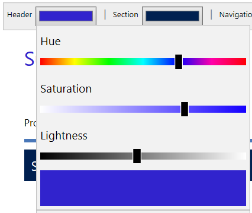  

7. Select **Save**.

**Voice of the Customer app**

Voice of the Customer app provides a WYSIWYG theme designer. This allows you to see how a survey will look when the theme is applied to it. In addition to modifying theme colors, you can also modify the font type, font size, and font color of the elements in the survey.

1. [Open Voice of the Customer app](install-solution.md#open-voice-of-the-customer-app).

2. Go to **Voice of the Customer** > **Themes**.

3. To create a new theme, select **New**.

4. To edit an existing theme, select the theme name.

5. Enter the name of the theme.

6. Adjust the theme color and font properties from the **Properties** pane on the right side of the screen.

    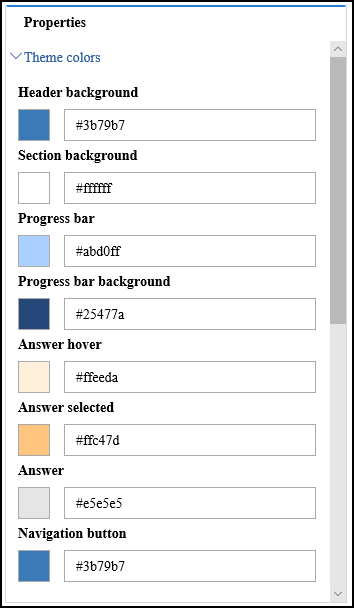

    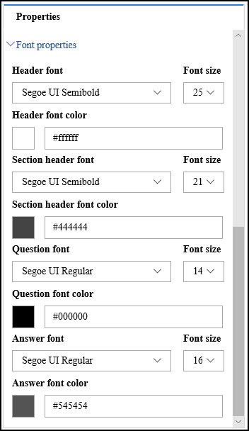 

    > [!NOTE]
    > When you upgrade Voice of the Customer to version 9.0.1162 and higher, there might be changes to the survey theme during the upgrade. You must preview a survey before publishing it.

7. Select **Save**.

## Upload image

You can upload images to Dynamics 365 and add them to your surveys later. After an image is uploaded, you can reuse it in multiple surveys.

> [!NOTE]
> The maximum size of an uploaded image can be 102.4 KB.

**Web client**

1. Sign in to the Voice of the Customer legacy web client.

2. Go to **Voice of the Customer** &gt; **Images**.

3. Select **New**.

4. Under **General**, enter values in the **Name**, **Image Title**, and **Alternative Text** fields.

5. Select **Save** to save the record so you can upload an image and add other information.

6. Under **Custom Icon**, in the **Upload your image to remote server** field, select **Choose File**, and then select the image you want to upload.

7. Select **Submit**.

8. From the **Image Format** field, select the format of the image you uploaded to preview it. You can select from .gif, .jpg, and .png.

9. Select **Save** in the lower-right corner of the screen.

**Voice of the Customer app**

1. [Open Voice of the Customer app](install-solution.md#open-voice-of-the-customer-app).

2. Go to **Voice of the Customer** > **Images**.

3. Select **New**.

4. Under **General**, enter values in the **Name**, **Image Title**, and **Alternative Text** fields.

5. Select **Save** to save the record so you can upload an image.

6. Under **Custom Icon**, select **Edit** to browse and select an image. The image URL is displayed in the **Image URL** field.

7. Select the icon in the **Image URL** field to preview the image.

8. Select **Save** in the lower-right corner of the screen.

## Create or edit a survey

After creating a theme for your survey and uploading the images to Dynamics 365, you can start creating your Voice of the Customer survey.

1. Sign in to the Voice of the Customer legacy web client or [open Voice of the Customer app](install-solution.md#open-voice-of-the-customer-app).

2. Go to **Voice of the Customer** &gt; **Surveys**.

3. To create a new survey, select **New**.

4. To edit an existing survey, select the name of the survey.

5. Under **Summary**, enter the required information and then select **Save** to create the survey record so you can continue working on your survey.

6. Under **Survey Runtime**, specify the theme and logo image you want to use. Also, set the values for header and footer text, navigation, and other options.

7. Under **Invitations and Actions**, specify values for invitations, responses, and unsubscribe options.

8. Edit the items under **Advanced** and **Feedback** as necessary.  

9. Select **Save**.

> [!NOTE]
> In Voice of the Customer app, it is recommended that you review the changes in survey designer after making any logo or theme changes, as the survey designer provides WYSIWYG experience.

## Create and add survey questions

After your survey is created, you can start adding questions to it by using the survey designer. By default, following pages are available in the survey designer:

- **Welcome page**: Displays a welcome message to the respondent.

- **Question page**: Contains questions for the respondent.

- **Complete page**: Displays a thank-you message to the respondent.

You can add more pages as required by your survey.

### Add or edit a survey page

**Web client**

1. Sign in to the Voice of the Customer legacy web client.

2. Go to **Voice of the Customer** &gt; **Surveys**.

3. Select the name of the survey that you want to add a page to or edit.

4. From the **Survey** box, select **Designer**.

   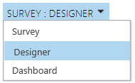

5. To add a new page, select **Add** at the lower-left side of the survey designer.

6. To edit a page, select the page on the left side of the survey designer, point to the page name, and select one of the editing buttons that appear to the right of the page name.

   > [!NOTE]
   > To edit an item on a page, point to the item and select one of the editing commands that appear to the right of the item. If you need help, point to an editing command to read its tooltip.

**Voice of the Customer app**

1. [Open Voice of the Customer app](install-solution.md#open-voice-of-the-customer-app).

2. Go to **Voice of the Customer** > **Surveys**.

3. Select the name of the survey for which you want to add or edit a page.

4. From the **Survey** box, select **Designer**.

    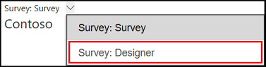

5. To add a new page, select **Add** from the page control toolbar at the bottom of the screen.

6. To edit a page, select the page from the page control toolbar at the bottom of the screen and modify the properties in the **Properties** pane on the right side of the screen.

7. To delete a page, select **Delete** beside the page name on the page control toolbar.

### Add questions to a survey

**Web client**

1. Sign in to the Voice of the Customer legacy web client.

2. Go to **Voice of the Customer** &gt; **Surveys**.

3. Select the name of the survey that you want to add questions to.

4. From the **Survey** box, select **Designer**.

     

5. Select the page that you want to add a question to.

6. To add a question, drag the type of question you want from the **Survey parts** pane to the location you want on the survey page. If you need help, point to a survey part to read the tooltip. [!INCLUDE[proc-more-information](../includes/proc-more-information.md)] [Decide the best question type](plan-survey.md#decide-the-question-type)  

7. To edit a question, point to the question, and then select **Edit**.

8. To add a new page or edit an existing page, see [Add or edit a page](#add-or-edit-a-survey-page).  

   > [!NOTE]
   > - Drag-and-drop editing only works with a mouse or other pointing device. It's not supported through devices with touch screens, like tablets.
   > - Do not copy and paste the question text from the question editor. You must copy and paste from [!INCLUDE[pn-notepad](../includes/pn-notepad.md)], and then format it by using the question editor.

9. To personalize your survey with fields like the customer's name or service case number, use piped data. [!INCLUDE[proc-more-information](../includes/proc-more-information.md)] [Personalize a survey](#personalize-a-survey)  

10. To take different actions based on a customer's response in the survey, like showing additional questions or sending a contact request to someone within your organization, use response routing. [!INCLUDE[proc-more-information](../includes/proc-more-information.md)] [Design interactive surveys by using response routing](design-advanced-survey.md#design-interactive-surveys-by-using-response-routing)  

11. To save your work, select **Save** in the lower-right corner of the screen. 

**Voice of the Customer app**

1. [Open Voice of the Customer app](install-solution.md#open-voice-of-the-customer-app).

2. Go to **Voice of the Customer** > **Surveys**.

3. Select the name of the survey for which you want to add or edit a page.

4. From the **Survey** box, select **Designer**.

   

5. Select the page on which you want to add a question.

6. To add a question, drag the type of question you want from the **Questions** pane to the location you want on the survey page. [!INCLUDE[proc-more-information](../includes/proc-more-information.md)] [Decide the best question type](plan-survey.md#decide-the-question-type)  

7. To edit a question, click the question, and modify the properties in the **Properties** pane.

8. To add a new page or edit an existing page, see [Add or edit a page](#add-or-edit-a-survey-page).

   > [!NOTE]
   > Do not copy and paste the question text from the question editor. You must copy and paste from [!INCLUDE[pn-notepad](../includes/pn-notepad.md)], and then format it by using the question editor.

9. To personalize your survey with fields like the customer's name or service case number, use piped data. [!INCLUDE[proc-more-information](../includes/proc-more-information.md)] [Personalize a survey](#personalize-a-survey)  

10. To take different actions based on a customer's response in the survey, like showing additional questions or sending a contact request to someone within your organization, use response routing. [!INCLUDE[proc-more-information](../includes/proc-more-information.md)] [Design interactive surveys by using response routing](design-advanced-survey.md#design-interactive-surveys-by-using-response-routing) 

11. To save your work, select **Save** in the lower-right corner of the screen. 

### Import a section into a page

You can import a section (along with its questions) from another survey into your survey. In this way, you can reuse existing questions without having to re-create them. You can drag the section to a new position on the page.

1. Sign in to the Voice of the Customer legacy web client.

2. Go to **Voice of the Customer** &gt; **Surveys**.

3. Select the name of the survey that you want to import a section into.

4. From the **Survey** box, select **Designer**.

5. Edit the page that you want to import the section into.

6. In the **Section To Copy And Import** field, browse to the section to be imported.

7. From the **Automatically Link Questions** list, choose whether to link the questions.

   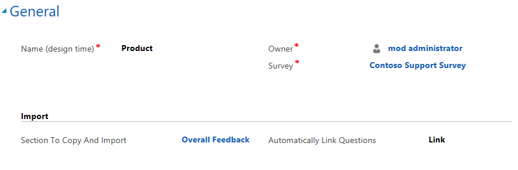  

8. Select **Save** in the lower-right corner of the screen. The section is imported, and **- Imported** is appended to the section name.

   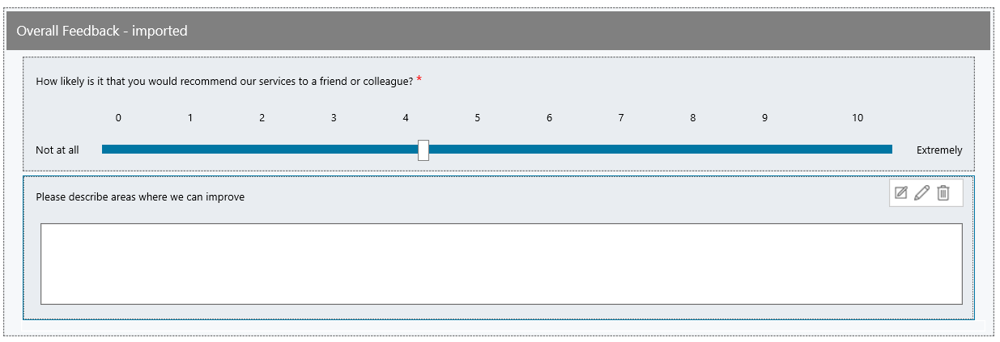

### Share questions between surveys by using linked questions

You can easily share questions between surveys for reporting purposes by using linked questions. For example, you might have a common question about customer satisfaction that you ask all respondents at the end of each survey and you want to report on that question from all surveys. Another example where linking questions is recommended is for multilingual surveys; you might have cloned the survey for five different languages but want to report on the results across all languages. Linked questions are also used by response routing rules to create actions from a survey response.

To create a linked question:

**Web client**

1. Sign in to the Voice of the Customer legacy web client.

2. Go to **Voice of the Customer** &gt; **Surveys**.

3. Select the name of the survey that you want to create a linked question in.

4. From the **Survey** box, select **Designer**.

5. Edit the question you want to link.

6. From the **Create Linked Question** list, select **Link**.

7. From the **Linked Question** field, browse to and select the question to be linked.

   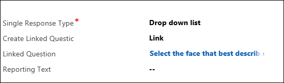  

8. Select **Save** in the lower-right corner of the screen.

**Voice of the Customer app**

1. [Open Voice of the Customer app](install-solution.md#open-voice-of-the-customer-app).

2. Go to **Voice of the Customer** > **Surveys**.

3. Select the name of the survey in which you want to create a linked question.

4. From the **Survey** box, select **Designer**.

5. Select the question you want to link.

6. In the **Properties** pane, select **Link** from the **Create linked question** list.

7. From the **Linked Question** field, browse to and select the question to be linked.

8. Select **Save** in the lower-right corner of the screen.

## Personalize a survey

Use placeholders to automatically insert Dynamics 365 information into your survey. Piped data is used as placeholders to include personalized Dynamics 365 data in your survey. For example, you can use piped data to automatically insert a customer's first name into the text on your survey's Welcome screen.

You can add the following data as placeholders:

-   User data (for example, a customer service representative's name)

-   Customer name

-   Service name

-   Product name

-   Date and time

-   Location

> [!NOTE]
> - Piped data can be used in personalizing survey invitations. [!INCLUDE[proc-more-information](../includes/proc-more-information.md)] [Personalize survey invitations](distribute-survey.md#personalize-survey-invitations)  
> - Don't use piped data if you plan to distribute a survey anonymously. Piped data will not be replaced with actual Dynamics 365 data in an anonymous survey.
> - Piped data placeholders are replaced with the values specified in appropriate fields in a survey activity or invitation, or survey email.

### Insert personalized data in a survey

**Web client**

1. Sign in to the Voice of the Customer legacy web client.

2. Go to **Voice of the Customer** &gt; **Surveys**.

3. Select the name of the survey that you want to add piped data to.

4. From the **Survey** box, select **Designer**.

5. Select **Edit** on the question or element that you want to add piped data to.

6. Place the cursor at the location where you want to add the piped data field.

7. From the **(Pipe)** list, select the field you want to add. For example, if you want to display the customer's name, select **Customer**. The **\_CUSTOMER\_PIPED\_DATA\_** field is inserted at the cursor location.

   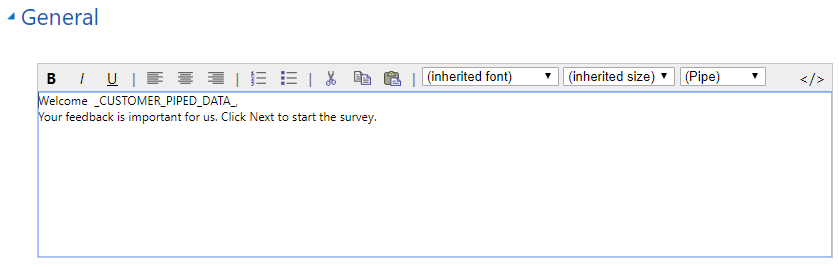  

   For example, the line:

   Thank you, \_CUSTOMER\_PIPED\_DATA\_! Your feedback will help us improve the service we deliver to you.

   will look like this when a customer named Marie takes your survey:

   *Thank you, Marie! Your feedback will help us improve the service we deliver to you.*

8. Select **Save** in the lower-right corner of the screen.

**Voice of the Customer app**

1. [Open Voice of the Customer app](install-solution.md#open-voice-of-the-customer-app).

2. Go to **Voice of the Customer** > **Surveys**.

3. Select the name of the survey to which you want to add piped data.

4. From the **Survey** box, select **Designer**. 

5. Select the question text to which you want to add piped data. The formatting toolbar appears.

6. Place the cursor at the location where you want to add the piped data field.

7. From the **(Pipe)** list in the formatting toolbar, select the field you want to add. For example, if you want to display the customer's name, select **Customer**. The **\_CUSTOMER\_PIPED\_DATA\_** field is inserted at the cursor location.

      

    For example, the line:

    Thank you, \_CUSTOMER\_PIPED\_DATA\_! Your feedback will help us improve the service we deliver to you.

    will look like this when a customer named Marie takes your survey:

    *Thank you, Marie! Your feedback will help us improve the service we deliver to you.*

8.  Select **Save** in the lower-right corner of the screen.

## Preview, publish, and test the survey

After you have created and edited a survey, you can preview, publish, and test the survey before distributing it to the respondents.

The **Preview**, **Publish**, and **Test** commands are available on the toolbar at the top of the screen.

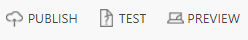  

-   To preview a survey, select **Preview**. We recommend that you preview the survey before publishing it to catch and rectify any missing information.

-   To publish a survey to the cloud, select **Publish**. After publishing a survey, you can distribute it to respondents.

-   To step through your survey as it will look to respondents, select **Test**. You can't test a survey until after you publish it.

For example, if you add two questions to a published survey, preview it first to see if the survey is working. After previewing the survey, you publish it to the cloud and then you can test the survey to see how it will look to respondents. If you test the survey before you publish it, you will not see your recent changes.

> [!NOTE]
> Survey responses are not stored in Dynamics 365 when you preview or test a survey.

## Clone or import an existing survey

You can reuse existing questions and sections to avoid creating the same questions multiple times for different surveys.

-   If you want to reuse only a section from another survey in your survey, you can [import the section](#import-a-section-into-a-page).  

-   If you want to create a survey exactly like another survey with some minor changes, you can clone a survey.

-   If you want to move a survey from one environment to another, you can import the survey.

> [!NOTE]
> Importing or cloning a survey more than 1 MB is not supported.

### Clone a survey

Cloning a survey means creating an exact duplicate survey where only the name is different. The new survey is created with an integer appended to the survey name. The cloned survey will be in Draft status. The questions are separate from the first survey, and any changes to one survey are not reflected in the other survey.

> [!NOTE]
> To clone a survey, it must be in Published status. You cannot clone a survey that is in Draft status.

1. Sign in to the Voice of the Customer legacy web client or [open Voice of the Customer app](install-solution.md#open-voice-of-the-customer-app).

2. Go to **Voice of the Customer** &gt; **Surveys**.

3. Select the name of the survey you want to clone.

4. Select **Clone** on the toolbar.

### Import a survey

You can create a survey in one environment, test it, and then move it to the production environment.

**Web client**

1. Sign in to the Voice of the Customer legacy web client.

2. Go to **Voice of the Customer** &gt; **Surveys**.

3. Select the name of the survey you want to move to another environment.

4. Select the survey XML file under the **Notes** section and save it to the location you want.

   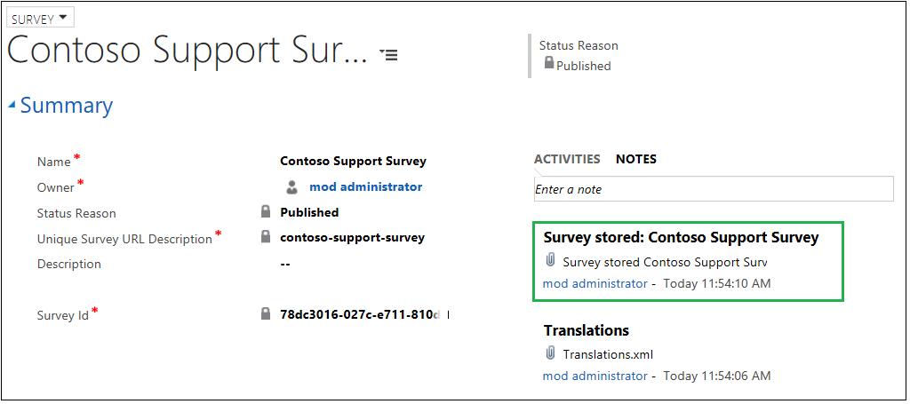  

5. Sign in to the Dynamics 365 environment to which you want to move the survey.

6. Go to **Settings** &gt; **Voice of the Customer Imports**.

7. Select **New**.

8. Enter information in the **General** area. If you need help, point to any field to read the tooltip.

9. To overwrite the existing survey, select **Yes** from the **Overwrite Survey** field. If you select **No**, a copy of the survey is created.

10. In the **Survey Xml To Import** field, paste the survey XML.

11. Select **Save** in the lower-right corner of the screen. The survey is imported and available at **Voice of the Customer** &gt; **Surveys**.

**Voice of the Customer app**

1. [Open Voice of the Customer app](install-solution.md#open-voice-of-the-customer-app).

2. Go to **Voice of the Customer** &gt; **Surveys**.

3. Select the name of the survey you want to move to another environment.

4. Select the survey XML file under the **Notes** section and save it to the location you want.

    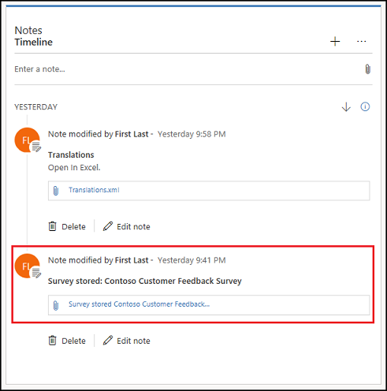

5. Sign in to the Dynamics 365 environment to which you want to move the survey.

6. Go to **Settings** &gt; **Imports**.

7. Select **New**.

8. Under **General**, enter the required information.

9. To overwrite the existing survey, select **Yes** from the **Overwrite Survey** field. If you select **No**, a copy of the survey is created.

10. In the **Survey Xml To Import** field, paste the survey XML.

11. Select **Save** in the lower-right corner of the screen. The survey is imported and available at **Voice of the Customer** &gt; **Surveys**.

## Translate a survey

After creating a survey, you can translate it into other languages as required by your respondents.

1. Sign in to the Voice of the Customer legacy web client or [open Voice of the Customer app](install-solution.md#open-voice-of-the-customer-app).

2. Go to **Voice of the Customer** &gt; **Surveys**.

3. Select the name of the survey you want to translate.

4. Select the Translations.xml file in the **Notes** section, and then save it to the location you want.

   **Web client**

   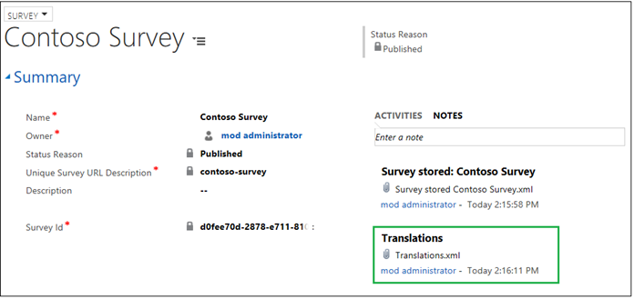

   **Voice of the Customer app**

   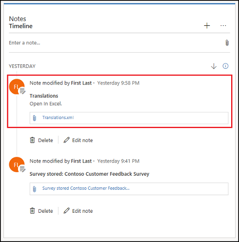

   > [!NOTE]
   > If the Translations.xml file is not available, select **Export translations** on the toolbar at the top of the screen to generate the file.

5. Open the file in [!INCLUDE[pn-excel-short](../includes/pn-excel-short.md)], and then go to the **Translations** tab.

6. Add a column to the right of the base language (for example, **en** for English), and specify the locale for the language in the column heading (for example, **es** for Spanish). You can also specify a locale in the heading (for example, **en-uk** for English in the United Kingdom). Add columns for each language or locale you need.

   > [!NOTE]
   > - You must only use the language codes supported by Dynamics 365 for the system-provided strings to be translated into, otherwise they will be displayed in the base language.
   > - You must be sure to mention specific locales where multiple dialects are supported.

7. Add translations to each language or locale column. You can retrieve translations from [[!INCLUDE[pn-bing](../includes/pn-bing.md)] translations](https://www.bing.com/translator/). If your text strings have HTML in them, you'll need to encode them. For example, you need to encode:  

   &lt;b&gt;Hello!&lt;/b&gt;

   as:

   &lt;b&gt;Hello!&lt;/b&gt;

   You can use any HTML encoder.

8. After completing your translations, save the file, go back to Dynamics 365, and then delete the Translations.xml file by selecting the delete icon next to the file.

   > [!NOTE]
   > - In web client, point to the file name, and then select **Delete**.
   > - In Voice of the Customer app, select **Delete**.
   > - If you accidentally delete the Translations.xml file, select **Export translations** on the survey page to generate the file.
   > - For every language added in the Translations.xml file, remember to provide a translation for each string in that language while editing it in [!INCLUDE[pn-excel-short](../includes/pn-excel-short.md)].

9. Select **Attach**, browse to your new Translations.xml file, and then select **Done**.

> [!NOTE]
> - A survey can be translated into multiple languages if the translations file consists of the translations with the correct country codes in each column.
> - If you add or change a question after adding your edited translations file, you need to add the translation for that question. To get an updated version of the translation file, select **Export translations** on the survey page and repeat the steps to add your new translations.
> - We recommend that you preview the survey with the latest translation file to detect any translation errors.
> - Dynamics 365 automatically detects the language at runtime based on the respondent's browser preferences. If no translation exists for that language, the survey will use the base language strings instead. Users can change the language of the survey by selecting the language they want from the drop-down list.
> - When you preview or publish a survey, the translation file is validated for missing string translations and incorrect HTML format. The appropriate error message is displayed with a link to download the log file to view details.

## Close or stop a survey

You can close a survey on a designated date by specifying the **Close Date** while creating or editing the survey.

If you want to stop the survey immediately, select **Stop** on the toolbar.

We recommend that when you create a survey you specify a redirect URL to display to users when the survey is closed, stopped, or an error has occurred.

## Delete a survey

You can delete a survey if it is not required anymore. When a survey is deleted, all its dependent entities are also deleted.

To delete a survey:
1. Sign in to the Voice of the Customer legacy web client or [open Voice of the Customer app](install-solution.md#open-voice-of-the-customer-app).

2. Go to **Voice of the Customer** > **Surveys**.

3. Select or open the survey you want to delete.

4. Select **Delete** from the toolbar at the top of the screen.

> [!Note]
> The associated survey responses must be deleted before deleting the survey.
> To delete survey responses:
> 1. Sign in to the Voice of the Customer legacy web client.
> 2. Go to **Voice of the Customer** > **Surveys**.
> 3. Select the name of the survey for which you want to delete survey responses.
> 4. Select the down arrow next to your survey name at the top of the screen, and then select **Survey Responses**.
> 5. Select all the survey responses and select **Delete Survey Response** from the toolbar.

### See also
[Plan a survey](plan-survey.md)   
[Design an advanced survey](design-advanced-survey.md)   
[Distribute a survey](distribute-survey.md)   
[Analyze survey data](analyze-survey-data.md)
