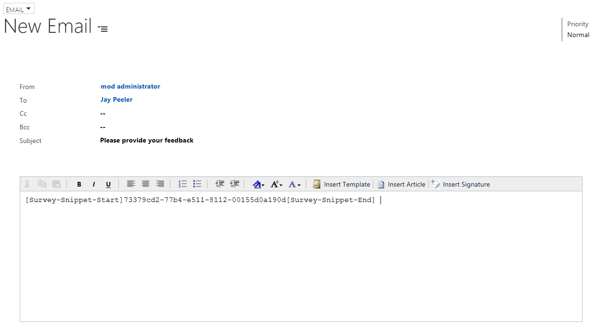
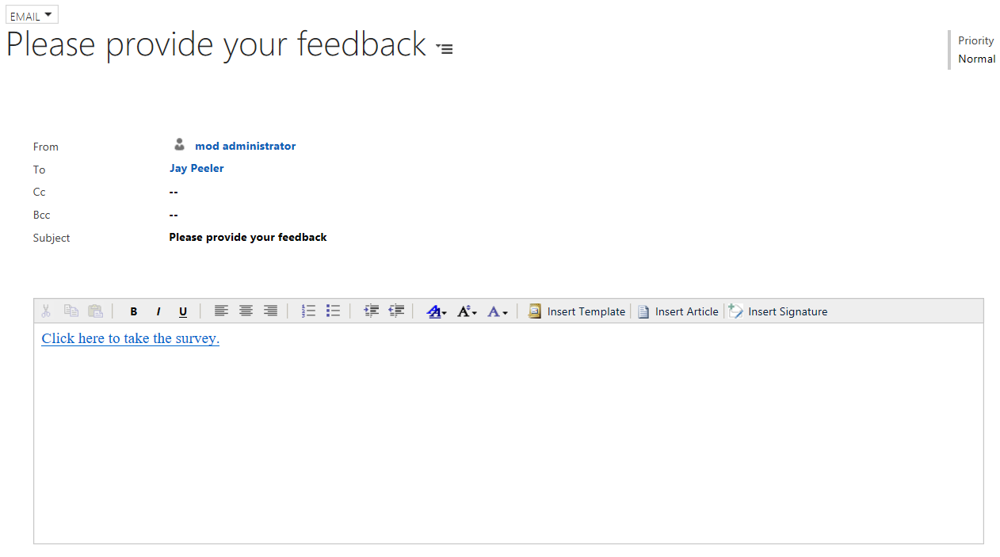
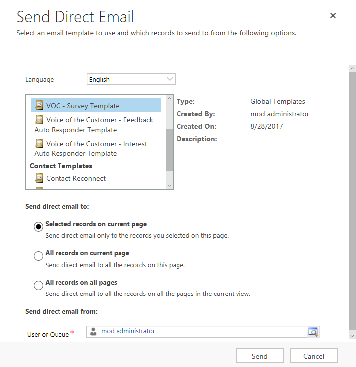
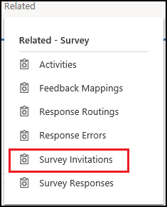
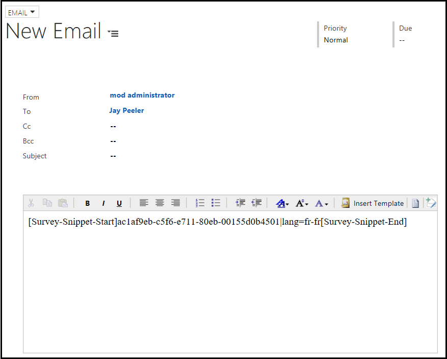
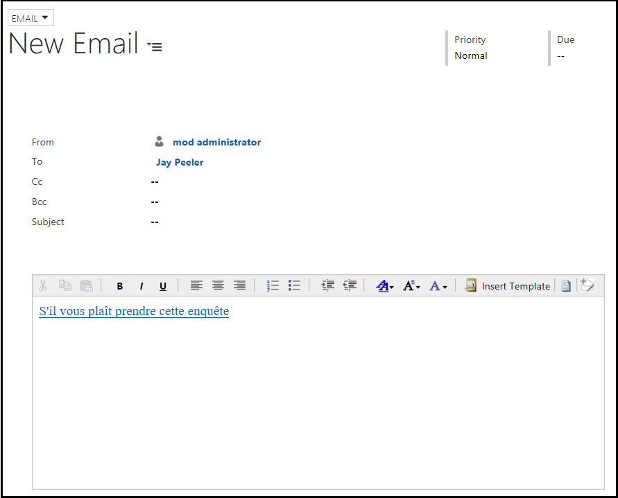
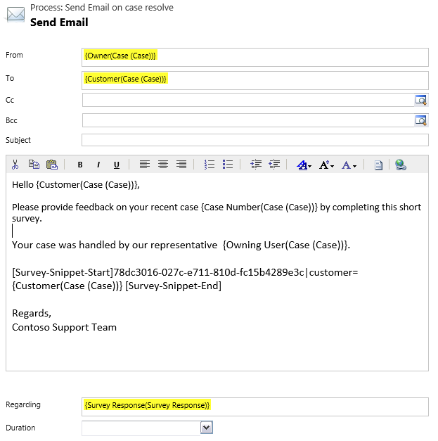
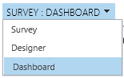
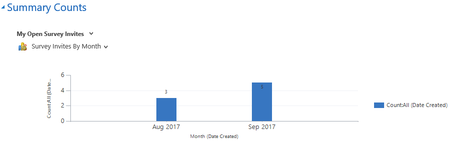

# Distribute a survey

> [!IMPORTANT]
> Voice of the Customer (VoC) is being deprecated and replaced with Microsoft Forms Pro. [Learn more](https://go.microsoft.com/fwlink/p/?linkid=2097704)

After your survey is ready, you can distribute the survey and invite respondents to take part in it. You can distribute surveys in one of two ways:

- **Anonymous**: For these surveys, Dynamics 365 doesn't know who the respondents are. You can distribute a link to the survey using email, the social sites [!INCLUDE[tn-twitter](../includes/tn-twitter.md)] or [!INCLUDE[tn-facebook](../includes/tn-facebook.md)], or other webpages. These types of surveys are best suited for lead creation or information-gathering where the identity of the respondent is not important.

- **Non-anonymous**: You send survey invitation links to specific contacts, accounts, or leads in Dynamics 365. You can personalize the invitation links using the customer name, product name, agent name, and so on.

## Distribute a survey to anonymous respondents

If you configure your survey to allow anonymous respondents, you can copy the survey URL and paste it from the survey to the medium you want to use to send it. You can send it in email, post it on social media sites like [!INCLUDE[tn-twitter](../includes/tn-twitter.md)] or [!INCLUDE[tn-facebook](../includes/tn-facebook.md)], or publish it on your website.

1. Sign in to the Voice of the Customer legacy web client or [open Voice of the Customer app](install-solution.md#open-voice-of-the-customer-app).

2. Go to **Voice of the Customer** &gt; **Surveys**.

3. Select the name of the survey that you want to receive anonymous responses to.

4. Under **Summary**, select **Yes** for the **Anonymous Responses** field.

   > [!NOTE]
   > If you select **No** for the **Anonymous Responses** field and send the link to a customer, the survey will not be rendered.

5. Under **Invitations and Actions**, copy the link from the **Anonymous Link** field and send it to your respondents.

6. To embed the survey in an iframe on your website, select the **Run in IFrame** check box. The **IFrame URL** field is displayed with the HTML code.

7. Copy the HTML code from the **IFrame URL** field and paste it on your website.

8. Save the changes.

Dynamics 365 doesn't associate responses with a customer record in Dynamics 365. If you want to create a lead from an anonymous response, set **Create Lead For Anonymous Responses** to **Yes**. [!INCLUDE[proc-more-information](../includes/proc-more-information.md)] [Create a lead from a survey response](design-advanced-survey.md#create-a-lead-from-a-survey-response)  

## Distribute a survey to non-anonymous respondents

For non-anonymous surveys, the link you send to respondents is specific and unique for each customer. Dynamics 365 generates the URLs for you to use when you create a survey invitation or embed the survey snippet in an email.

1. Sign in to the Voice of the Customer legacy web client or [open Voice of the Customer app](install-solution.md#open-voice-of-the-customer-app).

2. Go to **Voice of the Customer** &gt; **Surveys**.

3. Select the name of the survey for which you want to receive non-anonymous responses.

4. Under **Invitations and Actions**, copy the value from the **Email Snippet** field and send it to your respondents through Dynamics 365 email.

   > [!NOTE]
   > You can also select **Copy Snippet** on the toolbar to copy the email snippet.

5. Under **Invitations and Actions**, enter a value in the **Invitation Link Text** field. The value entered in this field is displayed as a link to the respondent when they take the survey.

6. Save the changes.

> [!NOTE]
> - If the **Restrict Multiple Completions** field is set to **Yes** when you create the survey, the respondent can't take the survey again.
> - You can translate the invitation link text to a different locale. More information: [Translate survey invitation link text](#translate-survey-invitation-link-text)

For example: You create an email and paste the survey snippet in the email body.

  

When you save the email, the snippet changes to the invitation link text you specified.

  

### Send an invitation using an email template

You can [create an email template](https://docs.microsoft.com/dynamics365/customer-engagement/admin/create-templates-email) with the survey snippet and use it to send emails to [!INCLUDE[pn-dynamics-crm](../includes/pn-dynamics-crm.md)] contacts.  

You can [send direct email](https://docs.microsoft.com/dynamics365/customer-engagement/basics/send-bulk-email-customers) to a contact in [!INCLUDE[pn-dynamics-crm](../includes/pn-dynamics-crm.md)] by selecting the survey email template from the email template list.  

  

> [!NOTE]
> You can add multiple survey snippets to an email and send them your respondents.

You can also select an email template when you create an email in Dynamics 365:

1.  Select **Insert Template** from the toolbar.

2.  Select the email template.

3.  Select **Select**. The email body and subject are populated as specified in the template.

### Create a survey invitation or survey activity

You can create a survey activity or survey invitation to create personalized invitation links that are distributed by using a non&ndash;Dynamics 365 email program. These personalized invitation links have the following advantages:

-   You can add piped data to the survey.

-   You can provide additional information to be associated with the survey invitation. This can be achieved through setting:

    -   The **Regarding** field.

    -   Any out-of-the-box fields on the survey activity, such as **Stage** or **Reminder**.

    -   Any additional custom fields to the entity.

-   The activity is not an email activity&mdash;for example, it might be a telephone survey.

To create a survey invitation or survey activity:

**Web client**

1. Sign in to the Voice of the Customer legacy web client.

2. Go to **Voice of the Customer** &gt; **Surveys**.

3. Select the name of the survey that you want to create a survey invitation or survey activity for.

4. Select the down arrow next to your survey name at the top of the screen, and then select **Survey Invitations**.

5. Select **Add New Survey Activity**.

6. Enter the required information in the **General** and **Advanced** sections. If you need help, point to any field to read the tooltips.

   > [!NOTE]
   >  If you have used piped data in the survey, ensure that the data is entered in the appropriate piped data field in the **Advanced** section.

7. Select **Save**. The invitation link is displayed in the **Invitation Link** field.

8. Copy the link and share it by using a third-party email provider.

**Voice of the Customer app**

1. [Open Voice of the Customer app](install-solution.md#open-voice-of-the-customer-app).

2. Go to **Voice of the Customer** > **Surveys**.

3. Select the name of the survey for which you want to create a survey invitation or survey activity.

4. Under **Related**, select **Survey Invitations**.

      

5. Select **Add New Survey Activity**.

6. Under **General** and **Advanced**, enter the required information.

    > [!NOTE]
    > If you have used piped data in the survey, ensure that the data is entered in the appropriate piped data field under **Advanced**.

7. Select **Save**. The invitation link is displayed in the **Invitation Link** field.

8. Copy the link and share it by using a third-party email provider.

> [!NOTE]
> If you send email by using Dynamics 365, a survey activity is created automatically for the respondent.

## Personalize survey invitations

If you want to personalize your survey invitation in a Dynamics 365 email, make sure your survey snippet contains piped data, and then add a vertical bar (|) (also called a pipe), plus the parameters after the GUID, in your email invitation. The syntax to insert piped data in a survey snippet is:

> \[Survey-Snippet-Start\]\[ID\]|\[PIPE\_NAME\]=\[PIPE\_VALUE\]\[Survey-Snippet-End\]

The available piped data names are:

- user
- customer
- product
- service
- datetime
- location
- other1
- other2
- lang

For example, this survey snippet contains piped data for Customer, User, and Other\_1 (used for the case number):

> Thank you, \_CUSTOMER\_PIPED\_DATA\_! Your feedback will help us improve the service we deliver to you. Please take the time to answer a few questions regarding case number OTHER\_1\_PIPED\_DATA\_ and Customer Service Representative USER\_PIPED\_DATA\_.

In the email invitation, add the piped data field, followed by an equal sign (=) and the value. You can add multiple parameters, separated by a pipe (|). Using the survey snippet example above, the following line in an email invitation:

> \[Survey-Snippet-Start\]bd3b2cc6-3597-e511-80bd-00155db50802|customer=Marie|other\_1=298724|user=Nancy\[Survey-Snippet-End\]

would look like this to the customer:

> Thank you, Marie! Your feedback will help us improve the service we deliver to you. Please take the time to answer a few questions regarding case number 298724 and Customer Service Representative Nancy.

### Translate survey invitation link text

You can translate the survey invitation link text to a different locale by using the **lang** pipe. This allows you to personalize the invitation link text as per the respondent's locale.

For example: You create an email and paste the survey snippet along with the **lang** pipe in the email body. In this example, French locale is specified in the pipe.

When you save the email, the snippet changes to the invitation link text in the language you specified.

> [!NOTE]
> - If the **lang** pipe is not specified, the invitation link text is displayed in the default language.
> - If the translation is not available for the language code specified in the **lang** pipe, an error message is displayed.

## Automatically send survey invitations

You can create a survey invitation from a workflow to gather feedback after an event in the customer journey. For example, you can send a satisfaction survey after a case is closed to gather feedback.

You can create a workflow to send email, as shown in the following image. You can paste the survey snippet in the email body to generate a specific URL invitation. You can also insert piped data to personalize the invitation for the respondent.

  

## Track survey invitations

You can use the survey dashboard to track surveys you have sent to your respondents. Use the dashboard to select a combination of views and charts to see the results you're interested in. You can also create your personal, customized view to see the results.

1. Sign in to the Voice of the Customer legacy web client.

2. Go to **Voice of the Customer** &gt; **Surveys**.

3. Select the name of the survey you want to track.

4. From the **Survey** box, select **Dashboard**.

     

5. Select a view and chart from the view list and chart list, respectively&mdash;for example, **My Open Survey Invites** as the view and **Survey Invites By Month** as the chart. The corresponding chart is displayed.

     

### See also
[Plan a survey](plan-survey.md)   
[Design a basic survey](design-basic-survey.md)   
[Design an advanced survey](design-advanced-survey.md)   
[Analyze survey data](analyze-survey-data.md)  
