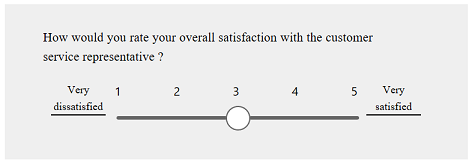
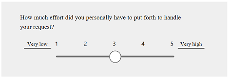
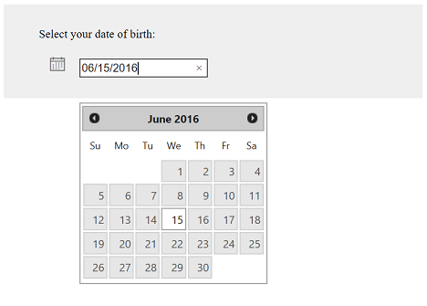
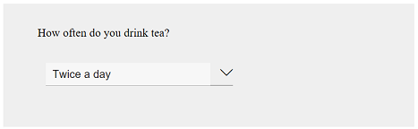
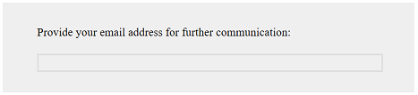
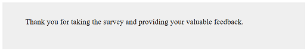
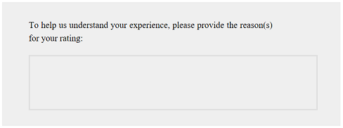
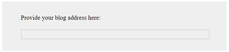

# Plan a survey

> [!IMPORTANT]
> Voice of the Customer (VoC) is being deprecated and replaced with Microsoft Forms Pro. [Learn more](https://go.microsoft.com/fwlink/p/?linkid=2097704)

It's important to have a plan for configuring your Voice of the Customer surveys. Here are a few things to think about to help you design the right questions for your survey:

-   What's the purpose of your survey? For example, you might want to interact with your customers, promote new products or services, or measure customer satisfaction. If your goal is to measure something, what and how do you want to measure it?

-   How long do you want the survey to be? Keep in mind that longer surveys tend to have higher abandon rates. A good rule of thumb is to keep surveys shorter than five minutes, or no longer than 10 questions (depending on the type of question you ask).

-   How many mandatory questions are to be included in the survey? We recommend that you ask as few mandatory questions as possible.

-   Can you reuse all or part of an existing survey?

-   Do you want to analyze results from multiple surveys at once? You can do this by linking questions across surveys.

-   How do you want to distribute your survey? For example, you can create an anonymous link for a lead creation survey and broadcast it, or you can send personalized links for case closure surveys to your customers.

-   How do you want to send invitations to your survey? For example, you might want to email them or post an invitation on your website.

-   In addition, consider these recommendations to help you improve survey response rates:

    -   Send the survey with a named contact from your organization, preferably one who your respondents know.

    -   Add an image of this contact to the survey.

## Best practices to create a survey

A few best practices will enable you to create a meaningful survey and gather good responses from your customers. You can then analyze those responses and act on them as best suits your organization. A few of the best practices for designing a survey are:

- **Define an objective**: Having an objective allows you to properly plan for your survey. This also allows you to identify what results you expect from your customers. You must know how you will use the responses to help you pick the right questions for your survey.

- **Keep the survey short**: If you create a survey that takes a long time to complete, you might reduce your response rate.
- **Create a logical flow of questions**: Ensure that your survey has a logical flow of questions to keep the respondents interested in the survey.

- **Organize the survey**: Group the related questions in a section and place the related sections on a single page.

- **Ask one question at a time**: Ensure that you ask only one question at a time to keep your audience focused. Avoid asking questions that are vague or don't communicate your intent. Keep the objective of your questions clear to your respondents. Avoid asking questions that are too narrow, such as "Do you like chocolate and ice cream?"

- **Preview and test the survey**: After creating your survey, always preview it to check the overall flow of the survey and to catch any mistakes. After publishing the survey, test it to ensure that respondents can find and open it easily.

- **Mention expectations in the survey invitation**: In the survey invitation, ensure that you mention the estimated time to complete it and give a brief overview. This will help respondents submit their input within the expected timeframe.

## Decide the question type

Deciding the question types while planning a survey helps you to create an organized survey and maintain a flow between the questions. The following table describes the Voice of the Customer for Dynamics 365 question types.

**Web client**

|   **Question type**   |                                                                  **[!INCLUDE[description](../includes/description.md)]**                                                                   |                                                                                                                                                                                                                                                                                                                 **Preview**                                                                                                                                                                                                                                                                                                                 |
|-----------------------|--------------------------------------------------------------------------------------------------------------------------------------------------------------------------------------------|---------------------------------------------------------------------------------------------------------------------------------------------------------------------------------------------------------------------------------------------------------------------------------------------------------------------------------------------------------------------------------------------------------------------------------------------------------------------------------------------------------------------------------------------------------------------------------------------------------------------------------------------|
|     Short answer      |                                                                            Question that has a one-line answer.                                                                            |                                                                                                                                                                                                                                                                                                                                                                                                                                                                                                                                      |
|      Long answer      |                                                       Question that has multiple lines in the answer, for example verbatim comments.                                                       |                                                                                                                                                                                                                                                                                                                                                                                                                                                                                                                                         |
|        Rating         |                                                  Question that asks a respondent to provide ratings by using stars, emoticons, or flags.                                                   |                                                                                                                                                                                                                                                                                                                                                                                                                                                                                                                                                        |
|    Single response    | Question that allows a respondent to choose only one answer.  **Note**: You can change the response type from the **Single Response Type** list while creating or editing the question. |       |
|   Multiple response   |                                                               Question that allows a respondent to choose multiple answers.                                                                |                                                                                                                                                                                                                       |
|         Date          |                                                                     Question that asks a respondent to select a date.                                                                      |                                                                                                                                                                                                                                                                                                                                                                                                                                                                                                                                                              |
|   Descriptive text    |                                                              Use to describe elements on the survey page, for example labels.                                                              |                                                                                                                                                                                                                                                                                                                                                                                                                                                                                                                                     |
|  Numerical response   |                                                                       Question that allows only numerical responses.                                                                       |                                                                                                                                                                                                                                                                                                                                                                                                                                                                                                                    |
|        Ranking        |                                                       Question that asks a respondent to rank answers in their order of preference.                                                        |                                                                                                                                                                                                                                                                                                                                                                                                                                                                                                                                                     |
|  Net Promoter Score   |                        Question that captures the satisfaction of the respondent based on the likelihood of their recommending the product or services to a friend.                        |                                                                                                                                                                                                                                                                                                                                                                                                                                                                                                                                   |
| Customer Effort Score |                               Question that captures the satisfaction of the respondent based on the effort spent on doing business, on a five-point scale.                                |                                                                                                                                                                                                                                                                                                                                                                                                                                                                                                                             |
|         CSAT          |                                    Question that captures the overall satisfaction of the respondent with the product or agent, on a five-point scale.                                     |                                                                                                                                                                                                                                                                                                                                                                                                                                                                                                                            |
|       Fixed sum       |                                          List of questions that ask a respondent to distribute ratings for the given criteria that add up to 100.                                          |                                                                                                                                                                                                                                                                                                                                                                                                                                                                                                                                               |
|      Upload file      |           Allow a respondent to upload a file.   Supported file types: .png, .jpg, .gif, .doc, .docx, .pdf, .xls, .xlsx, .zip, .txt, .ppt, .pptx   Maximum file size: 5 MB           |                                                                                                                                                                                                                                                                                                                                                                                                                                                                                                                                         |
|    Smilies rating     |                                               Question that asks a respondent to express their satisfaction by using emoticons ("smilies").                                                |                                                                                                                                                                                                                                                                                                                                                                                                                                                                                                                                |
|                       |                                                                                                                                                                                            |                                                                                                                                                                                                                                                                                                                                                                                                                                                                                                                                                                                                                                             |

The following table describes the question types to use when you need to address multiple questions that use the same option set.

|      **Question type**      |                   **[!INCLUDE[description](../includes/description.md)]**                    |                                                              **Preview**                                                               |
|-----------------------------|----------------------------------------------------------------------------------------------|----------------------------------------------------------------------------------------------------------------------------------------|
|       List of ratings       |      List of questions that ask a respondent to rate multiple items by using emoticons.      |                            |
|  Single rating in columns   |   List of questions that allow a respondent to select one answer from a column of choices.   |      |
| Multiple ratings in columns | List of questions that ask a respondent to select multiple answers from a column of choices. |  |
|                             |                                                                                              |                                                                                                                                        |

**Voice of the Customer app**

| **Question type** |                                                     **[!INCLUDE[description](../includes/description.md)]**                                                     |                                                 **Preview**                                                  |
|-------------------|-----------------------------------------------------------------------------------------------------------------------------------------------------------------|--------------------------------------------------------------------------------------------------------------|
|     Check box     |   Question that allows a respondent to choose multiple answers. **Note**: You can change the layout of the answer options from the **Option layout** list.   |                      |
|       CSAT        |                       Question that captures the overall satisfaction of the respondent with the product or agent, on a five-point scale.                       |  |
|  Customer effort  |                  Question that captures the satisfaction of the respondent based on the effort spent on doing business, on a five-point scale.                  |   |
|       Date        |                                                        Question that asks a respondent to select a date.                                                        |                                    |
|     Drop down     |                                          Question that allows a respondent to choose one answer from a drop-down list.                                          |           |
|       Email       |                                                     Question that asks a respondent to enter email address.                                                     |                               |
|       Label       |                                                Use to describe elements on the survey page; for example, labels.                                                |                                 |
|    Long answer    |                                         Question that has multiple lines in the answer; for example, verbatim comments.                                         |               |
|        NPS        |          Question that captures the satisfaction of the respondent based on the likelihood of their recommending the product or services to a friend.           |         |
|      Numeric      |                                                         Question that allows only numerical responses.                                                          |         |
|   Radio button    |   Question that allows a respondent to choose only one answer. **Note**: You can change the layout of the answer options from the **Option layout** list.    |            |
|   Short answer    |                                                              Question that has a one-line answer.                                                               |            |
|    Star rating    |                                     Question that asks a respondent to provide ratings by using stars, emoticons, or flags.                                     |                    |
|    Upload file    | Allow a respondent to upload a file. Supported file types: .png, .jpg, .gif, .doc, .docx, .pdf, .xls, .xlsx, .zip, .txt, .ppt, .pptx Maximum file size: 5 |               |
|      Website      |                                                     Question that asks a respondent to enter a website URL.                                                     |                           |

More information about how to add a question to your survey: [Create and add survey questions](design-basic-survey.md#create-and-add-survey-questions)  

> [!NOTE]
> Some of the question types are supported only in web client as of now. They will be added to the Voice of the Customer app in a future release. If you want to use any of those question types, you can continue to use them in web client.

## Available workflows in Voice of the Customer

Voice of the Customer provides the following workflows out-of-the-box.

|                 **Workflow name**                  | **Primary entity** |                   **[!INCLUDE[description](../includes/description.md)]**                   |
|----------------------------------------------------|--------------------|---------------------------------------------------------------------------------------------|
|            VoC - Close Survey Activity             |  Survey Activity   |                Close a survey activity when a closing response is received.                 |
|     VoC - Convert Response To Feedback Entity      |  Survey Response   |            Create a feedback entity record corresponding to the survey response.            |
| VoC - Convert Survey Response To Campaign Response |  Survey Response   |       Create a campaign response based on the survey invitation and survey response.        |
|                 VoC - Create Lead                  |  Survey Response   |                Create a lead corresponding to the anonymous survey response.                |
|            VoC - Process Face Response             |  Survey Response   | Process the survey response and classify the respondent as promoter, detractor, or neutral. |
|             VoC - Process NPS Response             |  Survey Response   | Process the survey response and classify the respondent as promoter, detractor, or neutral. |
|           VoC - Process Survey Response            |  Survey Response   |                      Trigger a workflow based on the survey response.                       |
|            VoC - Unsubscribe respondent            |  Survey Response   |    Unsubscribe the respondent from a channel (for example, email) based on the response.    |
|                                                    |                    |                                                                                             |

You can also create a workflow that sends a survey to a customer, asking for the feedback as soon as a case is closed. More information about creating a new workflow in [!INCLUDE[pn-dynamics-crm](../includes/pn-dynamics-crm.md)]: [Create custom business logic through processes](https://docs.microsoft.com/dynamics365/customer-engagement/customize/guide-staff-through-common-tasks-processes) 

### See also
[Design a basic survey](design-basic-survey.md)   
[Design an advanced survey](design-advanced-survey.md)   
[Distribute a survey](distribute-survey.md)   
[Analyze survey data](analyze-survey-data.md)
