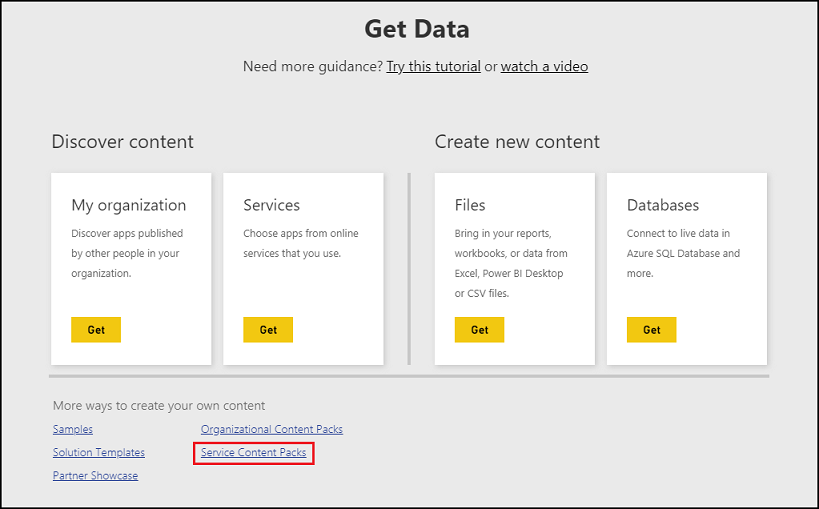
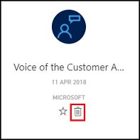
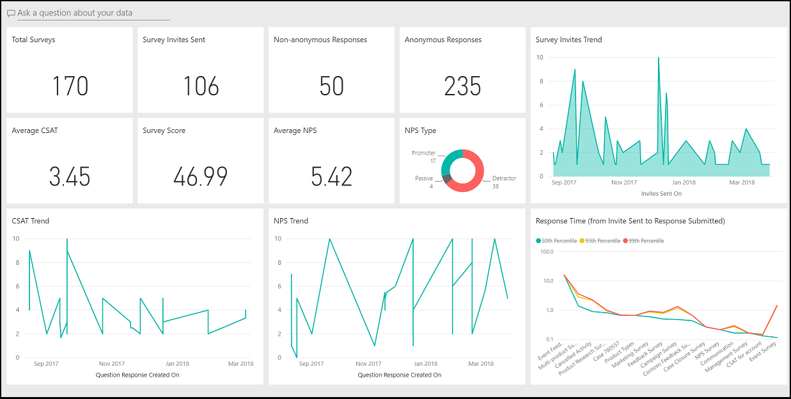
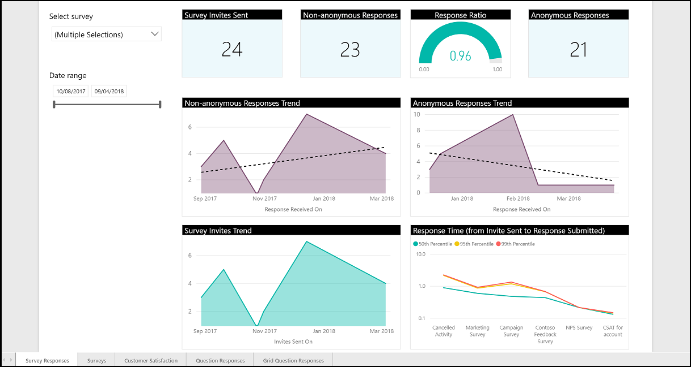
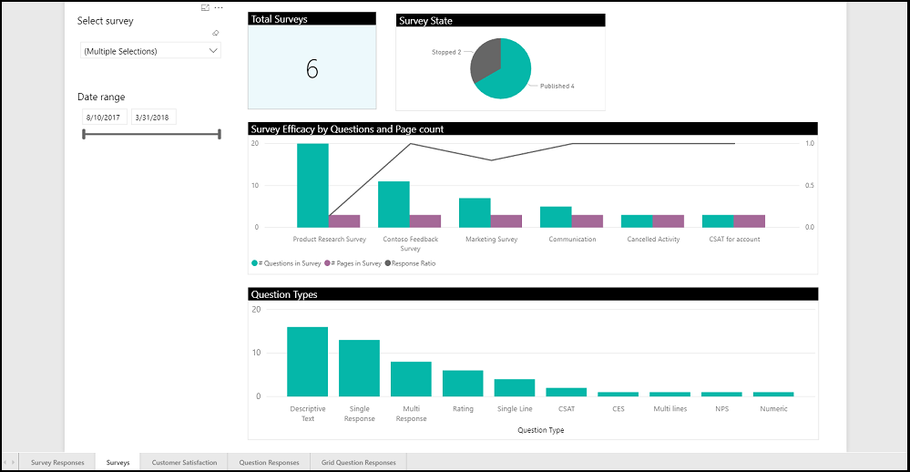
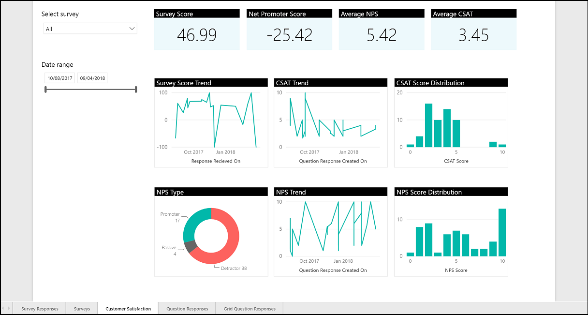
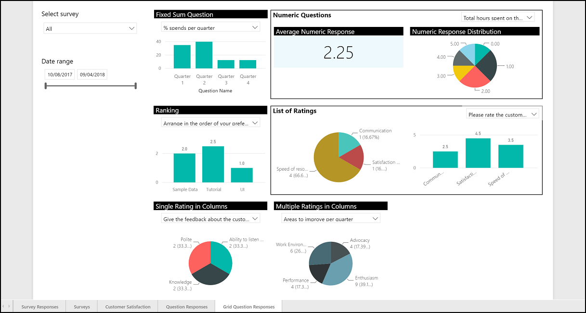

# Survey analytics using Power BI

> [!IMPORTANT]
> Voice of the Customer (VoC) is being deprecated and replaced with Microsoft Forms Pro. [Learn more](https://go.microsoft.com/fwlink/p/?linkid=2097704)

Using the Voice of the Customer Analytics for [!INCLUDE[pn-dynamics-365](../includes/pn-dynamics-365.md)] app or service content pack for Power BI, you can connect to your Voice of the Customer for Dynamics 365 instance and get insights about the surveys and their responses. As a Survey Administrator or Survey Designer, you can track metrics—such as average Net Promoter Score (NPS), average customer satisfaction (CSAT) score, and response ratio—and get visibility into the surveys. You can use the dashboard and report to explore and analyze the survey data as you need.

## Install and configure Voice of the Customer Analytics for Dynamics 365

You can install Voice of the Customer Analytics for [!INCLUDE[pn-dynamics-365](../includes/pn-dynamics-365.md)] as an app or a service content pack. 

If you install it as an app:
- You can view data only from your connected Voice of the Customer instance. 
- The app is not automatically upgraded. You have to install the new version when it is available. The installation will create a new copy of the app instead of overwriting the existing one. Both copies of the app will be available under Apps section and can be distinguished by the date of installation.

If you install it as a service content pack:
- It's installed in the selected workspace. 
- You can edit the data to comply with your requirements. 
- The service content pack isn't automatically upgraded—when a newer version of the service content pack is available, you must install it again. The new version will introduce copies of the dashboard, report, and dataset and won’t modify the already installed ones.

After you install Voice of the Customer Analytics for [!INCLUDE[pn-dynamics-365](../includes/pn-dynamics-365.md)] as a service content pack, you can also customize it to comply with your requirements and publish it as a service content pack or an app. You can also share the customized service content pack with other people in your organization. More information: [Create and publish apps](https://docs.microsoft.com/power-bi/service-create-distribute-apps) and [create and publish content pack](https://docs.microsoft.com/power-bi/service-organizational-content-pack-create-and-publish).

To install as an app:

1. Sign in to [Power BI](https://powerbi.microsoft.com/).

2. In the left navigation pane, select **Apps**.

3. Select **Get apps**. 

4. In AppSource, select the **Apps** tab.

5. Search for the Voice of the Customer Analytics for [!INCLUDE[pn-dynamics-365](../includes/pn-dynamics-365.md)] app, and then select **Get it now**. A wizard opens to connect to the Dynamics 365 instance.

6. Enter the URL associated to your Dynamics 365 account and select **Next**.

7. If prompted, select oAuth2 as the authentication method, select **Sign in**, and then enter the credentials.

After installation, the app is available under the **Apps** tab.

To install as a service content pack:

1. Sign in to [Power BI](https://powerbi.microsoft.com/).

2. Select or create the workspace in which you want to install the service content pack.

3. In the left navigation pane, select **Get Data**.

4. Select **Service Content Packs**.

   

5. In AppSource, select the **Apps** tab.

6. Search for the Voice of the Customer Analytics for [!INCLUDE[pn-dynamics-365](../includes/pn-dynamics-365.md)] app, and then select **Get it now**. A wizard opens to connect to the Dynamics 365 instance.

7. Enter the URL associated to your Dynamics 365 account and select **Next**.

8. If prompted, select oAuth2 as the authentication method, select **Sign in**, and then enter the credentials.

After installation, the service content pack is available under the selected workspace.

## Delete Voice of the Customer Analytics for Dynamics 365

Delete an app:

1. Sign in to [Power BI](https://powerbi.microsoft.com/).

2. In the left navigation pane, select **Apps**.

3. Point to the app, and then select **Delete**.

   

4. In the confirmation dialog box, select **Delete**. The app and its related data are deleted.

Delete a service content pack:

1. Sign in to [Power BI](https://powerbi.microsoft.com/).

2. Select the workspace in which you have installed the service content pack.

3. Delete the dashboard, report, and dataset associated with the service content pack.

## Dashboard

The dashboard is an intuitive user interface that graphically represents the survey insights. It consists of various tiles that provide an overview of the metrics—such as average NPS, average CSAT score, and response ratio—and visibility into the surveys. You can explore and analyze the survey data as needed. When you click a tile on the dashboard, the corresponding report page opens for further analysis.

More information: [Dashboards in Power BI service](https://docs.microsoft.com/power-bi/service-dashboards)

To open the dashboard:

1. Sign in to [Power BI](https://powerbi.microsoft.com/).

2. If you have installed an app, select **Apps** in the left navigation pane, and then select the app.

3. If you have installed a service content pack, select the dashboard under the workspace.

The dashboard contains the following tiles:

- **Total Surveys**: Displays the total number of surveys created.
- **Survey Invites Sent**: Displays the total number of survey invites sent.
- **Non-anonymous Responses**: Displays the number of non-anonymous survey responses received.
- **Anonymous Responses**: Displays the number of anonymous survey responses received.
- **Average CSAT**: Displays the average CSAT score.
- **Survey Score**: Displays the average survey score percentage.
- **Average NPS**: Displays the average NPS score.
- **NPS Type**: Displays the survey distribution of promotor, passive, and detractor NPS types.
- **CSAT Trend**: Displays the trend of average CSAT score over a period of time. The x-axis displays the time period and y-axis displays the average CSAT score.
- **NPS Trend**: Displays the trend of average Net Promoter Scores over a period of time. The x-axis displays the time period and y-axis displays the average NPS.
- **Survey Invite Trend**: Displays the number of survey invites sent over a period of time. The x-axis displays the time period and y-axis displays the count of survey invites sent. To view details, point to a data point on the line graph.
- **Response Time (from Invite Sent to Response Submitted)**: Displays the turnaround time for survey responses in 50th, 95th, and 99th percentile. The x-axis displays the survey name and y-axis displays the percentile. The unit is in seconds.

 

## Report

You can view detailed survey insights graphically in a Power BI report. You can open a report by selecting a tile on the dashboard. The Voice of the Customer Analytics app contains the following pages in the report:
- Surveys
- Survey Responses
- Customer Satisfaction
- Question Responses
- Grid Question Responses

More information: [Reports in Power BI](https://docs.microsoft.com/power-bi/service-reports)

### Survey Responses

The Survey Responses page in the report displays insights of the survey responses received. The data on the page is displayed in tiles. You can filter the data by using the following filters:

- **Select survey**: Select a survey to display data of the selected survey. By default, all surveys are selected.
- **Date range**: Select a date range to display data in the selected date range. By default, the date range selected is from the earliest date to the latest date of the data available in the report page.

The data is displayed in the following tiles:

- **Survey Invites Sent**: Displays the total number of survey invites sent.
- **Non-anonymous Responses**: Displays the number of non-anonymous survey responses received.
- **Response Ratio**: Displays the ratio of the non-anonymous survey responses received and the survey invites sent. It's calculated as follows:

  `(Number of survey invites with a survey response) / (Total number of survey invites created)`
  
- **Anonymous Responses**: Displays the number of anonymous survey responses received.
- **Non-anonymous Responses Trend**: Displays the number of non-anonymous survey responses received over a period of time. The x-axis displays the time period and y-axis displays the count of survey responses received. To view details, point to a data point on the line graph.
- **Anonymous Responses Trend**: Displays the number of anonymous survey responses received over a period of time. The x-axis displays the time period and y-axis displays the count of survey responses received. To view details, point to a data point on the line graph.
- **Survey Invites Trend**: Displays the number of survey invites sent over a period of time. The x-axis displays the time period and y-axis displays the count of survey invites sent. To view details, point to a data point on the line graph.
- **Response Time (from Invite Sent to Response Submitted)**: Displays the turnaround time for survey responses in 50th, 95th, and 99th percentile. The x-axis displays the survey name and y-axis displays the percentile. The unit is in seconds.

### Surveys

The Survey page in the report displays insights of the surveys created in Dynamics 365. The data on the page is displayed in tiles. You can filter the data by using the following filters:

- **Select survey**: Select a survey to display data of the selected survey. By default, all surveys are selected.
- **Date range**: Select a date range to display data in the selected date range. By default, the date range selected is from the earliest date to the latest date of the data available in the report page.

The data is displayed in the following tiles:

- **Total Surveys**: Displays the total number of surveys created.
- **Survey State**: Displays the distribution of surveys states: draft, published, inactive, stopped, and completed.
- **Survey Efficacy by Questions and Page Count**: Displays page count, question count, and response ratio. It displays the variation of response ratio depending on page and question count.
- **Question Types**: Displays the distribution of the number of times a question type has been used in a survey. The x-axis displays the question types and y-axis displays the number of times a question type has been used.

### Customer Satisfaction

The Customer Satisfaction page in the report displays insights based on the NPS and CSAT scores received. The data on the page is displayed in tiles. You can filter the data by using the following filters:

- **Select survey**: Select a survey to display data of the selected survey. By default, all surveys are selected.
- **Date range**: Select a date range to display data in the selected date range. By default, the date range selected is from the earliest date to the latest date of the data available in the report page.

The data is displayed in the following tiles:

- **Survey Score**: Displays the average survey score percentage.
- **Net Promoter Score**: Displays the NPS of the selected survey. It's calculated by subtracting the percentage of detractors from the percentage of promoters.
- **Average NPS**: Displays the average NPS score.
- **Average CSAT**: Displays the average CSAT score.
- **Survey Score Trend**: Displays the trend of average survey score over a period of time. The x-axis displays the time period and y-axis displays the average score.
- **CSAT Trend**: Displays the trend of average CSAT score over a period of time. The x-axis displays the time period and y-axis displays the average CSAT score.
- **CSAT Score Distribution**: Displays the survey response distribution of the CSAT scores. The x-axis displays the CSAT score and y-axis displays the count of the survey responses.
- **NPS Type**: Displays the survey distribution of promotor, passive, and detractor NPS types.
- **NPS Trend**: Displays the trend of average NPS over a period of time. The x-axis displays the time period and y-axis displays the average NPS.
- **NPS Score Distribution**: Displays the survey response distribution of the NPS. The x-axis displays the NPS score and y-axis displays the count of the survey responses.

### Question Responses

The Question Responses page in the report displays insights of the questions (other than the grid questions) created in a survey. The data on the page is grouped in tiles based on the question type. You can filter the data by using the following filters:

- **Select survey**: Select a survey to display data of the selected survey. By default, all surveys are selected.
- **Date range**: Select a date range to display data in the selected date range. By default, the date range selected is from the earliest date to the latest date of the data available in the report page.

The data is displayed in the following tiles:

- **Text Questions**: Displays a word cloud that's based on the question selected from the drop-down list. You can select the questions by type, short answer or long answer.
- **Single Response**: Displays the distribution of the responses in the question by type, single response or smilies rating. Select a question from the drop-down list to view its details. The labels displayed on the pie chart are the responses.
- **Multiple Responses**: Displays the distribution of the responses in the question of type multiple responses. Select a question from the drop-down list to view its details. The x-axis displays the responses and the y-axis displays the number of times a response is selected.
- **CSAT**: Displays the average, distribution, and trend of a CSAT question. When you select a question from the drop-down list, the following tiles are refreshed to display the corresponding data:
  - **Average CSAT**: Displays the average CSAT.
  - **CSAT Trend**: Displays the trend of average CSAT score over a period of time. The x-axis displays the time period and y-axis displays the average CSAT score.
  - **CSAT Distribution**: Displays survey response distribution of the CSAT score. The x-axis displays the CSAT score and y-axis displays the count of the survey responses.
- **NPS**: Displays the average, distribution, and trend of an NPS question. When you select a question from the drop-down list, the following tiles are refreshed to display the corresponding data:
  - **Average NPS Score**: Displays the average NPS.
  - **NPS Trend**: Displays the trend of average NPS over a period of time. The x-axis displays the time period and y-axis displays the average NPS.
  - **NPS Distribution**: Displays survey response distribution of the NPS. The x-axis displays the NPS and y-axis displays the count of the survey responses.
- **Rating and CES**: Displays the average, distribution, and trend of questions by type, Customer Effort Score and rating. When you select a question from the drop-down list, the following tiles are refreshed to display the corresponding data:
  - **Average CES**: Displays the average customer effort score or rating.
  - **CES Trend**: Displays the trend of average CES or rating over a period of time. The x-axis displays the time period and y-axis displays the average CES score.
  - **CES Distribution**: Displays survey response distribution of the CES or rating. The x-axis displays the NPS and y-axis displays the count of the survey responses.

### Grid Question Responses

The Grid Question Responses page in the report displays insights of the grid questions created in a survey. The data on the page is displayed in tiles. You can filter the data by using the following filters:

- **Select survey**: Select a survey to display data of the selected survey. By default, all surveys are selected.
- **Date range**: Select a date range to display data in the selected date range. By default, the date range selected is from the earliest date to the latest date of the data available in the report page.

The data is displayed in the following tiles:

- **Fixed Sum Question**: Displays the distribution of the average of each response in the question of type fixed sum. Select a question from the drop-down list to view its details. The x-axis displays the questions and the y-axis displays the average.
- **Ranking**: Displays the distribution of the average rank of each response in the question of type ranking. Select a question from the drop-down list to view its details. The x-axis displays the answer options and the y-axis displays the average.
- **Single Rating in Columns**: Displays the distribution of the responses in a question of type single rating in columns. Select a question from the drop-down list to view its details. By default, it displays the count distribution of the sub-questions. You can also drill-down the pie chart to view more information. When you drill down on a particular sub-question, it will show the distribution of responses for the selected sub-question.
- **Multiple Ratings in Columns**: Displays the distribution of the responses in a question of type multiple ratings in columns. Select a question from the drop-down list to view its details. By default, it displays the count distribution of the sub-questions. You can also drill-down the pie chart to view more information. When you drill down on a particular sub-question, it will show the distribution of responses for the selected sub-question.
- **Numeric Questions**: Displays the average and distribution of a question of type numerical response. When you select a question from the drop-down list, the following tiles are refreshed to display the corresponding data:
  - **Average Numeric Response**: Displays the average numeric response.
  - **Numeric Response Distribution**: Displays the distribution of the score.
- **List of Ratings**: Displays the distribution of the responses in a question of type list of ratings. Select a question from the drop-down list to view its details. The bar graph displays the average of sub-questions.

