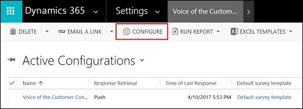
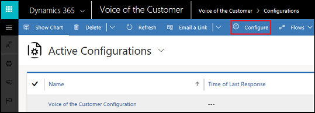

# Troubleshooting the Voice of the Customer solution

> [!IMPORTANT]
> Voice of the Customer (VoC) is being deprecated and replaced with Microsoft Forms Pro. [Learn more](https://go.microsoft.com/fwlink/p/?linkid=2097704)

This article provides information about troubleshooting issues in the Voice of the Customer solution.

## Reconfiguring Voice of the Customer

If the Voice of the Customer solution is accidentally deleted or misconfigured, it might not be able to receive survey responses. Now you can repair or restore the Voice of the Customer configuration from the **Voice of the Customer Configurations** page.

> [!Note]
> You must be a survey administrator to reconfigure the Voice of the Customer solution.
> If the solution cannot be reconfigured properly, an error message appears.

**Web client**

1. Sign in to the Voice of the Customer legacy web client.

2. Go to **Settings** > **Voice of the Customer Configurations**.

3. Select **Configure** from the toolbar at the top of the screen.

     

**Voice of the Customer app**

1. [Open Voice of the Customer app](install-solution.md#open-voice-of-the-customer-app).

2. Go to **Settings** > **Configurations**.

3. Select **Configure** from the toolbar at the top of the screen.

   

## Validating the Voice of the Customer solution

As a survey administrator, you can validate the status of your Voice of the Customer solution. Validation allows you to check whether:
- Voice of the Customer configuration and provisioning is in its proper state.
- Survey lifecycle is working for the organization.
- Survey responses are being received properly.

To validate the Voice of the Customer solution:

**Web client**

1. Sign in to the Voice of the Customer legacy web client.

2. Go to **Settings** > **Voice of the Customer Configurations**.

3. Select **Voice of the Customer Configuration** from the list of active configurations.

4. Select **Validate** from the toolbar at the top of the screen. A confirmation message appears, asking your consent for the validation process to start.

5. Select **OK** to start the validation process. The results are displayed under the **Voice of the Customer Validation Results** area.

6. Select **Download Log File** to download the detailed report.

**Voice of the Customer app**

1. [Open Voice of the Customer app](install-solution.md#open-voice-of-the-customer-app).

2.	Go to **Settings** > **Configurations**.

3.	Select **Voice of the Customer Configuration** from the list of active configurations.

4.	Select **Validate** from the toolbar at the top of the screen. A confirmation message appears, asking your consent for the validation process to start.

5.	Select **OK** to start the validation process. The results are displayed under **Voice of the Customer Validation Results**.

6.	Select **Download Log File** to download the detailed report.

## Validating a survey

As a survey administrator, you can validate whether a survey has created any issues.

1. Sign in to the Voice of the Customer legacy web client or [open Voice of the Customer app](install-solution.md#open-voice-of-the-customer-app).

2. Go to **Voice of the Customer** > **Surveys**.

3. Select the name of the survey you want to validate.

4. Select **Validate Survey** from the toolbar at the top of the screen. A confirmation message appears, asking your consent for the validation process to start with or without publishing the survey.

5. Select one of the following buttons in the confirmation message:

   - **Publish**: All the validation tests are performed.

   - **Skip Publish**: Only the validation tests that do not require publishing the survey are performed.
  
   The results are displayed under **Survey Validation Results**.
  
6. Select **Download Log File** to download the detailed report.

### See also
[Plan a survey](plan-survey.md)   
[Design a basic survey](design-basic-survey.md)   
[Design an advanced survey](design-advanced-survey.md)   
[Distribute a survey](distribute-survey.md) 
[Analyze survey data](analyze-survey-data.md) 
